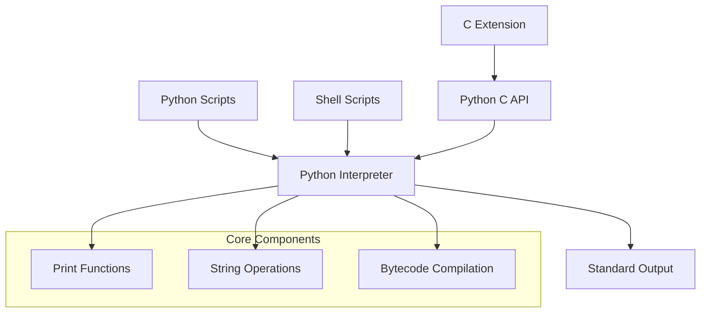
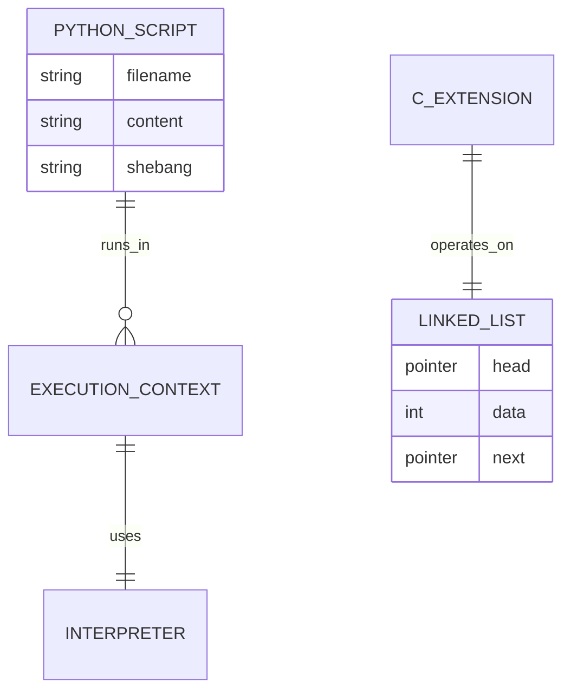
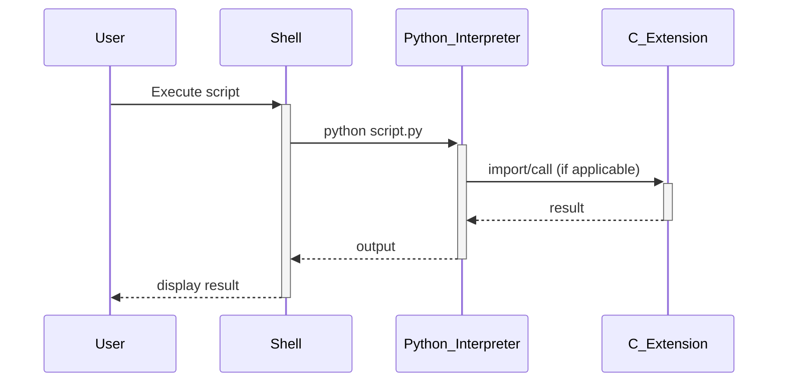

# 🏗️ System Architecture

## 📖 Overview
This container demonstrates fundamental Python programming concepts including basic syntax, print statements, string manipulation, and Python-C integration. It serves as an introduction to Python scripting and understanding the relationship between Python and system-level programming.

---

## 🏛️ High-Level Architecture



The architecture demonstrates basic Python execution flow with shell integration and C extension capabilities.

---

## 🧩 Core Components

### Python Scripts Layer
- **Purpose**: Implements basic Python programming concepts
- **Technology**: Python 3.8+
- **Location**: `*.py files`
- **Responsibilities**:
  - String printing and formatting
  - Basic algorithmic implementations
  - Demonstrating Python syntax
- **Interfaces**: Command-line execution, Python interpreter

### Shell Script Interface
- **Purpose**: Provides system-level execution entry points
- **Technology**: Bash/Shell scripting
- **Location**: `0-run`, `1-run_inline`, `101-compile`
- **Responsibilities**:
  - Python script execution
  - Compilation directives
  - System integration
- **Interfaces**: System shell, Python interpreter

### C Extension Module
- **Purpose**: Demonstrates Python-C integration through linked list operations
- **Technology**: C programming, Python C API
- **Location**: `10-check_cycle.c`, `lists.h`
- **Responsibilities**:
  - Cycle detection algorithms
  - Low-level data structure manipulation
  - Python-C bridge functionality
- **Interfaces**: Python C API, compiled extension module

---

## 📊 Data Models & Schema



### Key Data Entities
- **Python Scripts**: Individual .py files containing educational exercises
- **Execution Context**: Runtime environment for script execution
- **Linked List**: C data structure for cycle detection demonstration

### Relationships
- Scripts → Interpreter: Direct execution relationship
- C Extension → Python API: Integration through Python C interface

---

## 🔄 Data Flow & Interactions



### Request/Response Flow
1. **User Input**: User executes Python script via shell or direct interpreter
2. **Interpretation**: Python interpreter parses and executes code
3. **Output Generation**: Print statements generate standard output
4. **C Integration**: C extensions provide additional functionality when needed

---

## 🚀 Deployment & Environment

### Development Environment
- **Platform**: Ubuntu 20.04 LTS
- **Dependencies**: Python 3.8+, GCC compiler for C extensions
- **Setup**: Direct script execution with proper permissions

### Production Considerations
- **Scalability**: Educational scripts designed for individual learning
- **Performance**: Basic operations with minimal resource requirements
- **Monitoring**: Standard output and error streams

### Configuration Management
- **Environment Variables**: Standard Python path configuration
- **Execution Permissions**: Executable scripts with proper shebang

---

## 🔒 Security Architecture

### Authentication & Authorization
- **Authentication**: System-level user permissions
- **Authorization**: File system permissions for script execution

### Data Protection
- **Input Validation**: Basic string handling with no external input
- **Data Privacy**: No sensitive data handling in educational context

### Security Measures
- **Script Permissions**: Proper executable permissions
- **Safe Execution**: Sandboxed educational environment

---

## ⚡ Error Handling & Resilience

### Error Management Strategy
- **Error Detection**: Python interpreter syntax and runtime error detection
- **Error Reporting**: Standard error stream output
- **Error Recovery**: Script termination on errors (educational context)

### Resilience Patterns
- **Fail Fast**: Immediate error reporting for learning feedback
- **Clear Messaging**: Descriptive error output for educational value

---

## 🎯 Design Decisions & Trade-offs

### Key Architectural Decisions
1. **Python Focus with C Integration**
   - **Decision**: Primary Python implementation with C extension example
   - **Rationale**: Demonstrates both high-level and low-level programming concepts
   - **Alternatives**: Pure Python or pure C implementation
   - **Trade-offs**: Increased complexity for comprehensive learning

2. **Shell Script Integration**
   - **Decision**: Include shell scripts for execution management
   - **Rationale**: Teaches system integration and automation concepts
   - **Alternatives**: Direct Python execution only
   - **Trade-offs**: Added complexity for broader system understanding

### Known Limitations
- **Educational Scope**: Limited to basic concepts without advanced patterns
- **No Error Recovery**: Scripts terminate on errors for learning clarity

### Future Considerations
- **Advanced Python Concepts**: Integration with later learning modules
- **Extended C Integration**: More complex Python-C API usage examples

---

## 📁 Directory Structure & Organization

```
0x00-python-hello_world/
├── 0-run                    # Shell script for Python execution
├── 1-run_inline             # Inline Python execution script
├── 2-print.py              # Basic print statement example
├── 3-print_number.py       # Number printing with formatting
├── 4-print_float.py        # Float number formatting
├── 5-print_string.py       # String manipulation and printing
├── 6-concat.py             # String concatenation
├── 7-edges.py              # String slicing operations
├── 8-concat_edges.py       # Advanced string operations
├── 9-easter_egg.py         # Python Zen demonstration
├── 10-check_cycle.c        # C extension for cycle detection
├── 10-linked_lists.c       # C linked list implementation
├── 100-write.py            # File writing operations
├── 101-compile             # Python compilation script
├── 102-magic_calculation.py # Bytecode reverse engineering
├── lists.h                 # C header file for linked list operations
├── main.c                  # C test file
└── hello                   # Compiled output example
```

### Organization Principles
- **Progressive Complexity**: Files numbered by increasing difficulty
- **Technology Separation**: Python scripts vs C extensions clearly separated
- **Functional Grouping**: Related operations grouped logically

---

## 🔗 External Dependencies

| Dependency | Purpose | Version | Documentation |
|------------|---------|---------|---------------|
| Python | Core interpreter | 3.8+ | [Python.org](https://python.org) |
| GCC | C compiler for extensions | Latest | [GCC Documentation](https://gcc.gnu.org) |
| System Shell | Script execution | Bash/Zsh | [Bash Manual](https://www.gnu.org/software/bash/manual/) |

---

## 📚 References
- [Project README](README.md)
- [Project Manifest](PROJECT-MANIFEST.md)
- [Python Official Documentation](https://docs.python.org/)
- [Python C API Documentation](https://docs.python.org/3/c-api/)
