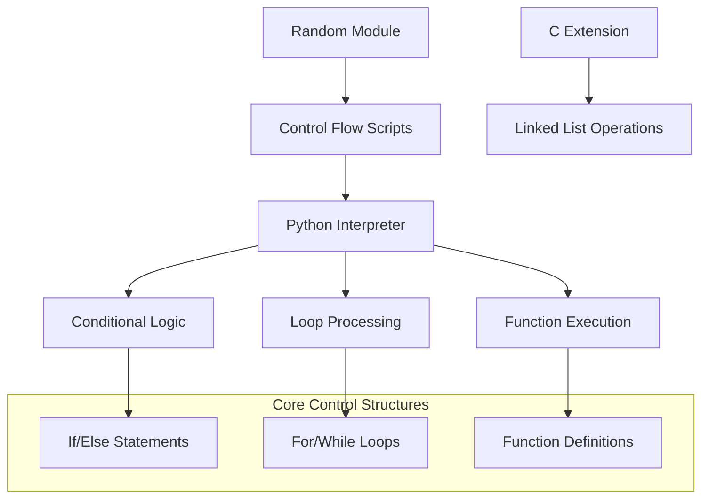
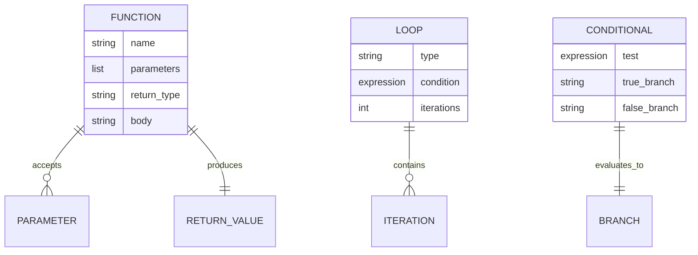
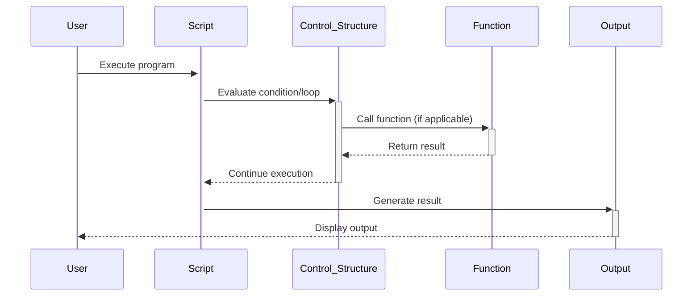

# 🏗️ System Architecture

## 📖 Overview
This container demonstrates fundamental Python control structures including conditional statements (if/else), loops, and functions. It builds upon basic Python syntax to introduce algorithmic thinking and program flow control through practical exercises.

---

## 🏛️ High-Level Architecture



The architecture demonstrates progression from basic control structures to complex algorithmic implementations using Python's control flow mechanisms.

---

## 🧩 Core Components

### Conditional Logic Module
- **Purpose**: Implements decision-making logic through if/else constructs
- **Technology**: Python 3.8+ conditional statements
- **Location**: `0-positive_or_negative.py`, `1-last_digit.py`
- **Responsibilities**:
  - Number classification and validation
  - Multi-branch decision making
  - Logical expression evaluation
- **Interfaces**: Standard input/output, random number generation

### Loop Processing Engine
- **Purpose**: Demonstrates iterative programming concepts
- **Technology**: Python for/while loops, range functions
- **Location**: `2-print_alphabet.py`, `4-print_hexa.py`, `5-print_comb2.py`, `6-print_comb3.py`
- **Responsibilities**:
  - Character iteration and printing
  - Number sequence generation
  - Pattern creation and formatting
- **Interfaces**: ASCII character mapping, formatted output streams

### Function Definition Framework
- **Purpose**: Encapsulates reusable code logic in function structures
- **Technology**: Python function definitions, parameter passing
- **Location**: `7-islower.py`, `8-uppercase.py`, `9-print_last_digit.py`, `10-add.py`, `11-pow.py`
- **Responsibilities**:
  - Character classification algorithms
  - Mathematical operations implementation
  - Code modularity and reusability
- **Interfaces**: Function parameters, return values, ASCII operations

### Advanced Algorithm Module
- **Purpose**: Implements complex algorithmic patterns
- **Technology**: Python algorithms, C integration
- **Location**: `12-fizzbuzz.py`, `13-insert_number.c`, `100-print_tebahpla.py`, `101-remove_char_at.py`
- **Responsibilities**:
  - Game logic implementation (FizzBuzz)
  - Linked list manipulation in C
  - String processing algorithms
- **Interfaces**: Mathematical modulo operations, C data structures

---

## 📊 Data Models & Schema



### Key Data Entities
- **Functions**: Reusable code blocks with parameters and return values
- **Control Structures**: If/else and loop constructs for program flow
- **Variables**: Data storage for intermediate calculations and results

### Relationships
- Functions → Parameters: Input data transformation relationship
- Loops → Iterations: Repetitive execution relationship
- Conditionals → Branches: Decision-based execution paths

---

## 🔄 Data Flow & Interactions



### Request/Response Flow
1. **Script Initialization**: Program starts and initializes variables
2. **Control Evaluation**: Conditions and loops are evaluated
3. **Function Execution**: Functions are called with appropriate parameters
4. **Result Processing**: Outputs are formatted and displayed

---

## 🚀 Deployment & Environment

### Development Environment
- **Platform**: Ubuntu 20.04 LTS
- **Dependencies**: Python 3.8+, GCC for C extensions
- **Setup**: Direct script execution with Python interpreter

### Production Considerations
- **Scalability**: Educational algorithms designed for learning, not production scale
- **Performance**: Basic operations with O(1) to O(n) complexity
- **Monitoring**: Standard output streams for result verification

### Configuration Management
- **Environment Variables**: Python path and interpreter settings
- **Execution Mode**: Interactive and script-based execution support

---

## 🔒 Security Architecture

### Authentication & Authorization
- **Authentication**: System user-level permissions
- **Authorization**: File system read/execute permissions

### Data Protection
- **Input Validation**: Parameter type checking in functions
- **Range Checking**: Boundary validation for mathematical operations

### Security Measures
- **Safe Operations**: No external input processing in educational context
- **Memory Safety**: Python's automatic memory management

---

## ⚡ Error Handling & Resilience

### Error Management Strategy
- **Error Detection**: Python interpreter syntax and runtime checking
- **Error Reporting**: Exception propagation with clear messages
- **Error Recovery**: Graceful script termination for educational feedback

### Resilience Patterns
- **Input Validation**: Parameter checking in function implementations
- **Boundary Checking**: Range validation for mathematical operations

---

## 🎯 Design Decisions & Trade-offs

### Key Architectural Decisions
1. **Progressive Complexity Design**
   - **Decision**: Start with simple conditionals, progress to complex algorithms
   - **Rationale**: Builds foundational understanding before advanced concepts
   - **Alternatives**: Mixed complexity or advanced-first approach
   - **Trade-offs**: Slower initial progress for stronger fundamentals

2. **Function-Based Architecture**
   - **Decision**: Introduce functions as reusable code components
   - **Rationale**: Teaches modularity and code organization principles
   - **Alternatives**: Inline code implementation only
   - **Trade-offs**: Additional complexity for better programming practices

### Known Limitations
- **Educational Scope**: Limited to basic algorithmic patterns
- **Input Constraints**: Predefined inputs rather than user interaction

### Future Considerations
- **Object-Oriented Transition**: Preparation for class-based programming
- **Algorithm Optimization**: Introduction to complexity analysis

---

## 📁 Directory Structure & Organization

```
0x01-python-if_else_loops_functions/
├── 0-positive_or_negative.py   # Conditional logic demonstration
├── 1-last_digit.py            # Complex conditional with modulo
├── 2-print_alphabet.py        # Basic loop with character printing
├── 3-print_alphabt.py         # Loop with conditional exclusion
├── 4-print_hexa.py           # Hexadecimal number printing
├── 5-print_comb2.py          # Nested loops for combinations
├── 6-print_comb3.py          # Three-digit combinations
├── 7-islower.py              # Character classification function
├── 8-uppercase.py            # String transformation function
├── 9-print_last_digit.py     # Mathematical function implementation
├── 10-add.py                 # Simple arithmetic function
├── 11-pow.py                 # Power calculation function
├── 12-fizzbuzz.py            # Classic algorithm implementation
├── 13-insert_number.c        # C linked list insertion
├── 100-print_tebahpla.py     # Reverse alphabet printing
├── 101-remove_char_at.py     # String manipulation function
└── lists.h                   # C header for linked list operations
```

### Organization Principles
- **Complexity Progression**: Files ordered by increasing algorithmic complexity
- **Concept Grouping**: Related control structures grouped together
- **Language Separation**: Python and C implementations clearly distinguished

---

## 🔗 External Dependencies

| Dependency | Purpose | Version | Documentation |
|------------|---------|---------|---------------|
| Python | Core interpreter and standard library | 3.8+ | [Python.org](https://python.org) |
| Random Module | Number generation for demonstrations | Built-in | [Random Documentation](https://docs.python.org/3/library/random.html) |
| GCC | C compiler for linked list extensions | Latest | [GCC Documentation](https://gcc.gnu.org) |

---

## 📚 References
- [Project README](README.md)
- [Project Manifest](PROJECT-MANIFEST.md)
- [Python Control Flow Documentation](https://docs.python.org/3/tutorial/controlflow.html)
- [Python Functions Guide](https://docs.python.org/3/tutorial/controlflow.html#defining-functions)
