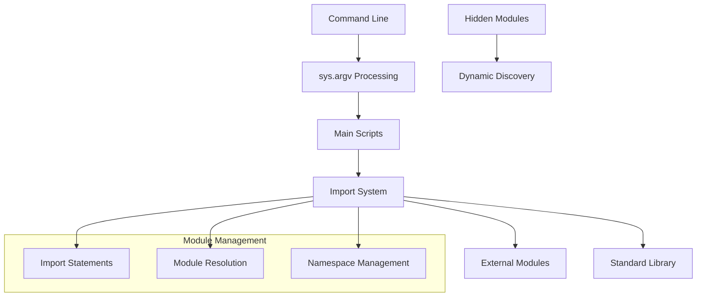
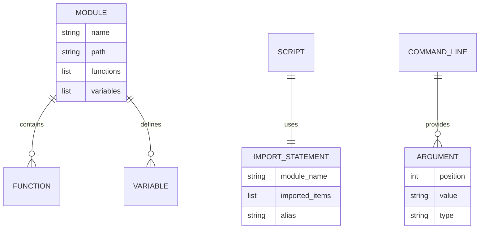
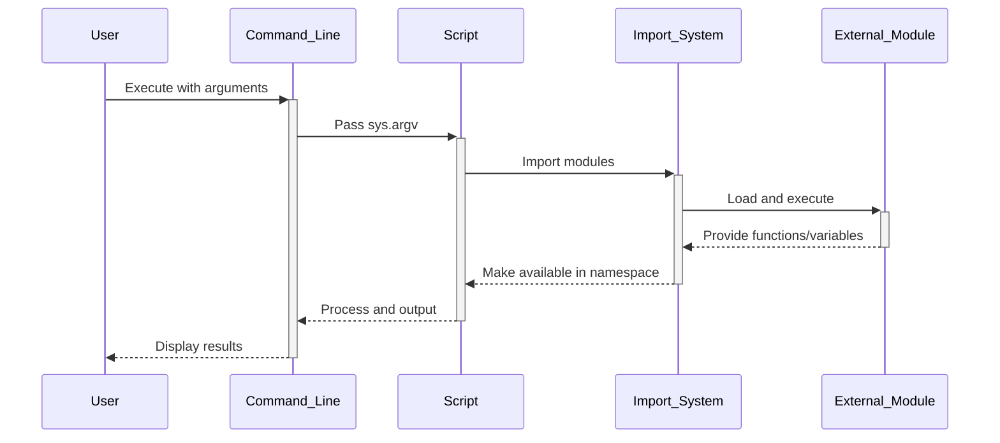

# 🏗️ System Architecture

## 📖 Overview
This container demonstrates Python module system fundamentals including imports, command-line argument processing, and module organization. It teaches how to structure Python programs using modular design principles and external module interactions.

---

## 🏛️ High-Level Architecture



The architecture demonstrates Python's module system with emphasis on import mechanisms, argument processing, and dynamic module discovery.

---

## 🧩 Core Components

### Import Management System
- **Purpose**: Handles module imports and namespace management
- **Technology**: Python import system, from/import statements
- **Location**: `0-add.py`, `1-calculation.py`, `100-my_calculator.py`
- **Responsibilities**:
  - External module integration
  - Function and variable importing
  - Namespace isolation and management
- **Interfaces**: Python module search path, import statements

### Command-Line Processing Engine
- **Purpose**: Processes command-line arguments and system interaction
- **Technology**: sys module, argv processing
- **Location**: `2-args.py`, `3-infinite_add.py`
- **Responsibilities**:
  - Argument parsing and validation
  - Dynamic input processing
  - System integration
- **Interfaces**: sys.argv, command-line interface

### Dynamic Module Discovery
- **Purpose**: Demonstrates runtime module exploration and introspection
- **Technology**: Python introspection, dir() function, hidden attributes
- **Location**: `4-hidden_discovery.py`, `5-variable_load.py`
- **Responsibilities**:
  - Module content discovery
  - Hidden attribute exploration
  - Runtime variable access
- **Interfaces**: Module introspection APIs, attribute access

### Alternative Import Methods
- **Purpose**: Shows various import techniques and optimizations
- **Technology**: Alternative import mechanisms, bytecode analysis
- **Location**: `101-easy_print.py`, `102-magic_calculation.py`, `103-fast_alphabet.py`
- **Responsibilities**:
  - Import-free implementations
  - Bytecode reverse engineering
  - Performance-optimized solutions
- **Interfaces**: Python internals, optimization techniques

---

## 📊 Data Models & Schema



### Key Data Entities
- **Modules**: External Python files providing functionality
- **Import Statements**: Mechanisms for bringing external code into current namespace
- **Command Arguments**: Runtime parameters passed to scripts

### Relationships
- Scripts → Modules: Import and dependency relationships
- Arguments → Processing: Command-line to program data flow
- Modules → Functions: Encapsulation and exposure relationships

---

## 🔄 Data Flow & Interactions



### Request/Response Flow
1. **Command Execution**: User executes script with optional arguments
2. **Import Resolution**: Python locates and loads required modules
3. **Namespace Setup**: Imported items are made available in current scope
4. **Argument Processing**: Command-line arguments are parsed and processed
5. **Function Execution**: Imported functions are called with processed data

---

## 🚀 Deployment & Environment

### Development Environment
- **Platform**: Ubuntu 20.04 LTS
- **Dependencies**: Python 3.8+, external modules (add_0, calculator_1, etc.)
- **Setup**: Module files must be in Python path or current directory

### Production Considerations
- **Scalability**: Modular design supports larger application development
- **Performance**: Import caching improves execution speed
- **Monitoring**: Module loading and execution tracking

### Configuration Management
- **Module Path**: PYTHONPATH environment variable configuration
- **Import Caching**: Python's import cache management
- **Dependency Management**: Module availability and version control

---

## 🔒 Security Architecture

### Authentication & Authorization
- **Authentication**: System-level user permissions
- **Authorization**: Module access permissions and file system security

### Data Protection
- **Input Validation**: Command-line argument sanitization
- **Module Safety**: Trusted module import practices

### Security Measures
- **Path Security**: Controlled module search paths
- **Import Safety**: Avoiding dangerous imports and dynamic execution

---

## ⚡ Error Handling & Resilience

### Error Management Strategy
- **Error Detection**: Import errors, module not found exceptions
- **Error Reporting**: Clear error messages for missing modules
- **Error Recovery**: Graceful handling of import failures

### Resilience Patterns
- **Import Guards**: Conditional imports with fallbacks
- **Argument Validation**: Command-line argument checking
- **Module Verification**: Ensuring required attributes exist

---

## 🎯 Design Decisions & Trade-offs

### Key Architectural Decisions
1. **Modular Design Approach**
   - **Decision**: Separate functionality into distinct modules
   - **Rationale**: Promotes code reusability and maintainability
   - **Alternatives**: Monolithic script design
   - **Trade-offs**: Increased complexity for better organization

2. **Command-Line Integration**
   - **Decision**: Include sys.argv processing for dynamic input
   - **Rationale**: Demonstrates real-world script usage patterns
   - **Alternatives**: Hard-coded values only
   - **Trade-offs**: Additional complexity for practical applicability

### Known Limitations
- **Module Dependencies**: Requires external modules to be available
- **Educational Scope**: Limited to basic import patterns

### Future Considerations
- **Package Development**: Transition to full package structures
- **Advanced Imports**: Relative imports and package initialization

---

## 📁 Directory Structure & Organization

```
0x02-python-import_modules/
├── 0-add.py                  # Basic function import example
├── 1-calculation.py          # Multiple function imports
├── 2-args.py                 # Command-line argument processing
├── 3-infinite_add.py         # Dynamic argument addition
├── 4-hidden_discovery.py     # Module introspection
├── 5-variable_load.py        # Dynamic variable loading
├── 100-my_calculator.py      # Calculator with imports
├── 101-easy_print.py         # Print without import
├── 102-magic_calculation.py  # Bytecode reverse engineering
└── 103-fast_alphabet.py      # Optimized alphabet printing
```

### Organization Principles
- **Import Complexity**: Progressive complexity in import techniques
- **Functionality Grouping**: Related import concepts grouped together
- **Alternative Methods**: Advanced techniques demonstrated separately

---

## 🔗 External Dependencies

| Dependency | Purpose | Version | Documentation |
|------------|---------|---------|---------------|
| Python | Core interpreter and import system | 3.8+ | [Python.org](https://python.org) |
| sys module | System-specific parameters and functions | Built-in | [Sys Documentation](https://docs.python.org/3/library/sys.html) |
| External modules | add_0, calculator_1, etc. | Custom | Local module files |

---

## 📚 References
- [Project README](README.md)
- [Project Manifest](PROJECT-MANIFEST.md)
- [Python Module Documentation](https://docs.python.org/3/tutorial/modules.html)
- [Python Import System](https://docs.python.org/3/reference/import.html)
