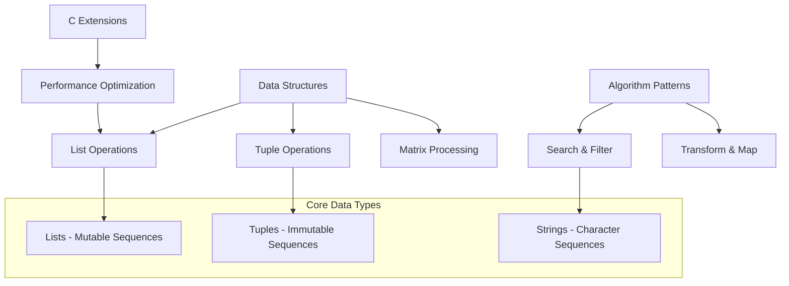
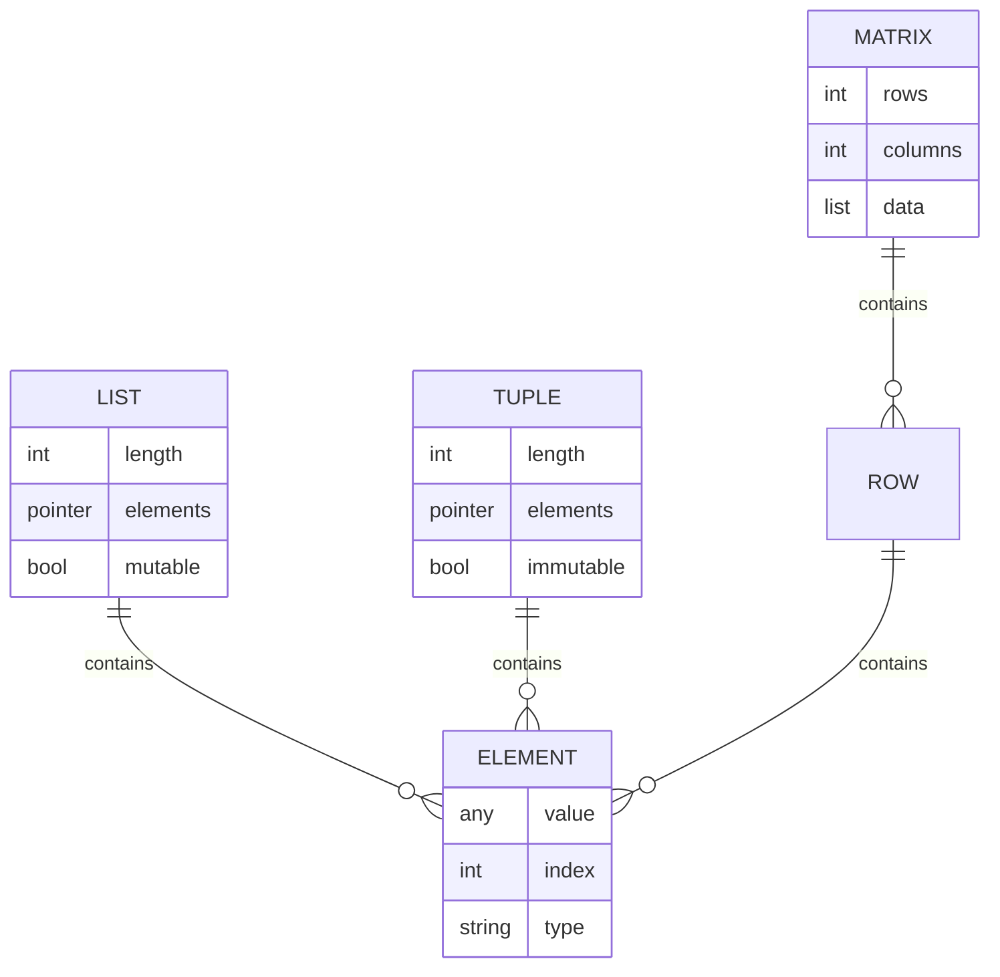
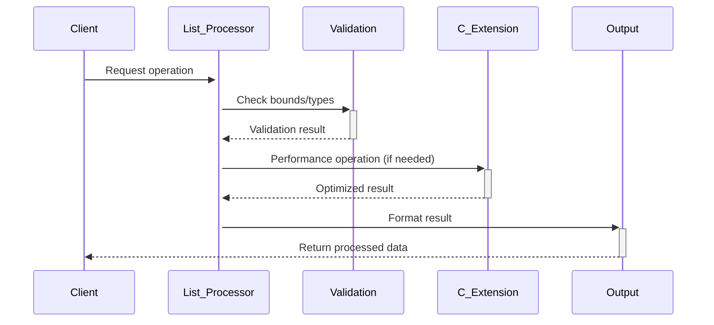

# 🏗️ System Architecture

## 📖 Overview
This container focuses on Python's fundamental data structures including lists, tuples, and their manipulation. It demonstrates core operations, iteration patterns, and C integration for performance-critical operations, establishing the foundation for data-driven programming.

---

## 🏛️ High-Level Architecture



The architecture demonstrates Python's sequence types with emphasis on list manipulation, tuple handling, and matrix operations.

---

## 🧩 Core Components

### List Processing Engine
- **Purpose**: Implements comprehensive list manipulation operations
- **Technology**: Python list methods, indexing, slicing
- **Location**: `0-print_list_integer.py`, `1-element_at.py`, `2-replace_in_list.py`, `3-print_reversed_list_integer.py`
- **Responsibilities**:
  - Element access and modification
  - List traversal and iteration
  - Safe indexing with bounds checking
- **Interfaces**: List indexing, iteration protocols, bounds validation

### Tuple Operations Module
- **Purpose**: Demonstrates immutable sequence handling and tuple manipulation
- **Technology**: Python tuple operations, packing/unpacking
- **Location**: `7-add_tuple.py`, `8-multiple_returns.py`
- **Responsibilities**:
  - Tuple arithmetic operations
  - Multiple value returns
  - Immutable data handling
- **Interfaces**: Tuple creation, unpacking, arithmetic operations

### Advanced List Algorithms
- **Purpose**: Implements complex list processing algorithms
- **Technology**: List comprehensions, filtering, conditional operations
- **Location**: `4-new_in_list.py`, `5-no_c.py`, `9-max_integer.py`, `10-divisible_by_2.py`, `11-delete_at.py`
- **Responsibilities**:
  - Non-destructive list operations
  - Character/element filtering
  - Statistical operations (max finding)
  - Conditional list transformations
- **Interfaces**: List copying, filtering functions, mathematical operations

### Matrix and 2D Operations
- **Purpose**: Handles two-dimensional data structures and matrix operations
- **Technology**: Nested lists, 2D iteration patterns
- **Location**: `6-print_matrix_integer.py`
- **Responsibilities**:
  - 2D data structure traversal
  - Matrix formatting and display
  - Nested iteration patterns
- **Interfaces**: 2D indexing, nested iteration, formatted output

### C Integration Layer
- **Purpose**: Provides performance-optimized operations through C extensions
- **Technology**: Python C API, CPython integration
- **Location**: `100-print_python_list_info.c`, `13-is_palindrome.c`, `lists.h`
- **Responsibilities**:
  - High-performance list analysis
  - Palindrome detection algorithms
  - Memory-efficient operations
- **Interfaces**: Python C API, compiled extensions

---

## 📊 Data Models & Schema



### Key Data Entities
- **Lists**: Mutable sequences supporting modification operations
- **Tuples**: Immutable sequences for fixed data collections
- **Matrices**: Two-dimensional data structures using nested lists

### Relationships
- Lists → Elements: One-to-many containment with index-based access
- Tuples → Elements: Immutable containment with positional access
- Matrices → Rows: Hierarchical structure for 2D data organization

---

## 🔄 Data Flow & Interactions



### Request/Response Flow
1. **Data Input**: Client provides data structures for processing
2. **Validation**: Bounds checking and type validation performed
3. **Processing**: Core algorithms applied to data structures
4. **Optimization**: C extensions used for performance-critical operations
5. **Output**: Results formatted and returned to client

---

## 🚀 Deployment & Environment

### Development Environment
- **Platform**: Ubuntu 20.04 LTS
- **Dependencies**: Python 3.8+, GCC for C extensions
- **Setup**: Compilation required for C extension modules

### Production Considerations
- **Scalability**: Algorithms designed for reasonable data set sizes
- **Performance**: C extensions provide optimized operations
- **Memory**: Efficient memory usage patterns demonstrated

### Configuration Management
- **Compilation Flags**: GCC optimization settings for C extensions
- **Python Path**: Module loading configuration

---

## 🔒 Security Architecture

### Authentication & Authorization
- **Authentication**: System-level permissions
- **Authorization**: File system access control

### Data Protection
- **Input Validation**: Bounds checking for array access
- **Type Safety**: Data type validation in operations

### Security Measures
- **Bounds Checking**: Prevention of index out of bounds errors
- **Safe Operations**: Non-destructive operations where appropriate

---

## ⚡ Error Handling & Resilience

### Error Management Strategy
- **Error Detection**: Index bounds validation, type checking
- **Error Reporting**: Clear error messages for invalid operations
- **Error Recovery**: Graceful handling of edge cases

### Resilience Patterns
- **Safe Indexing**: Bounds checking before array access
- **Default Values**: Fallback values for edge cases
- **Type Validation**: Input type verification

---

## 🎯 Design Decisions & Trade-offs

### Key Architectural Decisions
1. **Mixed Python/C Implementation**
   - **Decision**: Combine Python flexibility with C performance
   - **Rationale**: Demonstrates both ease of use and optimization techniques
   - **Alternatives**: Pure Python or pure C implementation
   - **Trade-offs**: Complexity increase for performance gains

2. **Non-Destructive Operations Emphasis**
   - **Decision**: Prefer operations that don't modify original data
   - **Rationale**: Safer programming practices and functional approach
   - **Alternatives**: In-place modifications for memory efficiency
   - **Trade-offs**: Memory usage for data safety

### Known Limitations
- **Educational Scope**: Limited to fundamental data structure operations
- **Performance**: Python operations not optimized for large datasets

### Future Considerations
- **Advanced Data Structures**: Integration with specialized collections
- **Performance Optimization**: More extensive C integration

---

## 📁 Directory Structure & Organization

```
0x03-python-data_structures/
├── 0-print_list_integer.py      # Basic list printing
├── 1-element_at.py              # Safe element access
├── 2-replace_in_list.py         # List element replacement
├── 3-print_reversed_list_integer.py # Reverse iteration
├── 4-new_in_list.py             # Non-destructive replacement
├── 5-no_c.py                    # Character filtering
├── 6-print_matrix_integer.py    # 2D matrix operations
├── 7-add_tuple.py               # Tuple arithmetic
├── 8-multiple_returns.py        # Multiple value returns
├── 9-max_integer.py             # List maximum finding
├── 10-divisible_by_2.py         # Conditional list operations
├── 11-delete_at.py              # Element deletion
├── 12-switch.py                 # Variable swapping
├── 13-is_palindrome.c           # C palindrome detection
├── 100-print_python_list_info.c # C list analysis
├── lists.h                      # C header definitions
└── main.c                       # C test file
```

### Organization Principles
- **Progressive Complexity**: From basic access to advanced operations
- **Data Type Grouping**: Lists, tuples, and matrices organized logically
- **Language Separation**: Python and C implementations clearly distinguished

---

## 🔗 External Dependencies

| Dependency | Purpose | Version | Documentation |
|------------|---------|---------|---------------|
| Python | Core interpreter and data structures | 3.8+ | [Python.org](https://python.org) |
| GCC | C compiler for extensions | Latest | [GCC Documentation](https://gcc.gnu.org) |
| Python C API | C extension development | 3.8+ | [Python C API](https://docs.python.org/3/c-api/) |

---

## 📚 References
- [Project README](README.md)
- [Project Manifest](PROJECT-MANIFEST.md)
- [Python Data Structures](https://docs.python.org/3/tutorial/datastructures.html)
- [Python C Extension Guide](https://docs.python.org/3/extending/extending.html)
