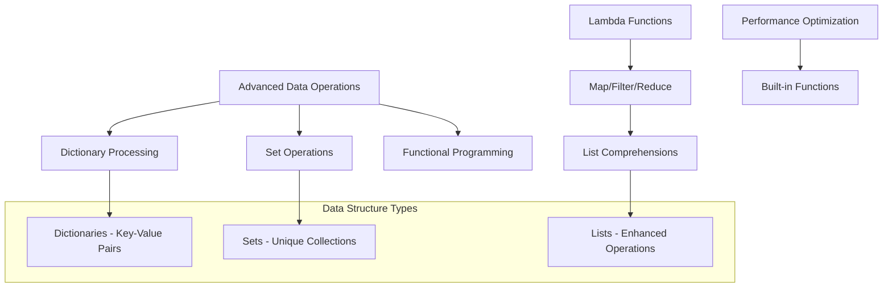
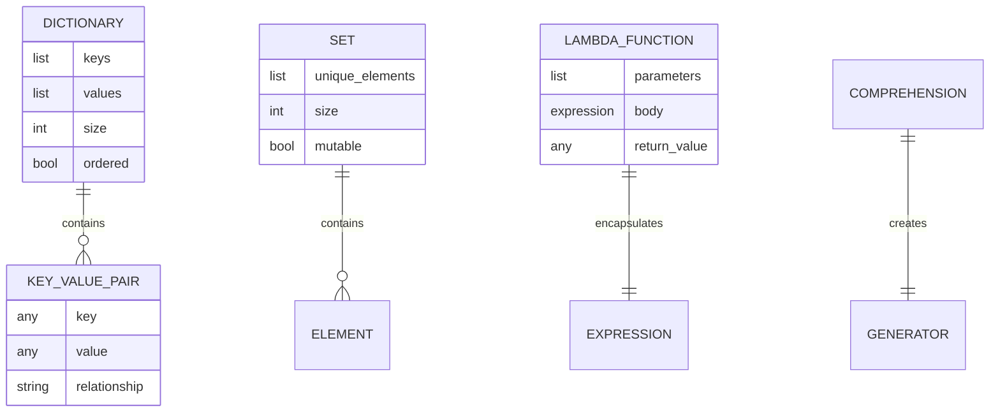
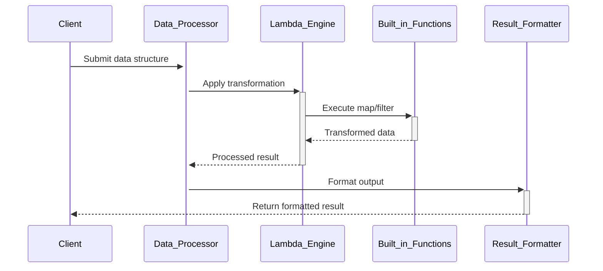

# 🏗️ System Architecture

## 📖 Overview
This container extends data structure knowledge to advanced operations including sets, dictionaries, lambda functions, and comprehensions. It demonstrates functional programming concepts and efficient data processing techniques using Python's powerful built-in data structures.

---

## 🏛️ High-Level Architecture



The architecture focuses on advanced Python data manipulation using functional programming paradigms and optimized built-in operations.

---

## 🧩 Core Components

### Dictionary Operations Engine
- **Purpose**: Implements comprehensive dictionary manipulation and processing
- **Technology**: Python dict methods, key-value operations
- **Location**: `0-square_matrix_simple.py`, `1-search_replace.py`, `6-print_sorted_dictionary.py`
- **Responsibilities**:
  - Matrix transformations using dictionaries
  - Search and replace operations
  - Sorted dictionary processing
- **Interfaces**: Dictionary access patterns, key iteration, value transformation

### Set Processing Module
- **Purpose**: Demonstrates set operations and unique collection handling
- **Technology**: Python set operations, mathematical set theory
- **Location**: `3-common_elements.py`, `4-only_diff_elements.py`, `5-number_keys.py`
- **Responsibilities**:
  - Set intersection and difference operations
  - Unique element identification
  - Mathematical set operations
- **Interfaces**: Set creation, union/intersection operations, element testing

### Functional Programming Framework
- **Purpose**: Implements functional programming patterns and lambda operations
- **Technology**: Lambda functions, map/filter/reduce, comprehensions
- **Location**: `2-uniq_add.py`, `7-update_dictionary.py`, `8-simple_delete.py`
- **Responsibilities**:
  - Functional transformation patterns
  - Dictionary updates and deletions
  - Unique value calculations
- **Interfaces**: Lambda expressions, built-in functional operations

### Advanced List Processing
- **Purpose**: Provides sophisticated list manipulation using modern Python features
- **Technology**: List comprehensions, advanced iteration patterns
- **Location**: `9-multiply_by_2.py`, `10-best_score.py`, `11-multiply_list_map.py`, `12-roman_to_int.py`
- **Responsibilities**:
  - Mathematical transformations
  - Score analysis and optimization
  - Roman numeral conversion algorithms
- **Interfaces**: Comprehension syntax, mapping functions, algorithmic conversions

### Weight Calculation System
- **Purpose**: Demonstrates complex algorithmic thinking with weighted averages
- **Technology**: List processing, mathematical calculations
- **Location**: `100-weight_average.py`, `101-square_matrix_map.py`, `102-complex_delete.py`
- **Responsibilities**:
  - Statistical calculations
  - Matrix transformations using map
  - Complex deletion criteria
- **Interfaces**: Mathematical operations, mapping transformations, conditional logic

---

## 📊 Data Models & Schema



### Key Data Entities
- **Dictionaries**: Key-value mappings for associative data storage
- **Sets**: Collections of unique elements with mathematical operations
- **Lambda Functions**: Anonymous functions for functional programming

### Relationships
- Dictionaries → Key-Value Pairs: Associative mapping relationships
- Sets → Elements: Unique containment with mathematical operations
- Lambda Functions → Expressions: Functional encapsulation patterns

---

## 🔄 Data Flow & Interactions



### Request/Response Flow
1. **Data Input**: Client provides complex data structures
2. **Transformation Setup**: Lambda functions defined for operations
3. **Functional Processing**: Built-in functions apply transformations
4. **Result Collection**: Processed data collected and validated
5. **Output Formatting**: Results formatted for client consumption

---

## 🚀 Deployment & Environment

### Development Environment
- **Platform**: Ubuntu 20.04 LTS
- **Dependencies**: Python 3.8+ with advanced features
- **Setup**: No compilation required, pure Python implementation

### Production Considerations
- **Scalability**: Efficient algorithms for moderate data sizes
- **Performance**: Built-in functions provide optimized operations
- **Memory**: Comprehensions offer memory-efficient processing

### Configuration Management
- **Function Definitions**: Lambda and regular function configurations
- **Data Structure Choices**: Optimal data type selection

---

## 🔒 Security Architecture

### Authentication & Authorization
- **Authentication**: System-level access control
- **Authorization**: Data structure access permissions

### Data Protection
- **Input Validation**: Type checking for data structure operations
- **Safe Operations**: Non-destructive transformations where possible

### Security Measures
- **Type Safety**: Validation of data types in operations
- **Boundary Checking**: Safe access patterns for collections

---

## ⚡ Error Handling & Resilience

### Error Management Strategy
- **Error Detection**: Type validation and key existence checking
- **Error Reporting**: Clear messages for invalid operations
- **Error Recovery**: Graceful handling of missing keys/values

### Resilience Patterns
- **Safe Access**: Key checking before dictionary access
- **Default Values**: Fallback values for missing data
- **Type Validation**: Input verification before processing

---

## 🎯 Design Decisions & Trade-offs

### Key Architectural Decisions
1. **Functional Programming Emphasis**
   - **Decision**: Focus on functional programming patterns
   - **Rationale**: Demonstrates modern Python idioms and efficiency
   - **Alternatives**: Imperative programming approach
   - **Trade-offs**: Learning curve for functional concepts

2. **Built-in Function Utilization**
   - **Decision**: Leverage Python's built-in functions for performance
   - **Rationale**: Optimal performance and idiomatic Python code
   - **Alternatives**: Manual implementation of all operations
   - **Trade-offs**: Less custom code for better performance

### Known Limitations
- **Educational Scope**: Limited to intermediate data structure concepts
- **Complexity**: Some algorithms simplified for learning purposes

### Future Considerations
- **Advanced Algorithms**: More complex data processing patterns
- **Performance Analysis**: Complexity analysis and optimization

---

## 📁 Directory Structure & Organization

```
0x04-python-more_data_structures/
├── 0-square_matrix_simple.py    # Matrix transformation
├── 1-search_replace.py          # Search and replace in lists
├── 2-uniq_add.py               # Unique element summation
├── 3-common_elements.py         # Set intersection operations
├── 4-only_diff_elements.py     # Set difference operations
├── 5-number_keys.py            # Integer key counting
├── 6-print_sorted_dictionary.py # Sorted dictionary output
├── 7-update_dictionary.py      # Dictionary update operations
├── 8-simple_delete.py          # Dictionary key deletion
├── 9-multiply_by_2.py          # Dictionary value multiplication
├── 10-best_score.py            # Maximum value finding
├── 11-multiply_list_map.py     # List transformation with map
├── 12-roman_to_int.py          # Roman numeral conversion
├── 100-weight_average.py        # Weighted average calculation
├── 101-square_matrix_map.py     # Matrix squaring with map
└── 102-complex_delete.py        # Complex deletion criteria
```

### Organization Principles
- **Concept Progression**: From basic operations to complex algorithms
- **Data Type Focus**: Grouped by primary data structure used
- **Functional Patterns**: Emphasis on functional programming techniques

---

## 🔗 External Dependencies

| Dependency | Purpose | Version | Documentation |
|------------|---------|---------|---------------|
| Python | Core interpreter and built-in functions | 3.8+ | [Python.org](https://python.org) |
| Built-in Functions | map, filter, reduce, sorted | Built-in | [Built-in Functions](https://docs.python.org/3/library/functions.html) |
| Data Types | dict, set, list advanced features | Built-in | [Data Types](https://docs.python.org/3/library/stdtypes.html) |

---

## 📚 References
- [Project README](README.md)
- [Project Manifest](PROJECT-MANIFEST.md)
- [Python Data Structures](https://docs.python.org/3/tutorial/datastructures.html)
- [Functional Programming HOWTO](https://docs.python.org/3/howto/functional.html)
