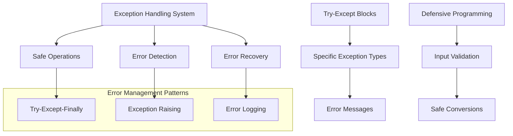
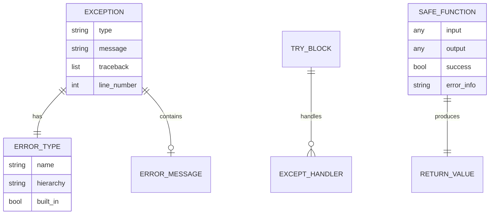
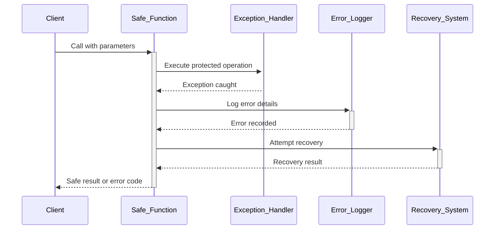

# 🏗️ System Architecture

## 📖 Overview
This container focuses on Python exception handling, error management, and robust programming practices. It demonstrates how to write defensive code that gracefully handles errors and unexpected conditions while maintaining program stability.

---

## 🏛️ High-Level Architecture



The architecture emphasizes robust error handling through defensive programming and comprehensive exception management.

---

## 🧩 Core Components

### Safe Operations Framework
- **Purpose**: Provides error-resistant implementations of common operations
- **Technology**: Try-except blocks, exception handling patterns
- **Location**: `0-safe_print_list.py`, `1-safe_print_integer.py`, `2-safe_print_list_integers.py`
- **Responsibilities**:
  - Safe list printing with bounds checking
  - Type-safe integer operations
  - Graceful error recovery
- **Interfaces**: Safe printing functions, error return codes

### Exception Management Engine
- **Purpose**: Implements comprehensive exception handling strategies
- **Technology**: Python exception hierarchy, custom exception handling
- **Location**: `3-safe_print_division.py`, `4-list_division.py`, `100-safe_print_integer_err.py`
- **Responsibilities**:
  - Division by zero handling
  - Type error management
  - Error logging and reporting
- **Interfaces**: Exception catching, error message formatting

### Exception Generation Module
- **Purpose**: Demonstrates controlled exception raising and propagation
- **Technology**: Raise statements, custom exception messages
- **Location**: `5-raise_exception.py`, `6-raise_exception_msg.py`
- **Responsibilities**:
  - Exception creation and raising
  - Custom error message generation
  - Exception propagation control
- **Interfaces**: Exception raising, message passing

### Advanced Error Handling
- **Purpose**: Implements sophisticated error management patterns
- **Technology**: Generic exception handling, C integration
- **Location**: `101-safe_function.py`, `102-magic_calculation.py`, `103-python.c`
- **Responsibilities**:
  - Generic function safety wrappers
  - Bytecode error analysis
  - C-level exception handling
- **Interfaces**: Function wrappers, C API error handling

---

## 📊 Data Models & Schema



### Key Data Entities
- **Exceptions**: Error objects containing type and message information
- **Safe Functions**: Wrapped operations that handle errors gracefully
- **Error Handlers**: Code blocks that process specific exception types

### Relationships
- Exceptions → Error Types: Classification and hierarchy relationships
- Safe Functions → Return Values: Success/failure result relationships
- Try Blocks → Exception Handlers: Error processing relationships

---

## 🔄 Data Flow & Interactions



### Request/Response Flow
1. **Operation Request**: Client calls safe function with parameters
2. **Protected Execution**: Function executes with exception protection
3. **Error Detection**: Exceptions caught and analyzed
4. **Error Logging**: Error details recorded for debugging
5. **Recovery Attempt**: System attempts graceful error recovery
6. **Safe Return**: Function returns safe result or error indication

---

## 🚀 Deployment & Environment

### Development Environment
- **Platform**: Ubuntu 20.04 LTS
- **Dependencies**: Python 3.8+, GCC for C extensions
- **Setup**: Standard Python execution with error monitoring

### Production Considerations
- **Scalability**: Error handling patterns scale with application size
- **Performance**: Exception handling adds minimal overhead
- **Monitoring**: Comprehensive error logging and tracking

### Configuration Management
- **Error Levels**: Configurable error reporting levels
- **Recovery Strategies**: Customizable error recovery approaches

---

## 🔒 Security Architecture

### Authentication & Authorization
- **Authentication**: System-level access control
- **Authorization**: Safe operation permissions

### Data Protection
- **Input Validation**: Comprehensive parameter checking
- **Error Information**: Controlled error message exposure

### Security Measures
- **Safe Defaults**: Secure fallback values for errors
- **Information Leakage**: Controlled error message content

---

## ⚡ Error Handling & Resilience

### Error Management Strategy
- **Error Detection**: Comprehensive exception catching
- **Error Reporting**: Detailed error logging and user feedback
- **Error Recovery**: Graceful degradation and fallback mechanisms

### Resilience Patterns
- **Defensive Programming**: Input validation and bounds checking
- **Fail-Safe Operations**: Safe defaults for error conditions
- **Error Isolation**: Preventing error propagation to system level

---

## 🎯 Design Decisions & Trade-offs

### Key Architectural Decisions
1. **Safe-by-Default Operations**
   - **Decision**: Implement safe versions of common operations
   - **Rationale**: Prevents crashes and provides reliable operation
   - **Alternatives**: Allow exceptions to propagate naturally
   - **Trade-offs**: Additional code complexity for improved reliability

2. **Comprehensive Exception Coverage**
   - **Decision**: Handle multiple exception types explicitly
   - **Rationale**: Provides specific responses to different error conditions
   - **Alternatives**: Generic exception handling only
   - **Trade-offs**: More code for better error specificity

### Known Limitations
- **Performance Overhead**: Exception handling adds execution cost
- **Complexity**: Additional error handling code increases maintenance

### Future Considerations
- **Advanced Patterns**: Context managers and custom exception types
- **Monitoring Integration**: Enhanced error tracking systems

---

## 📁 Directory Structure & Organization

```
0x05-python-exceptions/
├── 0-safe_print_list.py        # Safe list printing
├── 1-safe_print_integer.py     # Safe integer printing
├── 2-safe_print_list_integers.py # Safe integer list printing
├── 3-safe_print_division.py    # Safe division operations
├── 4-list_division.py          # List element division
├── 5-raise_exception.py        # Exception raising
├── 6-raise_exception_msg.py    # Exception with messages
├── 100-safe_print_integer_err.py # Error stream printing
├── 101-safe_function.py        # Generic safe function wrapper
├── 102-magic_calculation.py    # Bytecode error analysis
├── 103-python.c               # C-level exception handling
└── main.py                    # Test and demonstration file
```

### Organization Principles
- **Safety Progression**: From basic to advanced safety patterns
- **Exception Types**: Organized by types of exceptions handled
- **Implementation Complexity**: Simple to complex error handling

---

## 🔗 External Dependencies

| Dependency | Purpose | Version | Documentation |
|------------|---------|---------|---------------|
| Python | Core interpreter and exception system | 3.8+ | [Python.org](https://python.org) |
| sys module | Error stream and system functions | Built-in | [Sys Documentation](https://docs.python.org/3/library/sys.html) |
| GCC | C compiler for extension modules | Latest | [GCC Documentation](https://gcc.gnu.org) |

---

## 📚 References
- [Project README](README.md)
- [Project Manifest](PROJECT-MANIFEST.md)
- [Python Exception Handling](https://docs.python.org/3/tutorial/errors.html)
- [Python Built-in Exceptions](https://docs.python.org/3/library/exceptions.html)
