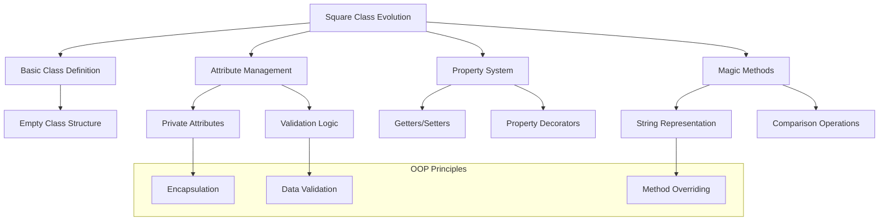
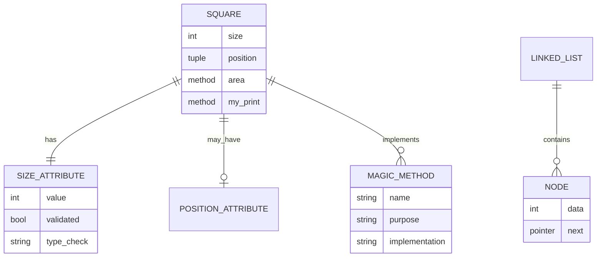
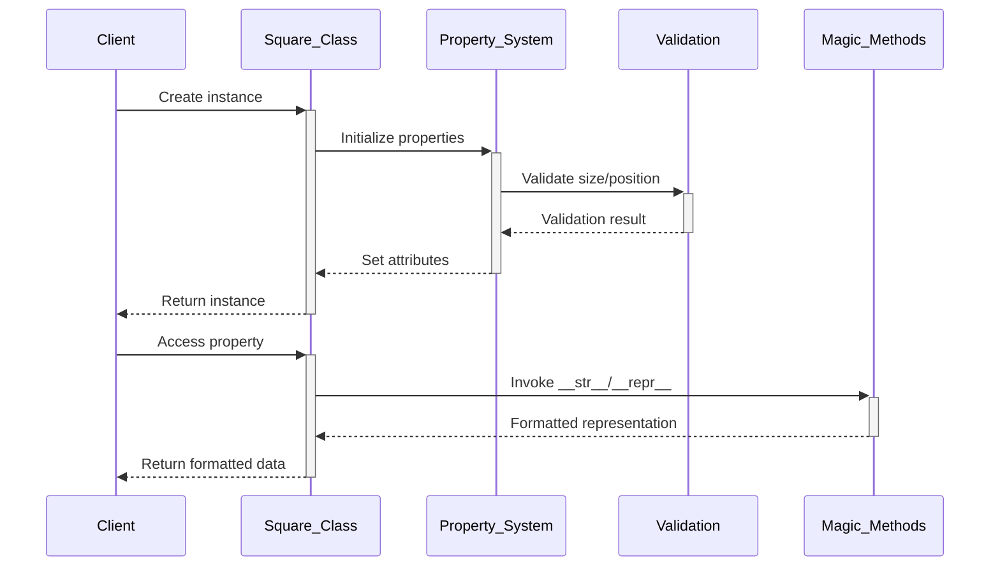

# 🏗️ System Architecture

## 📖 Overview
This container introduces Object-Oriented Programming (OOP) in Python through the implementation of a Square class. It demonstrates progressive enhancement of class functionality from basic definition through advanced features including properties, magic methods, and position handling.

---

## 🏛️ High-Level Architecture



The architecture demonstrates progressive OOP concept implementation through iterative class enhancement.

---

## 🧩 Core Components

### Basic Class Framework
- **Purpose**: Establishes fundamental class structure and instantiation
- **Technology**: Python class definitions, constructor methods
- **Location**: `0-square.py`, `1-square.py`, `2-square.py`
- **Responsibilities**:
  - Class definition and object creation
  - Basic attribute initialization
  - Size parameter validation
- **Interfaces**: Class instantiation, attribute access

### Property Management System
- **Purpose**: Implements Python property decorators for controlled attribute access
- **Technology**: Python @property decorators, getter/setter methods
- **Location**: `3-square.py`, `4-square.py`, `5-square.py`, `6-square.py`
- **Responsibilities**:
  - Attribute validation and type checking
  - Private attribute encapsulation
  - Controlled data access patterns
- **Interfaces**: Property access, validation exceptions

### Magic Method Implementation
- **Purpose**: Provides special method implementations for enhanced object behavior
- **Technology**: Python magic methods (__str__, __repr__, comparison operators)
- **Location**: `101-square.py`, `102-square.py`
- **Responsibilities**:
  - String representation customization
  - Object comparison operations
  - Pythonic object behavior
- **Interfaces**: Built-in function integration, operator overloading

### Advanced Features Module
- **Purpose**: Demonstrates complex OOP patterns and advanced class features
- **Technology**: Position handling, linked list integration, bytecode analysis
- **Location**: `100-singly_linked_list.py`, `103-magic_class.py`
- **Responsibilities**:
  - Data structure implementation
  - Complex object positioning
  - Reverse engineering demonstration
- **Interfaces**: Node-based data structures, coordinate systems

---

## 📊 Data Models & Schema



### Key Data Entities
- **Square Class**: Core geometric object with size and position properties
- **Attributes**: Validated data members with type and range checking
- **Magic Methods**: Special methods providing built-in Python integration

### Relationships
- Square → Attributes: Composition relationship with validated properties
- Square → Methods: Behavioral interface for object operations
- LinkedList → Nodes: Container relationship for data structure implementation

---

## 🔄 Data Flow & Interactions



### Request/Response Flow
1. **Object Creation**: Client instantiates Square with optional parameters
2. **Property Validation**: Size and position values are validated
3. **Attribute Assignment**: Validated values are stored in private attributes
4. **Method Invocation**: Methods provide calculated values and representations
5. **Magic Method Integration**: Special methods enable Pythonic object usage

---

## 🚀 Deployment & Environment

### Development Environment
- **Platform**: Ubuntu 20.04 LTS
- **Dependencies**: Python 3.8+
- **Setup**: Direct script execution and interactive testing

### Production Considerations
- **Scalability**: Class design supports inheritance and extension
- **Performance**: Property validation adds minimal overhead
- **Monitoring**: Exception handling for invalid operations

### Configuration Management
- **Class Parameters**: Size and position configuration
- **Validation Rules**: Type and range checking settings

---

## 🔒 Security Architecture

### Authentication & Authorization
- **Authentication**: System-level access control
- **Authorization**: Attribute access through property system

### Data Protection
- **Input Validation**: Comprehensive type and range checking
- **Encapsulation**: Private attribute protection through naming conventions

### Security Measures
- **Type Safety**: Strict type checking for all attributes
- **Range Validation**: Boundary checking for size values
- **Exception Handling**: Controlled error responses for invalid operations

---

## ⚡ Error Handling & Resilience

### Error Management Strategy
- **Error Detection**: Type and value validation at property level
- **Error Reporting**: Descriptive exception messages for validation failures
- **Error Recovery**: Immediate exception raising for invalid states

### Resilience Patterns
- **Validation Guards**: Pre-condition checking before attribute assignment
- **Type Enforcement**: Strict type checking with meaningful error messages
- **State Consistency**: Ensuring object remains in valid state after operations

---

## 🎯 Design Decisions & Trade-offs

### Key Architectural Decisions
1. **Property-Based Attribute Access**
   - **Decision**: Use @property decorators for controlled attribute access
   - **Rationale**: Provides validation while maintaining simple syntax
   - **Alternatives**: Direct attribute access or explicit getter/setter methods
   - **Trade-offs**: Slight performance overhead for enhanced data integrity

2. **Progressive Complexity Implementation**
   - **Decision**: Build features incrementally across multiple files
   - **Rationale**: Demonstrates OOP concept evolution and learning progression
   - **Alternatives**: Single comprehensive implementation
   - **Trade-offs**: Multiple files for clearer learning path

### Known Limitations
- **Educational Focus**: Simplified implementation for learning purposes
- **Single Responsibility**: Square class focuses on geometric concepts only

### Future Considerations
- **Inheritance Patterns**: Extension to shape hierarchy
- **Advanced OOP**: Multiple inheritance and abstract base classes

---

## 📁 Directory Structure & Organization

```
0x06-python-classes/
├── 0-square.py              # Empty class definition
├── 1-square.py              # Class with private size attribute
├── 2-square.py              # Size validation in constructor
├── 3-square.py              # Area calculation method
├── 4-square.py              # Property implementation for size
├── 5-square.py              # Square printing functionality
├── 6-square.py              # Position attribute and printing
├── 100-singly_linked_list.py # Linked list implementation
├── 101-square.py            # String representation methods
├── 102-square.py            # Square comparison operations
├── 103-magic_class.py       # Bytecode reverse engineering
└── main.py                  # Test and demonstration file
```

### Organization Principles
- **Progressive Enhancement**: Each file builds upon previous concepts
- **Single Concept Focus**: Each file demonstrates one primary OOP concept
- **Complexity Graduation**: From simple to advanced implementations

---

## 🔗 External Dependencies

| Dependency | Purpose | Version | Documentation |
|------------|---------|---------|---------------|
| Python | Core interpreter and object system | 3.8+ | [Python.org](https://python.org) |
| Built-in Types | Type checking and validation | Built-in | [Python Types](https://docs.python.org/3/library/stdtypes.html) |
| Magic Methods | Special method implementation | Built-in | [Python Data Model](https://docs.python.org/3/reference/datamodel.html) |

---

## 📚 References
- [Project README](README.md)
- [Project Manifest](PROJECT-MANIFEST.md)
- [Python Classes Documentation](https://docs.python.org/3/tutorial/classes.html)
- [Python Property Decorators](https://docs.python.org/3/library/functions.html#property)
- [Python Magic Methods Guide](https://docs.python.org/3/reference/datamodel.html#special-method-names)
