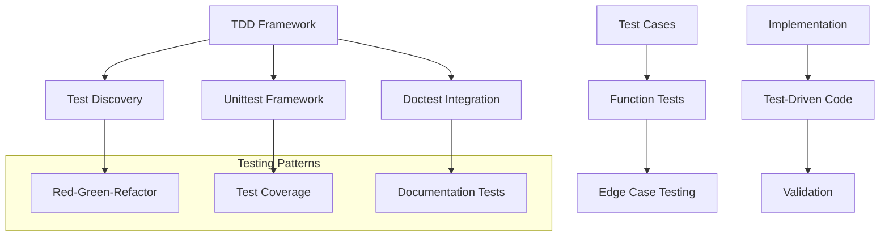
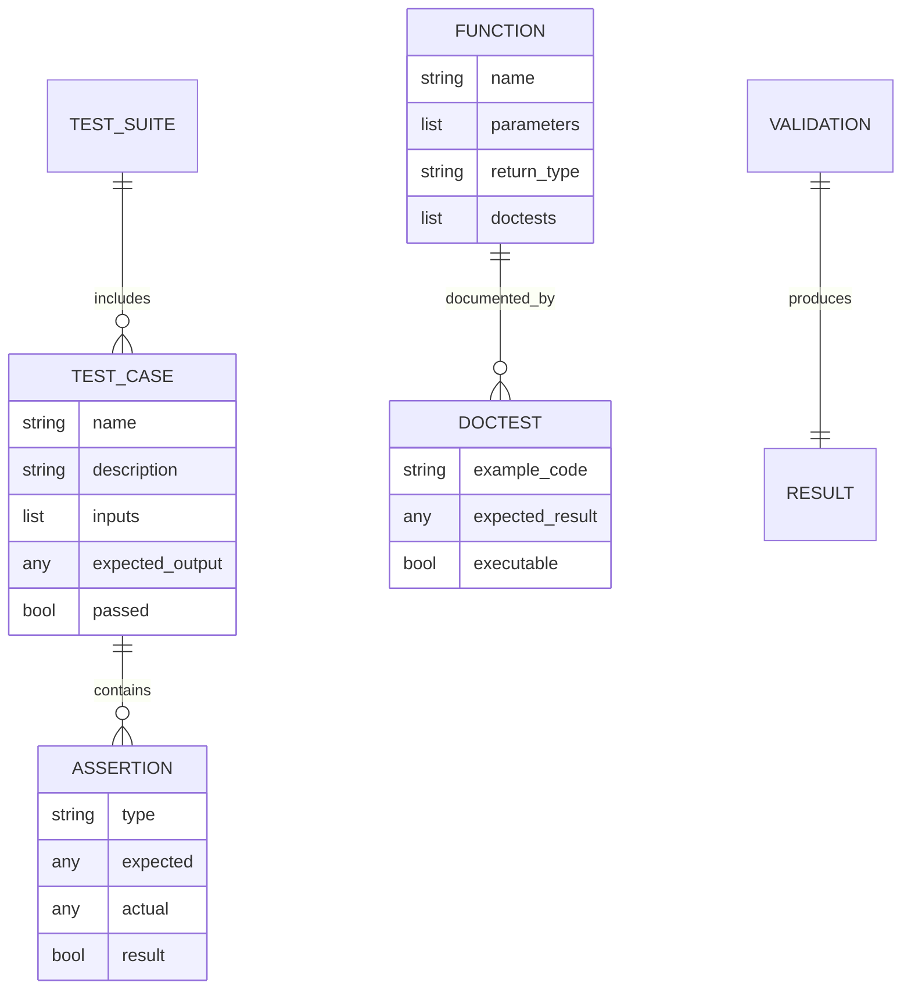
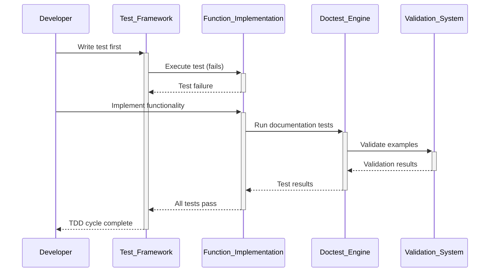

# 🏗️ System Architecture

## 📖 Overview
This container focuses on Test-Driven Development (TDD) methodology using Python's doctest and unittest frameworks. It demonstrates how to write tests before implementation, validate code behavior through comprehensive testing, and maintain code quality through systematic testing practices.

---

## 🏛️ High-Level Architecture



The architecture emphasizes systematic testing approaches with integrated documentation testing and comprehensive validation.

---

## 🧩 Core Components

### Doctest Integration Engine
- **Purpose**: Implements documentation-based testing using doctest framework
- **Technology**: Python doctest module, inline documentation tests
- **Location**: Function docstrings with test examples
- **Responsibilities**:
  - Inline test execution
  - Documentation validation
  - Example verification
  - Interactive testing support
- **Interfaces**: Docstring integration, test execution, result validation

### Mathematical Function Library
- **Purpose**: Provides mathematical operations with comprehensive test coverage
- **Technology**: Python mathematical operations, edge case handling
- **Location**: `0-add_integer.py`, `2-matrix_divided.py`, `4-print_square.py`, `5-text_indentation.py`
- **Responsibilities**:
  - Integer addition with type validation
  - Matrix division operations
  - Square pattern printing
  - Text formatting and indentation
- **Interfaces**: Function calls, parameter validation, formatted output

### String Processing Module
- **Purpose**: Implements text manipulation with thorough testing
- **Technology**: String operations, regular expressions, text formatting
- **Location**: `3-say_my_name.py`, `5-text_indentation.py`
- **Responsibilities**:
  - Name formatting and validation
  - Text processing and indentation
  - String manipulation algorithms
- **Interfaces**: String input/output, formatting functions

### Unittest Framework
- **Purpose**: Provides comprehensive unit testing infrastructure
- **Technology**: Python unittest module, test discovery, assertions
- **Location**: `tests/` directory with test files
- **Responsibilities**:
  - Test case organization
  - Assertion methods
  - Test execution and reporting
  - Coverage analysis
- **Interfaces**: Test runner, assertion methods, test reporting

### Edge Case Testing System
- **Purpose**: Validates function behavior under extreme conditions
- **Technology**: Boundary testing, error condition validation
- **Location**: Integrated in all test implementations
- **Responsibilities**:
  - Boundary value testing
  - Error condition validation
  - Type safety verification
  - Performance edge cases
- **Interfaces**: Error detection, exception validation, boundary testing

---

## 📊 Data Models & Schema



### Key Data Entities
- **Test Cases**: Individual test scenarios with inputs and expected outputs
- **Doctests**: Documentation-embedded test examples
- **Functions**: Tested implementations with validation requirements

### Relationships
- Functions → Doctests: Documentation and testing integration
- Test Cases → Assertions: Validation and verification relationships
- Test Suites → Test Cases: Organizational testing relationships

---

## 🔄 Data Flow & Interactions



### Request/Response Flow
1. **Test Creation**: Tests written before implementation (Red phase)
2. **Implementation**: Code written to pass tests (Green phase)
3. **Validation**: Comprehensive testing including doctests
4. **Refactoring**: Code improvement while maintaining test coverage
5. **Documentation**: Tests serve as living documentation

---

## 🚀 Deployment & Environment

### Development Environment
- **Platform**: Ubuntu 20.04 LTS
- **Dependencies**: Python 3.8+, doctest, unittest modules
- **Setup**: Test discovery and execution environment

### Production Considerations
- **Scalability**: Test suites designed to grow with codebase
- **Performance**: Efficient test execution and reporting
- **Monitoring**: Continuous testing and validation

### Configuration Management
- **Test Discovery**: Automatic test detection and execution
- **Coverage Reporting**: Test coverage analysis and reporting
- **Integration**: CI/CD pipeline integration support

---

## 🔒 Security Architecture

### Authentication & Authorization
- **Authentication**: System-level access for test execution
- **Authorization**: Test file and result access control

### Data Protection
- **Input Validation**: Comprehensive parameter testing
- **Type Safety**: Runtime type checking and validation

### Security Measures
- **Safe Testing**: Isolated test execution environment
- **Error Handling**: Secure error reporting without information leakage

---

## ⚡ Error Handling & Resilience

### Error Management Strategy
- **Error Detection**: Comprehensive test coverage for error conditions
- **Error Reporting**: Clear test failure messages and diagnostics
- **Error Recovery**: Test-driven error handling implementation

### Resilience Patterns
- **Defensive Testing**: Edge case and boundary testing
- **Error Validation**: Testing error conditions and exceptions
- **Regression Prevention**: Continuous testing for code changes

---

## 🎯 Design Decisions & Trade-offs

### Key Architectural Decisions
1. **Test-First Development**
   - **Decision**: Implement TDD methodology with tests before code
   - **Rationale**: Ensures comprehensive coverage and design validation
   - **Alternatives**: Implementation-first development
   - **Trade-offs**: Initial development overhead for long-term quality

2. **Doctest Integration**
   - **Decision**: Use doctests for documentation and testing integration
   - **Rationale**: Maintains documentation accuracy through executable examples
   - **Alternatives**: Separate documentation and testing
   - **Trade-offs**: Documentation complexity for integrated validation

### Known Limitations
- **Test Complexity**: Some edge cases may be difficult to test
- **Performance**: Comprehensive testing adds execution overhead

### Future Considerations
- **Advanced Testing**: Property-based testing and fuzzing
- **Coverage Analysis**: Detailed code coverage reporting

---

## 📁 Directory Structure & Organization

```
0x07-python-test_driven_development/
├── 0-add_integer.py            # Integer addition with validation
├── 2-matrix_divided.py         # Matrix division operations
├── 3-say_my_name.py           # Name formatting function
├── 4-print_square.py          # Square pattern printing
├── 5-text_indentation.py      # Text formatting function
├── 6-max_integer.py           # Maximum value finder
├── tests/
│   ├── 0-add_integer.txt      # Doctest examples
│   ├── 2-matrix_divided.txt   # Matrix operation tests
│   ├── 3-say_my_name.txt      # Name function tests
│   ├── 4-print_square.txt     # Square printing tests
│   ├── 5-text_indentation.txt # Text formatting tests
│   └── 6-max_integer_test.py  # Unittest implementation
└── README.md                  # Project documentation
```

### Organization Principles
- **Test-Code Pairing**: Each function has corresponding test file
- **Documentation Integration**: Tests serve as executable documentation
- **Framework Separation**: Doctest and unittest implementations separated

---

## 🔗 External Dependencies

| Dependency | Purpose | Version | Documentation |
|------------|---------|---------|---------------|
| Python | Core interpreter and testing frameworks | 3.8+ | [Python.org](https://python.org) |
| Doctest | Documentation testing framework | Built-in | [Doctest Documentation](https://docs.python.org/3/library/doctest.html) |
| Unittest | Unit testing framework | Built-in | [Unittest Documentation](https://docs.python.org/3/library/unittest.html) |

---

## 📚 References
- [Project README](README.md)
- [Project Manifest](PROJECT-MANIFEST.md)
- [Python Testing Documentation](https://docs.python.org/3/library/unittest.html)
- [Test-Driven Development Guide](https://docs.python.org/3/library/doctest.html)
