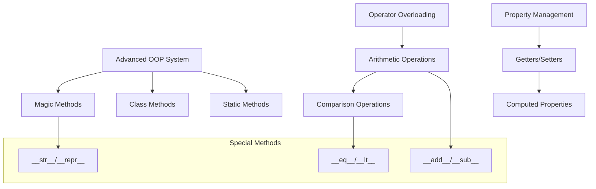
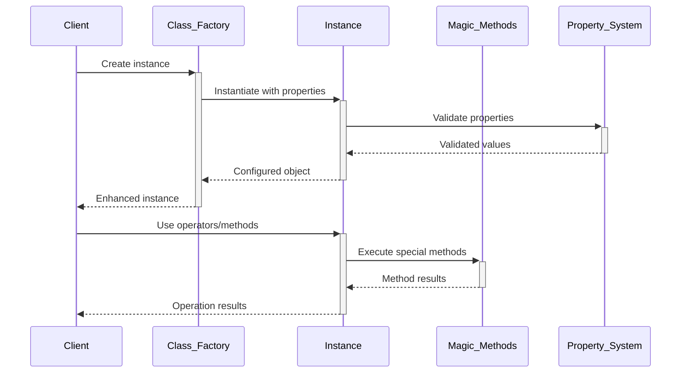

# 🏗️ System Architecture

## 📖 Overview
This container advances object-oriented programming concepts through enhanced class implementations including magic methods, operator overloading, class methods, static methods, and advanced property management. It demonstrates sophisticated OOP patterns and Python's special method protocol.

---

## 🏛️ High-Level Architecture



The architecture focuses on Python's data model through special methods and advanced class design patterns.

---

## 🧩 Core Components

### Magic Method Implementation Framework
- **Purpose**: Implements Python's special method protocol for custom behavior
- **Technology**: Python magic methods, operator overloading, string representation
- **Location**: Class implementations with `__method__` patterns
- **Responsibilities**:
  - String representation (`__str__`, `__repr__`)
  - Arithmetic operations (`__add__`, `__sub__`, `__mul__`)
  - Comparison operations (`__eq__`, `__ne__`, `__lt__`, `__gt__`)
  - Container behavior (`__len__`, `__getitem__`)
- **Interfaces**: Built-in function integration, operator syntax, string formatting

### Rectangle Class System
- **Purpose**: Provides comprehensive rectangle implementation with advanced features
- **Technology**: Property decorators, validation, area/perimeter calculations
- **Location**: Rectangle class with progressive enhancements
- **Responsibilities**:
  - Dimensional property management with validation
  - Area and perimeter calculations
  - Instance counting and tracking
  - Deletion detection and cleanup
- **Interfaces**: Property access, mathematical operations, lifecycle management

### Class Method Engine
- **Purpose**: Implements class-level methods and alternative constructors
- **Technology**: `@classmethod` decorator, class-level operations
- **Location**: Class method implementations
- **Responsibilities**:
  - Alternative object construction patterns
  - Class-level data management
  - Factory method implementations
- **Interfaces**: Class method calls, alternative instantiation

### Static Method Module
- **Purpose**: Provides utility methods that don't require instance or class state
- **Technology**: `@staticmethod` decorator, pure function implementations
- **Location**: Static method implementations
- **Responsibilities**:
  - Utility function implementations
  - Mathematical calculations
  - Helper method functionality
- **Interfaces**: Static function calls, utility operations

### Instance Management System
- **Purpose**: Tracks object lifecycle and manages instance collections
- **Technology**: Class variables, instance counting, deletion tracking
- **Location**: Instance tracking mechanisms
- **Responsibilities**:
  - Object creation counting
  - Instance lifecycle monitoring
  - Collection management
  - Memory cleanup detection
- **Interfaces**: Instance counting, lifecycle hooks, collection access

---

## 📊 Data Models & Schema

```mermaid
erDiagram
    CLASS ||--o{ INSTANCE : "creates"
    INSTANCE ||--o{ MAGIC_METHOD : "implements"
    INSTANCE ||--o{ PROPERTY : "has"
    CLASS ||--o{ CLASS_METHOD : "provides"
    CLASS ||--o{ STATIC_METHOD : "contains"
    
    CLASS {
        string name
        int instance_count
        list class_methods
        list static_methods
    }
    
    INSTANCE {
        int id
        dict properties
        list magic_methods
        string state
    }
    
    MAGIC_METHOD {
        string name
        string purpose
        list parameters
        any return_value
    }
    
    PROPERTY {
        string name
        any value
        bool validated
        string access_level
    }
```

### Key Data Entities
- **Classes**: Enhanced class definitions with advanced features
- **Instances**: Objects with magic method implementations
- **Properties**: Validated attributes with controlled access

### Relationships
- Classes → Instances: Creation and management relationships
- Instances → Magic Methods: Behavioral implementation relationships
- Classes → Methods: Class and static method containment

---

## 🔄 Data Flow & Interactions



### Request/Response Flow
1. **Object Creation**: Enhanced instantiation with validation
2. **Property Management**: Validated property access and modification
3. **Operator Usage**: Magic methods enable natural operator syntax
4. **Method Execution**: Class and static methods provide functionality
5. **Lifecycle Management**: Instance tracking and cleanup handling

---

## 🚀 Deployment & Environment

### Development Environment
- **Platform**: Ubuntu 20.04 LTS
- **Dependencies**: Python 3.8+ with full OOP support
- **Setup**: Advanced Python features and method resolution

### Production Considerations
- **Scalability**: Enhanced classes support complex applications
- **Performance**: Magic methods optimized for frequent operations
- **Monitoring**: Instance tracking and lifecycle management

### Configuration Management
- **Class Configuration**: Advanced class behavior settings
- **Method Resolution**: Magic method priority and execution
- **Property Validation**: Comprehensive validation rules

---

## 🔒 Security Architecture

### Authentication & Authorization
- **Authentication**: System-level access control
- **Authorization**: Property access through validation

### Data Protection
- **Input Validation**: Comprehensive property validation
- **Type Safety**: Magic method parameter checking
- **Encapsulation**: Protected attribute access patterns

### Security Measures
- **Validation Guards**: Property value validation
- **Method Safety**: Safe magic method implementations
- **State Protection**: Instance state integrity maintenance

---

## ⚡ Error Handling & Resilience

### Error Management Strategy
- **Error Detection**: Property validation, type checking
- **Error Reporting**: Clear magic method error messages
- **Error Recovery**: Graceful handling of invalid operations

### Resilience Patterns
- **Property Validation**: Comprehensive input checking
- **Method Guards**: Safe magic method execution
- **State Consistency**: Instance state validation

---

## 🎯 Design Decisions & Trade-offs

### Key Architectural Decisions
1. **Comprehensive Magic Method Implementation**
   - **Decision**: Implement full set of magic methods for natural usage
   - **Rationale**: Enables Pythonic object usage and operator overloading
   - **Alternatives**: Limited magic method implementation
   - **Trade-offs**: Implementation complexity for natural syntax

2. **Instance Lifecycle Tracking**
   - **Decision**: Track object creation and deletion
   - **Rationale**: Demonstrates advanced class features and memory management
   - **Alternatives**: Simple object creation without tracking
   - **Trade-offs**: Additional complexity for learning value

### Known Limitations
- **Complexity**: Advanced features increase implementation complexity
- **Memory**: Instance tracking adds memory overhead

### Future Considerations
- **Metaclasses**: Advanced class creation patterns
- **Descriptors**: Custom property behavior implementation

---

## 📁 Directory Structure & Organization

```
0x08-python-more_classes/
├── 0-rectangle.py              # Empty rectangle class
├── 1-rectangle.py              # Rectangle with width/height
├── 2-rectangle.py              # Area and perimeter methods
├── 3-rectangle.py              # String representation
├── 4-rectangle.py              # Repr implementation
├── 5-rectangle.py              # Deletion detection
├── 6-rectangle.py              # Instance counting
├── 7-rectangle.py              # Print symbol customization
├── 8-rectangle.py              # Instance comparison
├── 9-rectangle.py              # Square creation class method
├── 101-nqueens.py              # N-Queens algorithm implementation
└── main_*.py                   # Test and demonstration files
```

### Organization Principles
- **Progressive Enhancement**: Each file adds new OOP concepts
- **Feature Building**: Incremental addition of advanced features
- **Complexity Graduation**: From basic to sophisticated implementations

---

## 🔗 External Dependencies

| Dependency | Purpose | Version | Documentation |
|------------|---------|---------|---------------|
| Python | Core interpreter and object system | 3.8+ | [Python.org](https://python.org) |
| Built-in Functions | String representation, comparison | Built-in | [Built-in Functions](https://docs.python.org/3/library/functions.html) |
| Operator Module | Advanced operator implementations | Built-in | [Operator Documentation](https://docs.python.org/3/library/operator.html) |

---

## 📚 References
- [Project README](README.md)
- [Project Manifest](PROJECT-MANIFEST.md)
- [Python Data Model](https://docs.python.org/3/reference/datamodel.html)
- [Python Magic Methods Guide](https://docs.python.org/3/reference/datamodel.html#special-method-names)
