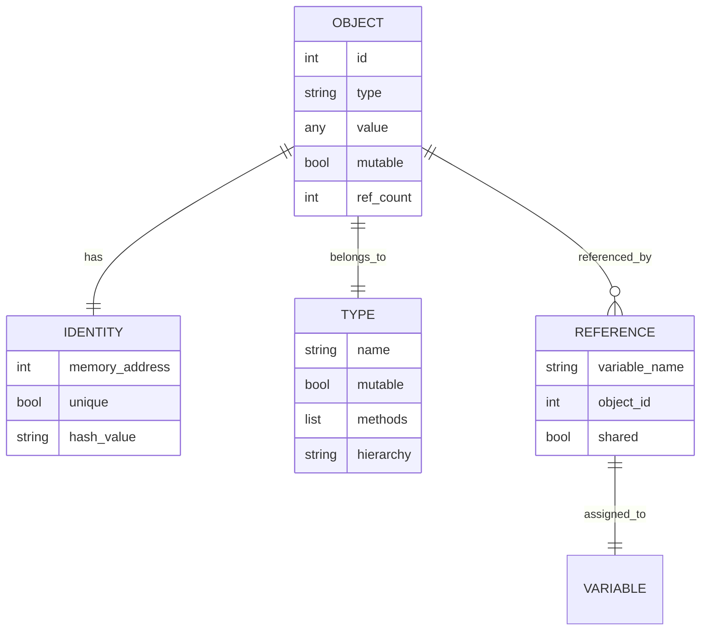
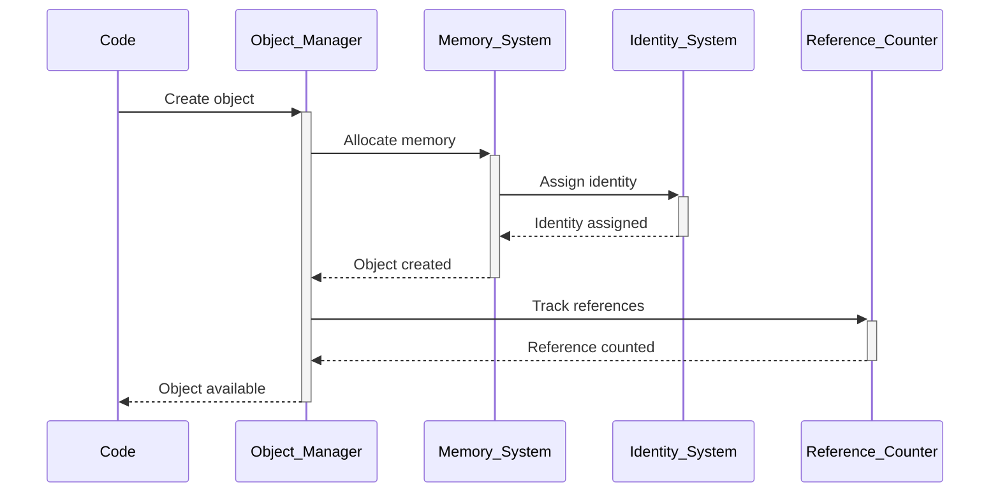

# 🏗️ System Architecture

## 📖 Overview
This container explores Python's object model fundamentals, examining how Python treats everything as objects, object identity, mutability concepts, and the intricate details of Python's internal object management. It provides deep insights into Python's design philosophy and implementation details.

---

## 🏛️ High-Level Architecture

```mermaid
graph TD
    A[Python Object Model] --> B[Object Identity]
    A --> C[Mutability System]
    A --> D[Reference Management]
    E[Object Types] --> F[Immutable Objects]
    E --> G[Mutable Objects]
    H[Memory Management] --> I[Object Lifecycle]
    I --> J[Garbage Collection]
    
    subgraph "Core Concepts"
        K[id() Function]
        L[is vs == Operators]
        M[Object Aliasing]
    end
    
    B --> K
    C --> L
    D --> M
```

The architecture demonstrates Python's fundamental object-oriented nature and memory management principles.

---

## 🧩 Core Components

### Object Identity System
- **Purpose**: Explores object identity, uniqueness, and comparison mechanisms
- **Technology**: Python id() function, is operator, object comparison
- **Location**: Identity exploration scripts and demonstrations
- **Responsibilities**:
  - Object identity determination
  - Reference comparison vs value comparison
  - Memory address analysis
  - Object uniqueness validation
- **Interfaces**: Identity functions, comparison operators, memory introspection

### Mutability Analysis Engine
- **Purpose**: Demonstrates differences between mutable and immutable objects
- **Technology**: Python object types, mutation operations, reference behavior
- **Location**: Mutability demonstration scripts
- **Responsibilities**:
  - Mutable vs immutable object behavior
  - In-place modification analysis
  - Reference sharing implications
  - Copy vs reference semantics
- **Interfaces**: Object modification, reference tracking, behavior analysis

### Reference Management System
- **Purpose**: Illustrates how Python manages object references and aliasing
- **Technology**: Reference counting, aliasing behavior, memory sharing
- **Location**: Reference behavior demonstrations
- **Responsibilities**:
  - Reference counting mechanics
  - Aliasing and shared references
  - Deep vs shallow copying
  - Memory optimization patterns
- **Interfaces**: Reference operations, aliasing detection, copy mechanisms

### Type and Class Analysis
- **Purpose**: Examines Python's type system and class relationships
- **Technology**: type() function, isinstance(), class hierarchy
- **Location**: Type analysis and class exploration scripts
- **Responsibilities**:
  - Type determination and analysis
  - Class hierarchy exploration
  - Instance relationship checking
  - Type system introspection
- **Interfaces**: Type functions, class inspection, hierarchy analysis

### Memory and Performance Module
- **Purpose**: Analyzes memory usage patterns and performance implications
- **Technology**: Memory profiling, object size analysis, optimization techniques
- **Location**: Performance and memory analysis scripts
- **Responsibilities**:
  - Memory usage measurement
  - Performance optimization analysis
  - Object creation overhead
  - Memory efficiency patterns
- **Interfaces**: Memory measurement, performance analysis, optimization tools

---

## 📊 Data Models & Schema



### Key Data Entities
- **Objects**: All Python entities with identity, type, and value
- **Identity**: Unique identification through memory address
- **References**: Variable bindings to objects

### Relationships
- Objects → Identity: One-to-one identification relationship
- Objects → References: One-to-many reference relationships
- Objects → Types: Classification and behavior relationships

---

## 🔄 Data Flow & Interactions



### Request/Response Flow
1. **Object Creation**: Python creates objects with identity and type
2. **Memory Allocation**: Memory system assigns unique identity
3. **Reference Tracking**: Reference counting system monitors usage
4. **Identity Management**: Object identity maintained throughout lifecycle
5. **Cleanup**: Garbage collection when references reach zero

---

## 🚀 Deployment & Environment

### Development Environment
- **Platform**: Ubuntu 20.04 LTS
- **Dependencies**: Python 3.8+ with full object model support
- **Setup**: Interactive Python environment for object exploration

### Production Considerations
- **Scalability**: Object model scales with application complexity
- **Performance**: Understanding object model improves performance
- **Monitoring**: Memory usage and object lifecycle tracking

### Configuration Management
- **Memory Settings**: Python memory management configuration
- **Garbage Collection**: GC tuning and optimization
- **Object Pools**: Object reuse and pooling strategies

---

## 🔒 Security Architecture

### Authentication & Authorization
- **Authentication**: System-level access for object inspection
- **Authorization**: Memory and object access permissions

### Data Protection
- **Object Integrity**: Protection of object state and identity
- **Memory Safety**: Safe object access and manipulation

### Security Measures
- **Safe Introspection**: Controlled object examination
- **Memory Protection**: Safe memory access patterns

---

## ⚡ Error Handling & Resilience

### Error Management Strategy
- **Error Detection**: Invalid object operations and references
- **Error Reporting**: Clear object-related error messages
- **Error Recovery**: Graceful handling of object lifecycle issues

### Resilience Patterns
- **Reference Validation**: Checking object existence and validity
- **Type Safety**: Ensuring appropriate object operations
- **Memory Management**: Proper object cleanup and resource management

---

## 🎯 Design Decisions & Trade-offs

### Key Architectural Decisions
1. **Everything is an Object Philosophy**
   - **Decision**: Demonstrate Python's unified object model
   - **Rationale**: Understanding fundamental Python design principles
   - **Alternatives**: Focus on specific object types only
   - **Trade-offs**: Complexity for comprehensive understanding

2. **Identity vs Equality Focus**
   - **Decision**: Emphasize difference between identity and equality
   - **Rationale**: Critical concept for Python programming
   - **Alternatives**: Simple value comparison only
   - **Trade-offs**: Conceptual complexity for deeper understanding

### Known Limitations
- **Implementation Details**: Some concepts are CPython-specific
- **Complexity**: Advanced concepts may be challenging for beginners

### Future Considerations
- **Advanced Memory Management**: Weak references and memory optimization
- **Performance Analysis**: Detailed performance profiling techniques

---

## 📁 Directory Structure & Organization

```
0x09-python-everything_is_object/
├── 0-answer.txt                # What function prints type
├── 1-answer.txt                # What function prints variable identifier
├── 2-answer.txt                # Do a and b point to same object
├── 3-answer.txt                # Do a and b point to same object
├── 4-answer.txt                # Do a and b point to same object
├── 5-answer.txt                # Do a and b point to same object
├── 6-answer.txt                # What prints these lines
├── 7-answer.txt                # What prints these lines
├── 8-answer.txt                # What prints these lines
├── 9-answer.txt                # What prints these lines
├── 10-answer.txt               # What prints these lines
├── 11-answer.txt               # What prints these lines
├── 12-answer.txt               # What prints these lines
├── 13-answer.txt               # What prints these lines
├── 14-answer.txt               # What prints these lines
├── 15-answer.txt               # What prints these lines
├── 16-answer.txt               # What prints these lines
├── 17-answer.txt               # What prints these lines
├── 18-answer.txt               # What prints these lines
├── 19-copy_list.py             # Function that returns copy of list
├── 20-answer.txt               # Is a tuple object
├── 21-answer.txt               # Is a tuple object
├── 22-answer.txt               # Is a tuple object
├── 23-answer.txt               # Is a tuple object
├── 24-answer.txt               # Is a tuple object
├── 25-answer.txt               # Is a tuple object
├── 26-answer.txt               # Is a tuple object
├── 27-answer.txt               # Is a tuple object
├── 28-answer.txt               # Is a tuple object
├── 100-magic_string.py         # LockedClass implementation
├── 101-locked_class.py         # Locked class with restrictions
└── 103-line1.txt               # Integer object analysis
```

### Organization Principles
- **Question-Answer Format**: Systematic exploration through questions
- **Concept Progression**: From basic identity to complex object behavior
- **Practical Implementation**: Code examples demonstrating concepts

---

## 🔗 External Dependencies

| Dependency | Purpose | Version | Documentation |
|------------|---------|---------|---------------|
| Python | Core interpreter and object model | 3.8+ | [Python.org](https://python.org) |
| Built-in Functions | id, type, isinstance | Built-in | [Built-in Functions](https://docs.python.org/3/library/functions.html) |
| Copy Module | Object copying operations | Built-in | [Copy Documentation](https://docs.python.org/3/library/copy.html) |

---

## 📚 References
- [Project README](README.md)
- [Project Manifest](PROJECT-MANIFEST.md)
- [Python Object Model](https://docs.python.org/3/reference/datamodel.html)
- [Python Memory Management](https://docs.python.org/3/c-api/memory.html)
