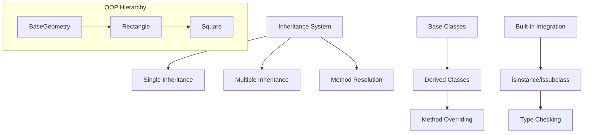
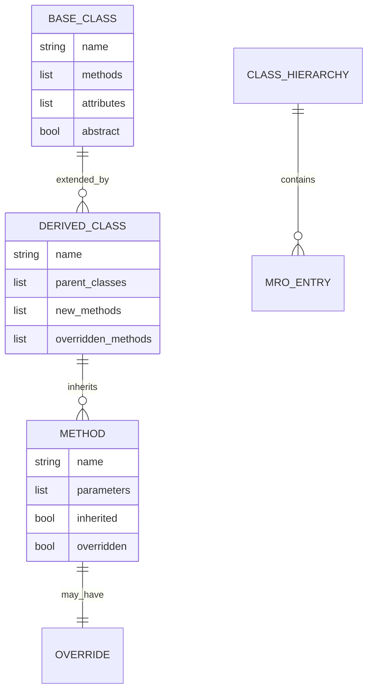
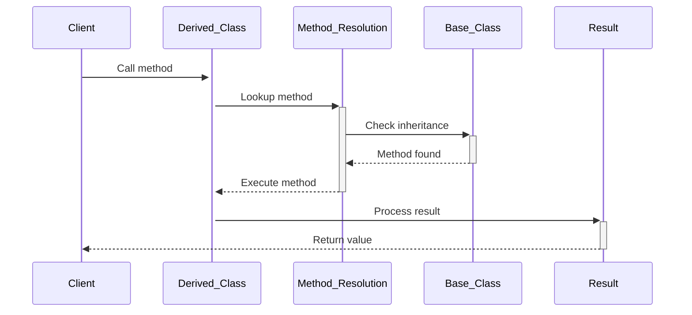

# 🏗️ System Architecture

## 📖 Overview
This container explores Python inheritance concepts including single inheritance, multiple inheritance, method resolution order (MRO), and advanced object-oriented programming patterns. It demonstrates how to build class hierarchies and extend functionality through inheritance.

---

## 🏛️ High-Level Architecture



The architecture demonstrates progressive inheritance patterns from simple extension to complex multiple inheritance scenarios.

---

## 🧩 Core Components

### Inheritance Framework
- **Purpose**: Implements fundamental inheritance patterns and class extension
- **Technology**: Python class inheritance, super() calls, method overriding
- **Location**: Base classes and derived implementations
- **Responsibilities**:
  - Class hierarchy establishment
  - Method inheritance and overriding
  - Attribute inheritance patterns
- **Interfaces**: Class instantiation, method calls, attribute access

### Type Checking System
- **Purpose**: Provides runtime type validation and class relationship checking
- **Technology**: isinstance(), issubclass(), type introspection
- **Location**: Type validation and checking functions
- **Responsibilities**:
  - Instance type verification
  - Class relationship validation
  - Runtime type safety
- **Interfaces**: Type checking functions, boolean return values

### Method Resolution Engine
- **Purpose**: Handles method resolution order in complex inheritance hierarchies
- **Technology**: Python MRO algorithm, super() mechanism
- **Location**: Multiple inheritance implementations
- **Responsibilities**:
  - Method lookup ordering
  - Conflict resolution
  - Super class method calling
- **Interfaces**: Method dispatch, super() calls

---

## 📊 Data Models & Schema



### Key Data Entities
- **Base Classes**: Foundation classes providing core functionality
- **Derived Classes**: Extended classes inheriting from base classes
- **Methods**: Function implementations with inheritance relationships

### Relationships
- Base → Derived: Parent-child inheritance relationships
- Methods → Classes: Ownership and inheritance relationships
- Classes → MRO: Method resolution order relationships

---

## 🔄 Data Flow & Interactions



### Request/Response Flow
1. **Method Call**: Client invokes method on derived class instance
2. **Resolution**: Python resolves method through MRO
3. **Execution**: Appropriate method version executed
4. **Inheritance**: Base class methods accessed as needed
5. **Result**: Processed result returned to client

---

## 🚀 Deployment & Environment

### Development Environment
- **Platform**: Ubuntu 20.04 LTS
- **Dependencies**: Python 3.8+ with full OOP support
- **Setup**: Standard Python execution environment

### Production Considerations
- **Scalability**: Inheritance patterns support large class hierarchies
- **Performance**: Method resolution optimized by Python
- **Monitoring**: Class usage and inheritance tracking

---

## 🔒 Security Architecture

### Authentication & Authorization
- **Authentication**: System-level access control
- **Authorization**: Method access through inheritance

### Data Protection
- **Encapsulation**: Protected and private attribute patterns
- **Type Safety**: Runtime type checking and validation

### Security Measures
- **Access Control**: Method visibility through inheritance
- **Type Validation**: Runtime type checking for safety

---

## ⚡ Error Handling & Resilience

### Error Management Strategy
- **Error Detection**: Type checking and validation errors
- **Error Reporting**: Clear inheritance-related error messages
- **Error Recovery**: Graceful handling of type mismatches

### Resilience Patterns
- **Type Guards**: isinstance/issubclass checking
- **Method Validation**: Ensuring proper method signatures
- **Inheritance Validation**: Checking class relationships

---

## 🎯 Design Decisions & Trade-offs

### Key Architectural Decisions
1. **Progressive Inheritance Complexity**
   - **Decision**: Build from simple to complex inheritance patterns
   - **Rationale**: Educational progression from basic to advanced concepts
   - **Alternatives**: Complex inheritance from start
   - **Trade-offs**: Gradual learning curve for comprehensive understanding

2. **Type Safety Emphasis**
   - **Decision**: Include extensive type checking mechanisms
   - **Rationale**: Promotes safe programming practices
   - **Alternatives**: Dynamic typing without checks
   - **Trade-offs**: Additional code for improved safety

---

## 📁 Directory Structure & Organization

```
0x0A-python-inheritance/
├── 0-lookup.py                  # Attribute/method lookup
├── 1-my_list.py                # List inheritance example
├── 2-is_same_class.py          # Exact class checking
├── 3-is_kind_of_class.py       # isinstance checking
├── 4-inherits_from.py          # Inheritance checking
├── 5-base_geometry.py          # Abstract base class
├── 6-base_geometry.py          # Base with validation
├── 7-base_geometry.py          # Complete base implementation
├── 8-rectangle.py              # Rectangle inheritance
├── 9-rectangle.py              # Full rectangle implementation
├── 10-square.py                # Square inheritance
├── 11-square.py                # Complete square class
├── 100-my_int.py               # Integer inheritance
└── 101-add_attribute.py        # Dynamic attribute addition
```

### Organization Principles
- **Concept Progression**: From basic lookup to complex inheritance
- **Class Hierarchy**: Logical progression through geometric shapes
- **Feature Building**: Incremental feature addition pattern

---

## 🔗 External Dependencies

| Dependency | Purpose | Version | Documentation |
|------------|---------|---------|---------------|
| Python | Core interpreter and OOP system | 3.8+ | [Python.org](https://python.org) |
| Built-in Functions | isinstance, issubclass, type | Built-in | [Built-in Functions](https://docs.python.org/3/library/functions.html) |

---

## 📚 References
- [Project README](README.md)
- [Project Manifest](PROJECT-MANIFEST.md)
- [Python Inheritance Documentation](https://docs.python.org/3/tutorial/classes.html#inheritance)
- [Python Method Resolution Order](https://docs.python.org/3/tutorial/classes.html#multiple-inheritance)
