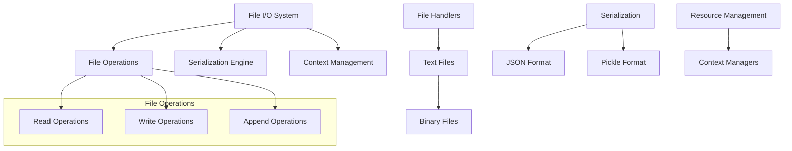
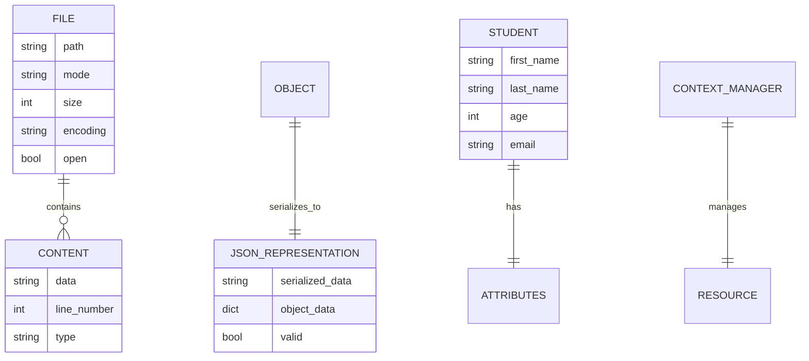
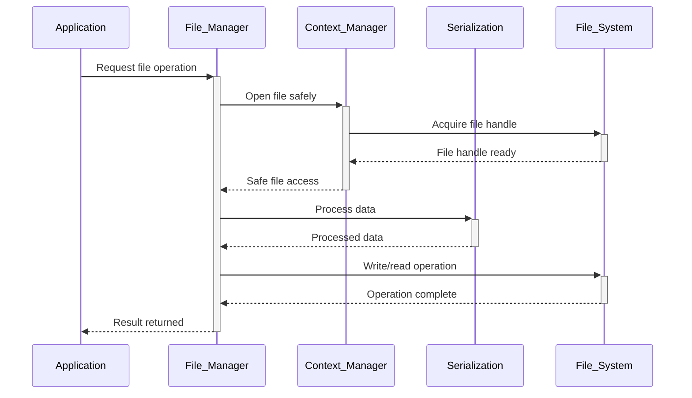

# 🏗️ System Architecture

## 📖 Overview
This container focuses on Python file input/output operations, file handling, serialization with JSON and pickle, and context managers. It demonstrates comprehensive file management, data persistence, and safe resource handling patterns essential for real-world applications.

---

## 🏛️ High-Level Architecture



The architecture emphasizes safe file handling, data serialization, and resource management through Python's file I/O system.

---

## 🧩 Core Components

### File Operations Engine
- **Purpose**: Provides comprehensive file reading, writing, and manipulation
- **Technology**: Python file objects, built-in file functions, path handling
- **Location**: File operation functions and utilities
- **Responsibilities**:
  - File reading with various methods
  - Safe file writing and appending
  - File content manipulation
  - Error handling for file operations
- **Interfaces**: File objects, read/write methods, path operations

### JSON Serialization System
- **Purpose**: Handles object serialization and deserialization using JSON format
- **Technology**: Python json module, object conversion, data validation
- **Location**: JSON handling functions and classes
- **Responsibilities**:
  - Object to JSON string conversion
  - JSON string to object reconstruction
  - File-based JSON persistence
  - Custom object serialization
- **Interfaces**: JSON conversion methods, file persistence, custom encoders

### Context Manager Framework
- **Purpose**: Implements safe resource management using context managers
- **Technology**: with statements, context manager protocol, resource cleanup
- **Location**: Context manager implementations and file handling
- **Responsibilities**:
  - Automatic resource cleanup
  - Exception-safe file handling
  - Custom context manager creation
  - Resource lifecycle management
- **Interfaces**: Context manager protocol, with statements, cleanup methods

### Student Management System
- **Purpose**: Demonstrates practical file I/O through student data management
- **Technology**: Class-based data modeling, JSON persistence, CRUD operations
- **Location**: Student class and related functionality
- **Responsibilities**:
  - Student data modeling and validation
  - Persistent storage and retrieval
  - Data conversion and serialization
  - Collection management operations
- **Interfaces**: Object creation, persistence methods, query operations

### Advanced File Processing
- **Purpose**: Provides sophisticated file processing and data transformation
- **Technology**: File streaming, data processing pipelines, batch operations
- **Location**: Advanced file processing utilities
- **Responsibilities**:
  - Large file processing
  - Data transformation pipelines
  - Batch file operations
  - Performance optimization
- **Interfaces**: Stream processing, transformation functions, batch operations

---

## 📊 Data Models & Schema



### Key Data Entities
- **Files**: File system objects with content and metadata
- **Students**: Data objects with persistent storage capabilities
- **JSON Data**: Serialized object representations

### Relationships
- Files → Content: Containment relationship for file data
- Objects → JSON: Serialization transformation relationships
- Context Managers → Resources: Management and lifecycle relationships

---

## 🔄 Data Flow & Interactions



### Request/Response Flow
1. **File Access**: Application requests file operation
2. **Resource Management**: Context manager ensures safe file handling
3. **Data Processing**: Serialization handles data conversion
4. **File Operations**: Actual file system operations performed
5. **Cleanup**: Automatic resource cleanup through context management

---

## 🚀 Deployment & Environment

### Development Environment
- **Platform**: Ubuntu 20.04 LTS
- **Dependencies**: Python 3.8+, json module, file system access
- **Setup**: File system permissions and directory structure

### Production Considerations
- **Scalability**: Efficient file processing for large datasets
- **Performance**: Streaming and batch processing for large files
- **Monitoring**: File operation logging and error tracking

### Configuration Management
- **File Paths**: Configurable file locations and naming
- **Serialization**: Format selection and encoding options
- **Error Handling**: Comprehensive error management strategies

---

## 🔒 Security Architecture

### Authentication & Authorization
- **Authentication**: System-level file access permissions
- **Authorization**: File and directory access control

### Data Protection
- **Input Validation**: File content and path validation
- **Safe Serialization**: Secure object serialization practices

### Security Measures
- **Path Validation**: Prevention of directory traversal attacks
- **Safe Deserialization**: Controlled object reconstruction
- **File Permissions**: Appropriate file access permissions

---

## ⚡ Error Handling & Resilience

### Error Management Strategy
- **Error Detection**: File operation exceptions, serialization errors
- **Error Reporting**: Clear file-related error messages
- **Error Recovery**: Graceful handling of file system issues

### Resilience Patterns
- **Context Managers**: Automatic resource cleanup on errors
- **Validation**: Input validation before file operations
- **Backup Strategies**: Safe file modification patterns

---

## 🎯 Design Decisions & Trade-offs

### Key Architectural Decisions
1. **Context Manager Usage**
   - **Decision**: Emphasize context managers for file operations
   - **Rationale**: Ensures proper resource cleanup and exception safety
   - **Alternatives**: Manual file handle management
   - **Trade-offs**: Additional syntax for guaranteed safety

2. **JSON Over Pickle**
   - **Decision**: Prioritize JSON for most serialization needs
   - **Rationale**: Human-readable, secure, and interoperable format
   - **Alternatives**: Binary pickle format for performance
   - **Trade-offs**: Limited data types for improved security

### Known Limitations
- **File Size**: Memory-based operations limited by available RAM
- **Concurrency**: Basic file operations without advanced locking

### Future Considerations
- **Async I/O**: Asynchronous file operations for performance
- **Database Integration**: Transition to database storage systems

---

## 📁 Directory Structure & Organization

```
0x0B-python-input_output/
├── 0-read_file.py              # File reading function
├── 1-write_file.py             # File writing function
├── 2-append_write.py           # File appending function
├── 3-to_json_string.py         # JSON serialization
├── 4-from_json_string.py       # JSON deserialization
├── 5-save_to_json_file.py      # Save object to JSON file
├── 6-load_from_json_file.py    # Load object from JSON file
├── 7-add_item.py               # Add item to JSON file
├── 8-class_to_json.py          # Class to JSON conversion
├── 9-student.py                # Student class with JSON
├── 10-student.py               # Student with filter method
├── 11-student.py               # Student with reload method
├── 12-pascal_triangle.py       # Pascal triangle generator
├── 100-append_after.py         # Advanced file manipulation
├── 101-stats.py                # Log parsing and statistics
└── README.md                   # Project documentation
```

### Organization Principles
- **Complexity Progression**: From basic I/O to advanced operations
- **Concept Grouping**: Related file operations grouped together
- **Practical Applications**: Real-world usage patterns demonstrated

---

## 🔗 External Dependencies

| Dependency | Purpose | Version | Documentation |
|------------|---------|---------|---------------|
| Python | Core interpreter and I/O system | 3.8+ | [Python.org](https://python.org) |
| JSON Module | JSON serialization and parsing | Built-in | [JSON Documentation](https://docs.python.org/3/library/json.html) |
| OS Module | File system operations | Built-in | [OS Documentation](https://docs.python.org/3/library/os.html) |

---

## 📚 References
- [Project README](README.md)
- [Project Manifest](PROJECT-MANIFEST.md)
- [Python File I/O Documentation](https://docs.python.org/3/tutorial/inputoutput.html#reading-and-writing-files)
- [Python JSON Documentation](https://docs.python.org/3/library/json.html)
