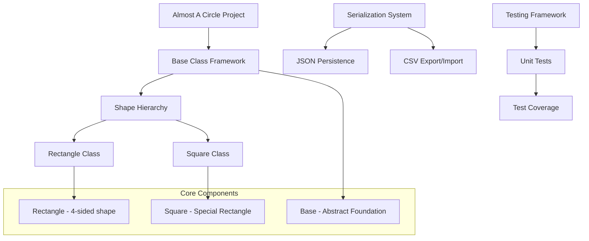
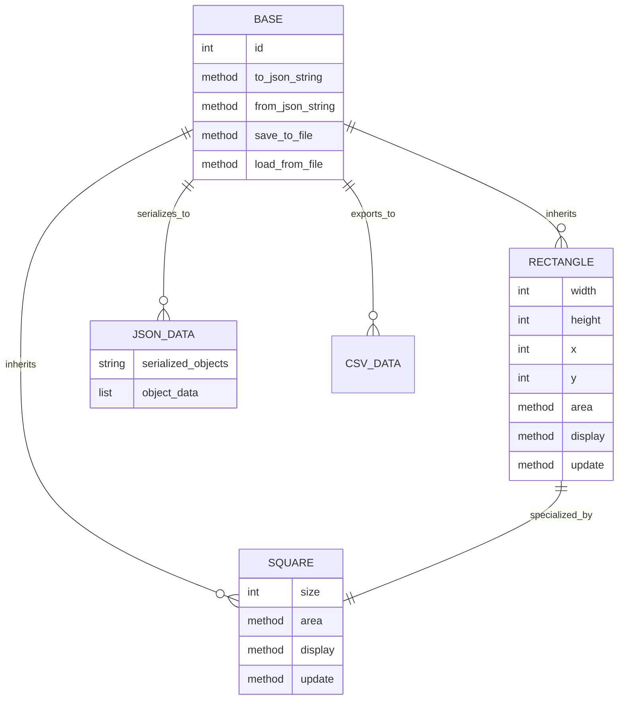
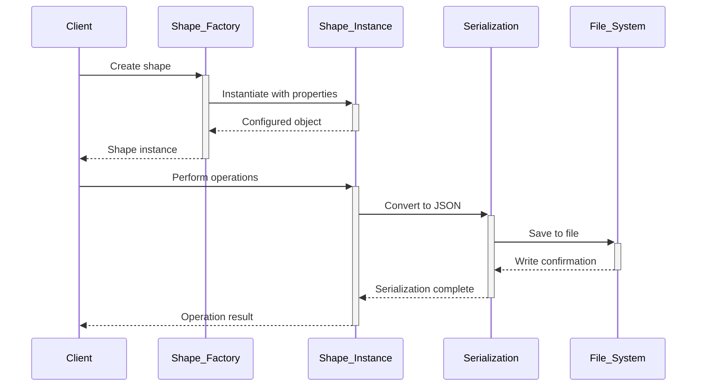

# 🏗️ System Architecture

## 📖 Overview
This container represents the culmination of Python OOP learning through a comprehensive project that integrates classes, inheritance, serialization, file I/O, and unit testing. It demonstrates real-world application development using object-oriented principles and design patterns.

---

## 🏛️ High-Level Architecture



The architecture demonstrates a complete OOP application with persistence, serialization, and comprehensive testing.

---

## 🧩 Core Components

### Base Class Foundation
- **Purpose**: Provides common functionality for all geometric shapes
- **Technology**: Python abstract base patterns, ID management, serialization
- **Location**: `models/base.py`
- **Responsibilities**:
  - Unique ID assignment and management
  - JSON serialization/deserialization
  - CSV file operations
  - Factory method patterns
- **Interfaces**: Class methods, instance management, file I/O

### Rectangle Implementation
- **Purpose**: Implements 4-sided geometric shape with width and height
- **Technology**: Python classes, property validation, area/display methods
- **Location**: `models/rectangle.py`
- **Responsibilities**:
  - Dimensional property management
  - Area and perimeter calculations
  - Visual representation (display method)
  - Position-based rendering
- **Interfaces**: Property access, mathematical operations, display rendering

### Square Specialization
- **Purpose**: Implements square as specialized rectangle with equal sides
- **Technology**: Inheritance, property overriding, method delegation
- **Location**: `models/square.py`
- **Responsibilities**:
  - Size property management (width = height)
  - Inherited rectangle functionality
  - Specialized string representation
- **Interfaces**: Size property, inherited methods, string formatting

### Serialization Engine
- **Purpose**: Handles object persistence through JSON and CSV formats
- **Technology**: JSON module, CSV operations, file I/O
- **Location**: Integrated in Base class
- **Responsibilities**:
  - Object to JSON conversion
  - JSON to object reconstruction
  - CSV export functionality
  - File-based persistence
- **Interfaces**: Serialization methods, file operations, data conversion

### Testing Infrastructure
- **Purpose**: Provides comprehensive test coverage for all functionality
- **Technology**: Python unittest framework, test discovery
- **Location**: `tests/` directory
- **Responsibilities**:
  - Unit test implementation
  - Integration testing
  - Edge case validation
  - Coverage verification
- **Interfaces**: Test execution, assertion methods, test reporting

---

## 📊 Data Models & Schema



### Key Data Entities
- **Base**: Foundation class providing common functionality
- **Rectangle**: 4-sided shape with independent width/height
- **Square**: Specialized rectangle with equal sides

### Relationships
- Base → Shapes: Inheritance hierarchy for common functionality
- Rectangle → Square: Specialization relationship
- Objects → Serialization: Persistence and data conversion

---

## 🔄 Data Flow & Interactions



### Request/Response Flow
1. **Object Creation**: Factory methods create shape instances
2. **Property Management**: Validated property assignment and access
3. **Operations**: Mathematical and display operations execution
4. **Serialization**: Object conversion to persistent formats
5. **Persistence**: File-based storage and retrieval operations

---

## 🚀 Deployment & Environment

### Development Environment
- **Platform**: Ubuntu 20.04 LTS
- **Dependencies**: Python 3.8+, unittest module
- **Setup**: Package structure with proper imports

### Production Considerations
- **Scalability**: Object-oriented design supports extension
- **Performance**: Efficient property access and calculations
- **Monitoring**: Comprehensive test coverage for reliability

### Configuration Management
- **Package Structure**: Proper Python package organization
- **Import Management**: Relative and absolute import handling
- **Test Configuration**: Test discovery and execution setup

---

## 🔒 Security Architecture

### Authentication & Authorization
- **Authentication**: File system permissions
- **Authorization**: Object access through proper interfaces

### Data Protection
- **Input Validation**: Property validation and type checking
- **Serialization Safety**: Controlled JSON operations

### Security Measures
- **Type Safety**: Comprehensive input validation
- **File Operations**: Safe file handling practices
- **Data Integrity**: Validation during serialization/deserialization

---

## ⚡ Error Handling & Resilience

### Error Management Strategy
- **Error Detection**: Property validation, file operation errors
- **Error Reporting**: Descriptive exception messages
- **Error Recovery**: Graceful handling of invalid operations

### Resilience Patterns
- **Input Validation**: Comprehensive property checking
- **File Safety**: Error handling for file operations
- **Test Coverage**: Extensive testing for edge cases

---

## 🎯 Design Decisions & Trade-offs

### Key Architectural Decisions
1. **Inheritance-Based Design**
   - **Decision**: Use inheritance for shape relationships
   - **Rationale**: Natural geometric hierarchy and code reuse
   - **Alternatives**: Composition-based design
   - **Trade-offs**: Inheritance coupling for natural relationships

2. **Integrated Serialization**
   - **Decision**: Include serialization in base class
   - **Rationale**: Common functionality needed by all shapes
   - **Alternatives**: Separate serialization classes
   - **Trade-offs**: Base class complexity for unified interface

### Known Limitations
- **Shape Types**: Limited to rectangle and square geometries
- **Serialization**: JSON and CSV formats only

### Future Considerations
- **Additional Shapes**: Circle, triangle, and other geometries
- **Advanced Features**: Transformations, animations, complex operations

---

## 📁 Directory Structure & Organization

```
0x0C-python-almost_a_circle/
├── models/
│   ├── __init__.py             # Package initialization
│   ├── base.py                 # Base class with serialization
│   ├── rectangle.py            # Rectangle implementation
│   └── square.py               # Square implementation
├── tests/
│   ├── __init__.py             # Test package initialization
│   ├── test_base.py            # Base class tests
│   ├── test_rectangle.py       # Rectangle tests
│   └── test_square.py          # Square tests
├── main_*.py                   # Main demonstration files
└── README.md                   # Project documentation
```

### Organization Principles
- **Package Structure**: Proper Python package organization
- **Separation of Concerns**: Models and tests separated
- **Logical Grouping**: Related functionality grouped together

---

## 🔗 External Dependencies

| Dependency | Purpose | Version | Documentation |
|------------|---------|---------|---------------|
| Python | Core interpreter and standard library | 3.8+ | [Python.org](https://python.org) |
| JSON Module | Object serialization | Built-in | [JSON Documentation](https://docs.python.org/3/library/json.html) |
| CSV Module | CSV file operations | Built-in | [CSV Documentation](https://docs.python.org/3/library/csv.html) |
| Unittest | Testing framework | Built-in | [Unittest Documentation](https://docs.python.org/3/library/unittest.html) |

---

## 📚 References
- [Project README](README.md)
- [Project Manifest](PROJECT-MANIFEST.md)
- [Python Classes and Objects](https://docs.python.org/3/tutorial/classes.html)
- [Python Unit Testing](https://docs.python.org/3/library/unittest.html)
- [JSON Serialization](https://docs.python.org/3/library/json.html)
