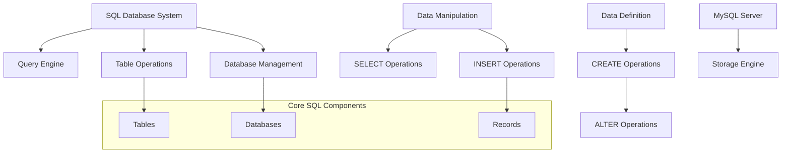
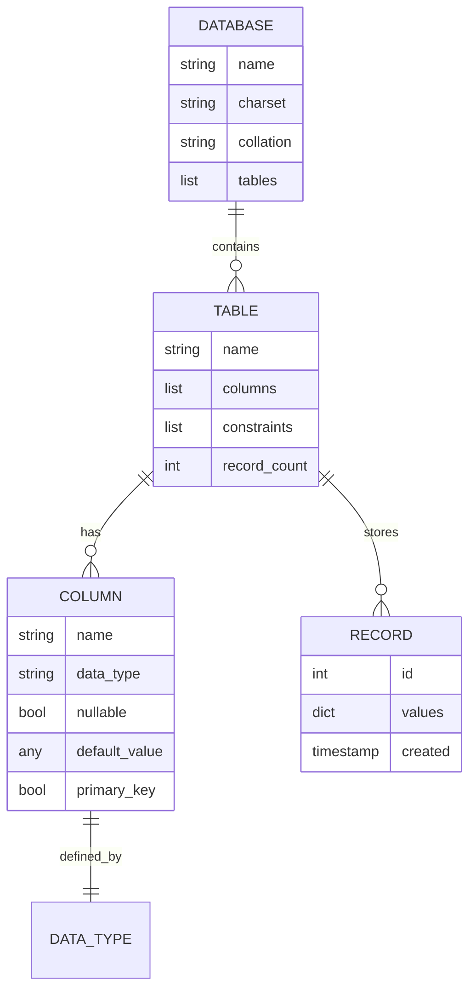
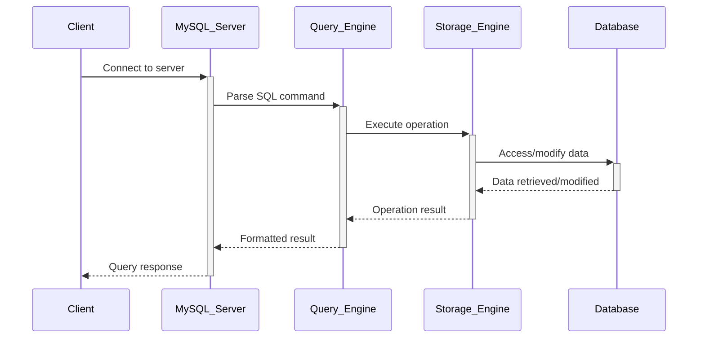

# 🏗️ System Architecture

## 📖 Overview
This container introduces fundamental SQL concepts including database creation, table design, data insertion, querying, and basic database operations. It provides a foundation in relational database management using MySQL as the primary database system.

---

## 🏛️ High-Level Architecture



The architecture demonstrates fundamental SQL operations for database creation, table management, and data manipulation.

---

## 🧩 Core Components

### Database Management Layer
- **Purpose**: Handles database creation, selection, and management operations
- **Technology**: MySQL database server, SQL DDL commands
- **Location**: Database creation and management scripts
- **Responsibilities**:
  - Database creation and deletion
  - Database selection and switching
  - User permissions and access control
  - Database backup and restoration
- **Interfaces**: SQL DDL commands, database connections, administrative tools

### Table Definition Engine
- **Purpose**: Manages table creation, modification, and structure definition
- **Technology**: SQL CREATE, ALTER, DROP statements, data types
- **Location**: Table definition and modification scripts
- **Responsibilities**:
  - Table schema design and creation
  - Column definitions and constraints
  - Primary key and index management
  - Table structure modifications
- **Interfaces**: Table creation statements, constraint definitions, schema management

### Data Manipulation System
- **Purpose**: Handles data insertion, selection, and basic CRUD operations
- **Technology**: SQL DML commands (INSERT, SELECT, UPDATE, DELETE)
- **Location**: Data manipulation and query scripts
- **Responsibilities**:
  - Record insertion and data entry
  - Data retrieval and filtering
  - Basic data updates and deletions
  - Query result formatting
- **Interfaces**: SQL DML statements, query results, data formatting

### Query Processing Framework
- **Purpose**: Processes SQL queries and returns formatted results
- **Technology**: MySQL query processor, result sets, data filtering
- **Location**: Query execution and result processing
- **Responsibilities**:
  - Query parsing and execution
  - Result set generation and formatting
  - Data filtering and sorting
  - Performance optimization basics
- **Interfaces**: Query execution, result formatting, performance metrics

### Data Type Management
- **Purpose**: Handles various SQL data types and their appropriate usage
- **Technology**: MySQL data types (INT, VARCHAR, DATE, etc.)
- **Location**: Data type definitions and usage examples
- **Responsibilities**:
  - Appropriate data type selection
  - Data validation and constraints
  - Type conversion and casting
  - Storage optimization
- **Interfaces**: Data type definitions, validation rules, conversion functions

---

## 📊 Data Models & Schema



### Key Data Entities
- **Databases**: Container for related tables and data
- **Tables**: Structured collections of related data
- **Columns**: Individual data fields with specific types
- **Records**: Individual data entries within tables

### Relationships
- Databases → Tables: Containment and organization relationships
- Tables → Columns: Structure and schema relationships
- Tables → Records: Data storage and retrieval relationships

---

## 🔄 Data Flow & Interactions



### Request/Response Flow
1. **Connection**: Client connects to MySQL server
2. **Query Submission**: SQL commands sent to server
3. **Query Processing**: MySQL parses and optimizes query
4. **Execution**: Storage engine performs data operations
5. **Result Return**: Formatted results returned to client

---

## 🚀 Deployment & Environment

### Development Environment
- **Platform**: Ubuntu 20.04 LTS
- **Dependencies**: MySQL Server 8.0+, MySQL client tools
- **Setup**: Database server installation and configuration

### Production Considerations
- **Scalability**: Database design for growth and performance
- **Performance**: Query optimization and indexing strategies
- **Monitoring**: Database performance and health monitoring

### Configuration Management
- **Server Configuration**: MySQL server settings and optimization
- **User Management**: Database users and permissions
- **Backup Strategy**: Regular database backup procedures

---

## 🔒 Security Architecture

### Authentication & Authorization
- **Authentication**: MySQL user authentication system
- **Authorization**: Database and table-level permissions

### Data Protection
- **Input Validation**: SQL injection prevention
- **Access Control**: User privilege management

### Security Measures
- **User Permissions**: Principle of least privilege
- **Connection Security**: Secure database connections
- **Data Encryption**: Database encryption options

---

## ⚡ Error Handling & Resilience

### Error Management Strategy
- **Error Detection**: SQL syntax and constraint violation detection
- **Error Reporting**: Clear database error messages
- **Error Recovery**: Transaction rollback and recovery procedures

### Resilience Patterns
- **Data Validation**: Constraint enforcement and validation
- **Transaction Management**: ACID properties maintenance
- **Backup Recovery**: Data recovery and restoration procedures

---

## 🎯 Design Decisions & Trade-offs

### Key Architectural Decisions
1. **MySQL Database Choice**
   - **Decision**: Use MySQL as primary database system
   - **Rationale**: Popular, well-documented, and widely supported
   - **Alternatives**: PostgreSQL, SQLite, or other databases
   - **Trade-offs**: Specific MySQL features vs database portability

2. **Basic SQL Focus**
   - **Decision**: Concentrate on fundamental SQL operations
   - **Rationale**: Build strong foundation before advanced features
   - **Alternatives**: Include advanced features from start
   - **Trade-offs**: Simplified learning path vs comprehensive coverage

### Known Limitations
- **Advanced Features**: Limited to basic SQL operations
- **Performance**: Basic optimization without advanced tuning

### Future Considerations
- **Advanced SQL**: Complex queries, joins, and subqueries
- **Database Design**: Normalization and advanced schema design

---

## 📁 Directory Structure & Organization

```
0x0D-SQL_introduction/
├── 0-list_databases.sql        # List all databases
├── 1-create_database_if_missing.sql # Create database
├── 2-remove_database.sql       # Remove database
├── 3-list_tables.sql           # List tables in database
├── 4-first_table.sql           # Create first table
├── 5-full_table.sql            # Show table structure
├── 6-list_values.sql           # List all records
├── 7-insert_value.sql          # Insert new record
├── 8-count_89.sql              # Count specific records
├── 9-full_creation.sql         # Complete table creation
├── 10-top_score.sql            # Select top records
├── 11-best_score.sql           # Filter records by criteria
├── 12-no_cheating.sql          # Update records
├── 13-change_class.sql         # Remove records by criteria
├── 14-average.sql              # Calculate averages
├── 15-groups.sql               # Group records
├── 16-no_link.sql              # Filter null values
├── 100-move_to_utf8.sql        # Database encoding conversion
├── 101-avg_temperatures.sql    # Temperature analysis
├── 102-top_city.sql            # Top cities query
└── 103-max_state.sql           # Maximum state temperatures
```

### Organization Principles
- **Progressive Complexity**: From basic operations to advanced queries
- **Concept Grouping**: Related database operations grouped together
- **Practical Examples**: Real-world database scenarios

---

## 🔗 External Dependencies

| Dependency | Purpose | Version | Documentation |
|------------|---------|---------|---------------|
| MySQL Server | Database management system | 8.0+ | [MySQL Documentation](https://dev.mysql.com/doc/) |
| MySQL Client | Command-line database client | 8.0+ | [MySQL Client](https://dev.mysql.com/doc/refman/8.0/en/mysql.html) |
| SQL Standard | Structured Query Language | SQL-92+ | [SQL Standard](https://www.iso.org/standard/63555.html) |

---

## 📚 References
- [Project README](README.md)
- [Project Manifest](PROJECT-MANIFEST.md)
- [MySQL Documentation](https://dev.mysql.com/doc/)
- [SQL Tutorial](https://www.w3schools.com/sql/)
