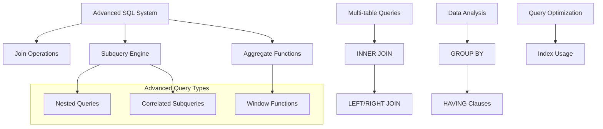
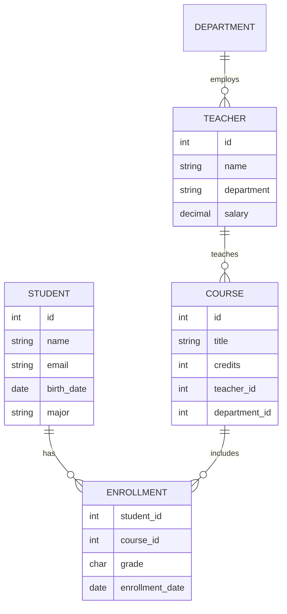
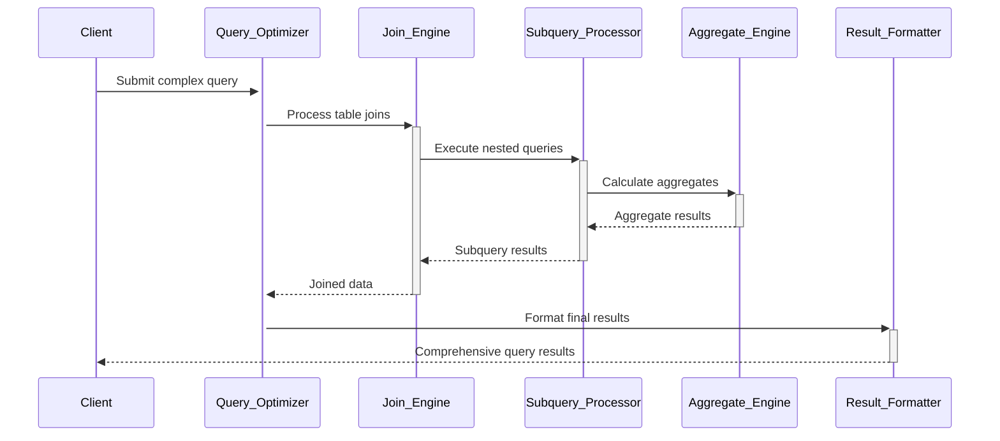

# 🏗️ System Architecture

## 📖 Overview
This container advances SQL knowledge through complex queries, joins, subqueries, and advanced database operations. It demonstrates sophisticated data retrieval patterns, multi-table operations, and advanced SQL techniques essential for real-world database applications.

---

## 🏛️ High-Level Architecture



The architecture emphasizes complex query construction, multi-table relationships, and advanced data analysis capabilities.

---

## 🧩 Core Components

### Join Operations Engine
- **Purpose**: Implements various types of table joins for multi-table queries
- **Technology**: SQL JOIN syntax, table relationships, foreign keys
- **Location**: Join query implementations and examples
- **Responsibilities**:
  - INNER JOIN for matching records
  - LEFT/RIGHT JOIN for comprehensive data retrieval
  - FULL OUTER JOIN for complete data coverage
  - CROSS JOIN for cartesian products
- **Interfaces**: JOIN syntax, table aliases, relationship definitions

### Subquery Processing System
- **Purpose**: Handles nested queries and complex data filtering
- **Technology**: SQL subqueries, correlated queries, EXISTS operators
- **Location**: Subquery implementations and nested query examples
- **Responsibilities**:
  - Nested SELECT statements
  - Correlated subquery execution
  - EXISTS and NOT EXISTS operations
  - Subquery optimization
- **Interfaces**: Nested query syntax, correlation references, existence checks

### Aggregate Function Framework
- **Purpose**: Provides statistical analysis and data summarization
- **Technology**: SQL aggregate functions (COUNT, SUM, AVG, MAX, MIN)
- **Location**: Aggregate query implementations
- **Responsibilities**:
  - Data summarization and statistics
  - GROUP BY clause processing
  - HAVING clause filtering
  - Window function operations
- **Interfaces**: Aggregate functions, grouping operations, statistical analysis

### Advanced Query Optimization
- **Purpose**: Demonstrates query performance optimization techniques
- **Technology**: Index usage, query planning, performance analysis
- **Location**: Optimized query examples and performance demonstrations
- **Responsibilities**:
  - Query execution plan analysis
  - Index utilization strategies
  - Performance tuning techniques
  - Query complexity management
- **Interfaces**: Query planning, index recommendations, performance metrics

### Data Import/Export System
- **Purpose**: Handles data migration and external data integration
- **Technology**: SQL import/export operations, data format conversion
- **Location**: Data migration and import/export scripts
- **Responsibilities**:
  - CSV and text file import
  - Data format conversion
  - Bulk data operations
  - Data validation during import
- **Interfaces**: Import/export commands, file format handling, validation rules

---

## 📊 Data Models & Schema



### Key Data Entities
- **Students**: Student information and academic records
- **Courses**: Course catalog with details and requirements
- **Enrollments**: Student-course relationships with grades
- **Teachers**: Instructor information and department assignments

### Relationships
- Students → Enrollments: Many-to-many through enrollment records
- Courses → Enrollments: Course participation tracking
- Teachers → Courses: Teaching assignments and responsibilities

---

## 🔄 Data Flow & Interactions



### Request/Response Flow
1. **Query Analysis**: Complex query analyzed and optimized
2. **Join Processing**: Multi-table joins executed efficiently
3. **Subquery Execution**: Nested queries processed in optimal order
4. **Aggregation**: Statistical calculations and grouping performed
5. **Result Assembly**: Final results compiled and formatted

---

## 🚀 Deployment & Environment

### Development Environment
- **Platform**: Ubuntu 20.04 LTS
- **Dependencies**: MySQL Server 8.0+, advanced SQL features
- **Setup**: Database with multiple related tables and sample data

### Production Considerations
- **Scalability**: Query optimization for large datasets
- **Performance**: Index strategies and query tuning
- **Monitoring**: Query performance and resource usage tracking

### Configuration Management
- **Index Strategy**: Optimal index design for query performance
- **Query Caching**: Result caching for frequently used queries
- **Resource Limits**: Query timeout and resource limit configuration

---

## 🔒 Security Architecture

### Authentication & Authorization
- **Authentication**: Advanced user authentication mechanisms
- **Authorization**: Fine-grained permission management

### Data Protection
- **Query Security**: Protection against SQL injection in complex queries
- **Access Control**: View-based access and column-level security

### Security Measures
- **Parameterized Queries**: Safe query construction practices
- **Data Masking**: Sensitive data protection in query results
- **Audit Logging**: Comprehensive query and access logging

---

## ⚡ Error Handling & Resilience

### Error Management Strategy
- **Error Detection**: Complex query validation and syntax checking
- **Error Reporting**: Detailed error messages for debugging
- **Error Recovery**: Query rollback and transaction management

### Resilience Patterns
- **Query Validation**: Pre-execution query validation
- **Performance Monitoring**: Query performance tracking and alerts
- **Resource Management**: Memory and CPU usage optimization

---

## 🎯 Design Decisions & Trade-offs

### Key Architectural Decisions
1. **Join-Heavy Architecture**
   - **Decision**: Emphasize complex multi-table operations
   - **Rationale**: Real-world applications require sophisticated data relationships
   - **Alternatives**: Denormalized single-table approach
   - **Trade-offs**: Query complexity for data integrity and normalization

2. **Subquery vs JOIN Preference**
   - **Decision**: Demonstrate both subqueries and JOINs for similar operations
   - **Rationale**: Show multiple approaches and their performance characteristics
   - **Alternatives**: Focus on single approach only
   - **Trade-offs**: Learning complexity for comprehensive understanding

### Known Limitations
- **Performance**: Complex queries may have high computational cost
- **Maintainability**: Advanced queries can be difficult to debug

### Future Considerations
- **Stored Procedures**: Advanced database programming capabilities
- **Triggers**: Automatic database event handling

---

## 📁 Directory Structure & Organization

```
0x0E-SQL_more_queries/
├── 0-privileges.sql            # Show user privileges
├── 1-create_user.sql           # Create database user
├── 2-create_read_user.sql      # Create read-only user
├── 3-force_name.sql            # Table with constraints
├── 4-never_empty.sql           # NOT NULL constraints
├── 5-unique_id.sql             # UNIQUE constraints
├── 6-states.sql                # States table creation
├── 7-cities.sql                # Cities table with foreign key
├── 8-cities_of_california_subquery.sql # Subquery example
├── 9-cities_by_state_join.sql  # JOIN example
├── 10-genre_id_by_show.sql     # TV show genre relationships
├── 11-genre_id_all_shows.sql   # All shows with genres
├── 12-no_genre.sql             # Shows without genres
├── 13-count_shows_by_genre.sql # Aggregate with GROUP BY
├── 14-my_genres.sql            # User preference queries
├── 15-comedy_only.sql          # Genre-specific queries
├── 16-shows_and_genres.sql     # Complex multi-table join
├── 100-not_my_genres.sql       # Exclusion queries
├── 101-not_a_comedy.sql        # NOT EXISTS examples
├── 102-rating_shows.sql        # Rating-based queries
└── 103-rating_genres.sql       # Complex rating analysis
```

### Organization Principles
- **Complexity Progression**: From user management to complex analytics
- **Query Type Grouping**: Related query patterns grouped together
- **Real-world Examples**: Practical database scenarios and use cases

---

## 🔗 External Dependencies

| Dependency | Purpose | Version | Documentation |
|------------|---------|---------|---------------|
| MySQL Server | Advanced database features | 8.0+ | [MySQL Documentation](https://dev.mysql.com/doc/) |
| Sample Databases | Practice data for complex queries | Various | [MySQL Sample Databases](https://dev.mysql.com/doc/index-other.html) |
| Query Optimizer | Performance optimization | Built-in | [MySQL Optimizer](https://dev.mysql.com/doc/refman/8.0/en/optimization.html) |

---

## 📚 References
- [Project README](README.md)
- [Project Manifest](PROJECT-MANIFEST.md)
- [MySQL Advanced Features](https://dev.mysql.com/doc/refman/8.0/en/)
- [SQL Performance Tuning](https://use-the-index-luke.com/)
