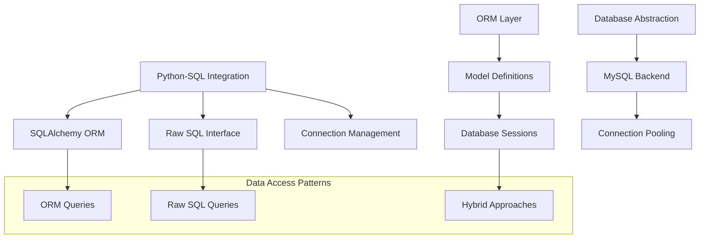
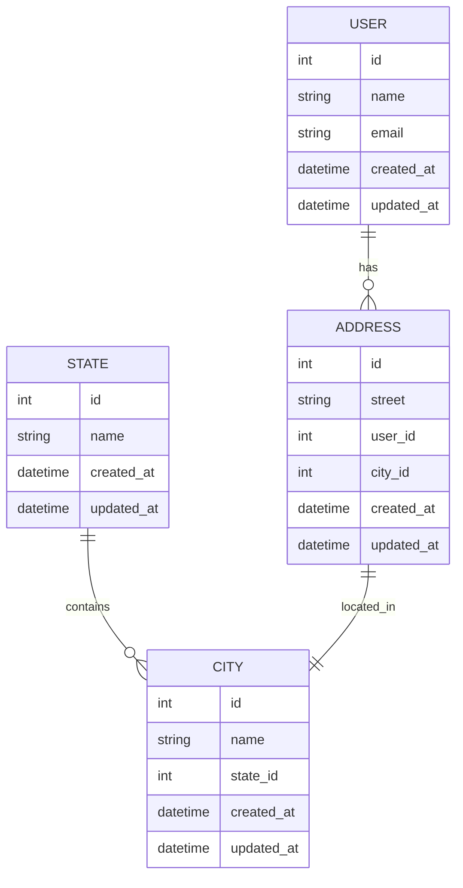
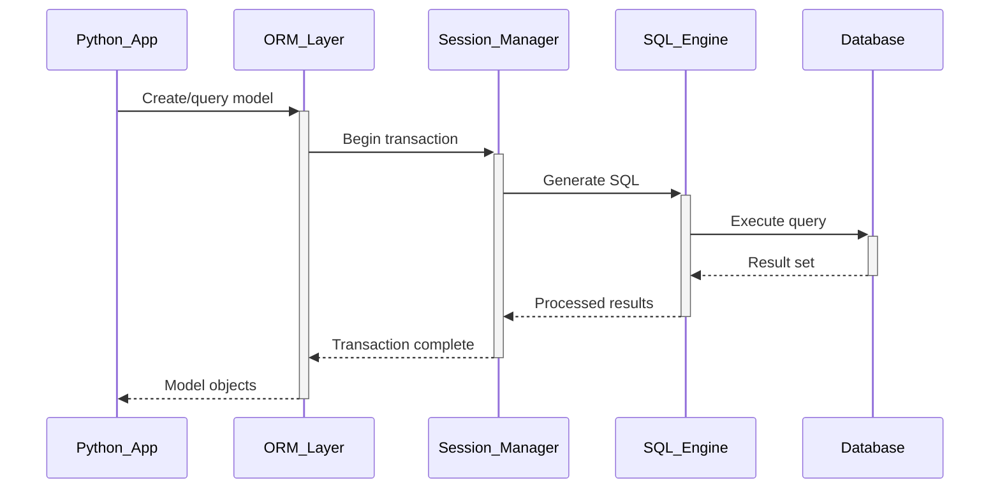

# 🏗️ System Architecture

## 📖 Overview
This container bridges SQL databases with Python programming through Object-Relational Mapping (ORM) using SQLAlchemy. It demonstrates how to integrate database operations with Python applications, providing both raw SQL capabilities and high-level ORM abstractions.

---

## 🏛️ High-Level Architecture



The architecture demonstrates modern database integration patterns using both ORM abstractions and direct SQL access.

---

## 🧩 Core Components

### SQLAlchemy ORM Engine
- **Purpose**: Provides object-relational mapping for Python-database integration
- **Technology**: SQLAlchemy ORM, declarative base, model definitions
- **Location**: ORM model definitions and session management
- **Responsibilities**:
  - Object-relational mapping configuration
  - Model class definitions and relationships
  - Session management and transactions
  - Query construction and execution
- **Interfaces**: ORM models, session objects, query interfaces

### Raw SQL Interface
- **Purpose**: Enables direct SQL execution for performance-critical operations
- **Technology**: MySQLdb/PyMySQL, raw SQL queries, connection management
- **Location**: Direct database connection and query execution
- **Responsibilities**:
  - Direct database connections
  - Raw SQL query execution
  - Result set processing
  - Transaction management
- **Interfaces**: Database connections, cursor objects, result processing

### Connection Management System
- **Purpose**: Handles database connections, pooling, and resource management
- **Technology**: Connection pooling, context managers, resource cleanup
- **Location**: Connection factory and management utilities
- **Responsibilities**:
  - Connection establishment and teardown
  - Connection pooling and reuse
  - Resource cleanup and error handling
  - Environment-based configuration
- **Interfaces**: Connection factory, pool management, configuration

### Model Definition Framework
- **Purpose**: Defines database schema through Python class definitions
- **Technology**: SQLAlchemy declarative models, column definitions, relationships
- **Location**: Model class definitions and schema declarations
- **Responsibilities**:
  - Table schema definition through classes
  - Column definitions and constraints
  - Relationship mapping between models
  - Data validation and serialization
- **Interfaces**: Model classes, relationship definitions, validation methods

### Query Builder System
- **Purpose**: Provides fluent interface for database query construction
- **Technology**: SQLAlchemy query builder, filter operations, joins
- **Location**: Query construction and execution utilities
- **Responsibilities**:
  - Fluent query construction interface
  - Filter and join operations
  - Query optimization and execution
  - Result processing and transformation
- **Interfaces**: Query builder, filter methods, result transformers

---

## 📊 Data Models & Schema



### Key Data Entities
- **States**: Geographic state/province entities
- **Cities**: Municipal entities belonging to states
- **Users**: Application user accounts
- **Addresses**: User location information

### Relationships
- States → Cities: One-to-many geographic relationship
- Users → Addresses: One-to-many address relationship
- Addresses → Cities: Many-to-one location relationship

---

## 🔄 Data Flow & Interactions



### Request/Response Flow
1. **Model Operation**: Python application interacts with ORM models
2. **Session Management**: ORM manages database sessions and transactions
3. **SQL Generation**: ORM translates operations to SQL statements
4. **Database Execution**: SQL executed against database backend
5. **Result Processing**: Database results converted back to Python objects

---

## 🚀 Deployment & Environment

### Development Environment
- **Platform**: Ubuntu 20.04 LTS
- **Dependencies**: Python 3.8+, SQLAlchemy, MySQLdb/PyMySQL, MySQL Server
- **Setup**: Virtual environment with database connectivity

### Production Considerations
- **Scalability**: Connection pooling and session management for high load
- **Performance**: Query optimization and lazy loading strategies
- **Monitoring**: Database connection and query performance tracking

### Configuration Management
- **Database URLs**: Environment-based database configuration
- **Connection Pools**: Optimized connection pool settings
- **ORM Configuration**: Query optimization and relationship loading

---

## 🔒 Security Architecture

### Authentication & Authorization
- **Authentication**: Database user authentication and connection security
- **Authorization**: ORM-level access control and permissions

### Data Protection
- **SQL Injection**: ORM protection against SQL injection attacks
- **Input Validation**: Model-level data validation and sanitization

### Security Measures
- **Parameterized Queries**: Safe query construction through ORM
- **Connection Security**: Encrypted database connections
- **Access Control**: Model-level permission management

---

## ⚡ Error Handling & Resilience

### Error Management Strategy
- **Error Detection**: Database connection and query error handling
- **Error Reporting**: Comprehensive error logging and debugging
- **Error Recovery**: Transaction rollback and connection recovery

### Resilience Patterns
- **Connection Retry**: Automatic connection retry mechanisms
- **Transaction Safety**: ACID transaction management
- **Resource Cleanup**: Proper session and connection cleanup

---

## 🎯 Design Decisions & Trade-offs

### Key Architectural Decisions
1. **ORM vs Raw SQL Balance**
   - **Decision**: Provide both ORM and raw SQL capabilities
   - **Rationale**: ORM for productivity, raw SQL for performance
   - **Alternatives**: Pure ORM or pure SQL approach
   - **Trade-offs**: Complexity for flexibility and performance options

2. **SQLAlchemy Choice**
   - **Decision**: Use SQLAlchemy as primary ORM framework
   - **Rationale**: Mature, feature-rich, and well-documented ORM
   - **Alternatives**: Django ORM, Peewee, or custom solutions
   - **Trade-offs**: Learning curve for powerful abstractions

### Known Limitations
- **Performance**: ORM overhead compared to raw SQL
- **Complexity**: Learning curve for advanced ORM features

### Future Considerations
- **Async Support**: Asynchronous database operations
- **Migration Tools**: Database schema migration management

---

## 📁 Directory Structure & Organization

```
0x0F-python-object_relational_mapping/
├── 0-select_states.py          # Raw SQL state selection
├── 1-filter_states.py          # SQL with user input
├── 2-my_filter_states.py       # Safe SQL with parameters
├── 3-my_safe_filter_states.py  # SQL injection prevention
├── 4-cities_by_state.py        # Multi-table raw SQL
├── 5-filter_cities.py          # Cities filtering
├── 6-model_state.py            # SQLAlchemy state model
├── 7-model_state_fetch_all.py  # ORM query all states
├── 8-model_state_fetch_first.py # ORM query first state
├── 9-model_state_filter_a.py   # ORM filtering
├── 10-model_state_my_get.py    # ORM get by ID
├── 11-model_state_insert.py    # ORM insert operations
├── 12-model_state_update_id_2.py # ORM update operations
├── 13-model_state_delete_a.py  # ORM delete operations
├── 14-model_city_fetch_by_state.py # ORM relationships
├── 100-relationship_states_cities.py # Advanced relationships
├── 101-relationship_states_cities_list.py # Relationship queries
└── relationship_*.py           # Relationship model definitions
```

### Organization Principles
- **Progression Path**: From raw SQL to advanced ORM concepts
- **Concept Separation**: Raw SQL vs ORM implementations clearly separated
- **Security Focus**: Emphasis on secure database interactions

---

## 🔗 External Dependencies

| Dependency | Purpose | Version | Documentation |
|------------|---------|---------|---------------|
| Python | Core interpreter | 3.8+ | [Python.org](https://python.org) |
| SQLAlchemy | Object-Relational Mapping | 1.4+ | [SQLAlchemy Documentation](https://docs.sqlalchemy.org/) |
| MySQLdb/PyMySQL | MySQL database adapter | Latest | [PyMySQL Documentation](https://pymysql.readthedocs.io/) |
| MySQL Server | Database backend | 8.0+ | [MySQL Documentation](https://dev.mysql.com/doc/) |

---

## 📚 References
- [Project README](README.md)
- [Project Manifest](PROJECT-MANIFEST.md)
- [SQLAlchemy Documentation](https://docs.sqlalchemy.org/)
- [Python Database Programming](https://docs.python.org/3/library/sqlite3.html)
