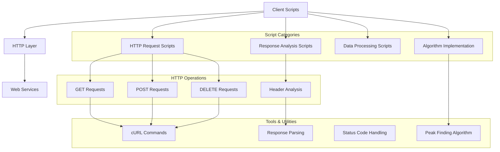
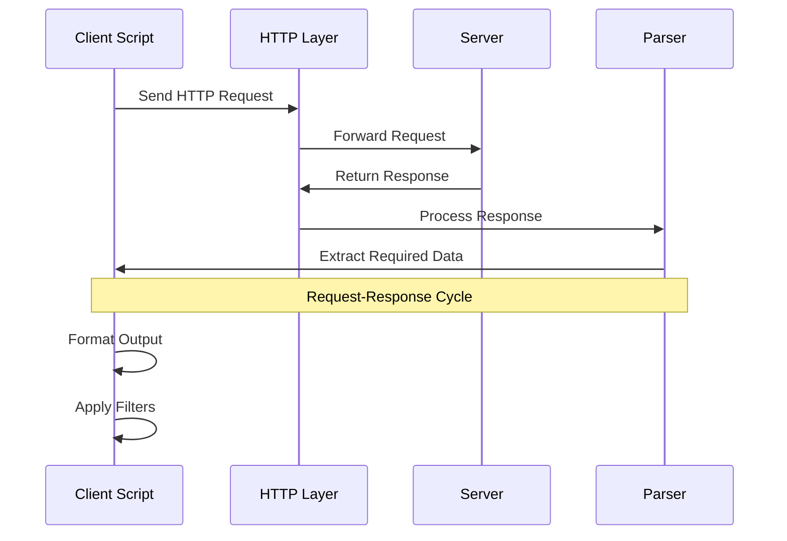
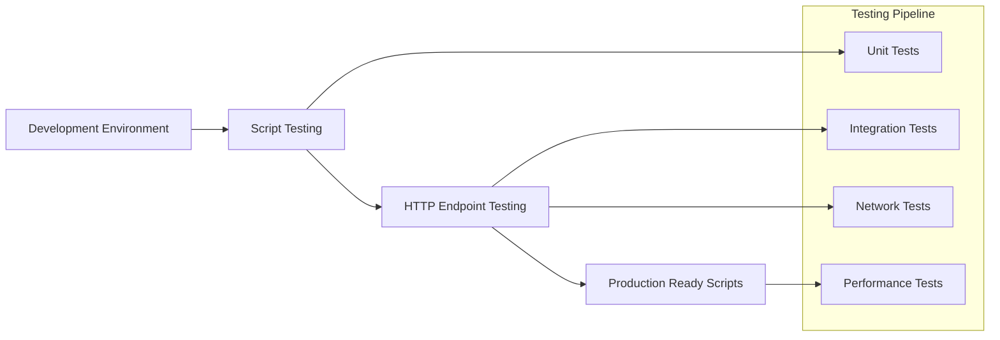

# Architecture Documentation

## Project: Python - Network #0

### System Overview

This container implements foundational HTTP networking concepts through Bash scripting and Python implementations. The project demonstrates HTTP protocol understanding, cURL command mastery, and algorithmic problem-solving with network-related operations.

### Architecture Diagram



### Component Breakdown

#### Core Components

1. **HTTP Request Handlers**
   - **0-body_size.sh**: Measures HTTP response body size
   - **1-body.sh**: Retrieves and displays response body
   - **2-delete.sh**: Performs HTTP DELETE operations
   - **3-methods.sh**: Lists allowed HTTP methods
   - **4-header.sh**: Sends custom headers with requests
   - **5-post_params.sh**: Sends POST data with parameters

2. **Advanced HTTP Operations**
   - **100-status_code.sh**: Extracts HTTP status codes
   - **101-post_json.sh**: Sends JSON data via POST
   - **102-catch_me.sh**: Complex HTTP request handling

3. **Algorithm Implementation**
   - **6-peak.py**: Peak finding algorithm implementation
   - **6-peak.txt**: Complexity analysis documentation

### Data Flow Architecture



### Security Considerations

#### Network Security
- **Request Validation**: All scripts validate input parameters
- **Safe Headers**: Custom headers are properly formatted
- **Error Handling**: Graceful handling of network failures

#### Data Protection
- **Input Sanitization**: URL and parameter validation
- **Output Filtering**: Safe response data processing
- **Connection Security**: Proper SSL/TLS handling

### API Design

#### HTTP Operations Interface
```bash
# Body size measurement
./0-body_size.sh <URL>

# Response body retrieval
./1-body.sh <URL>

# HTTP method operations
./2-delete.sh <URL>
./3-methods.sh <URL>

# Header and parameter handling
./4-header.sh <URL>
./5-post_params.sh <URL> <parameters>

# Status and JSON operations
./100-status_code.sh <URL>
./101-post_json.sh <URL> <json_file>
```

#### Algorithm Interface
```python
# Peak finding functionality
from 6-peak import find_peak

result = find_peak([1, 2, 3, 4, 5])
```

### Performance Metrics

#### Efficiency Targets
- **Request Time**: < 5 seconds per HTTP operation
- **Memory Usage**: Minimal footprint for script execution
- **Algorithm Complexity**: O(log n) for peak finding
- **Script Execution**: Fast startup and processing

#### Optimization Strategies
- **Efficient cURL Options**: Silent mode, optimized flags
- **Minimal Dependencies**: Pure Bash and Python implementations
- **Resource Management**: Clean script termination
- **Binary Search**: Optimal peak finding algorithm

### Deployment Architecture



### Error Handling Strategy

#### Network Error Management
- **Connection Timeouts**: Graceful timeout handling
- **HTTP Errors**: Status code interpretation
- **Invalid URLs**: Input validation and error reporting
- **Network Failures**: Retry mechanisms where appropriate

#### Script Error Handling
- **Parameter Validation**: Argument checking
- **File Operations**: Safe file handling
- **Command Execution**: Error propagation
- **Output Formatting**: Consistent error messages

### Monitoring and Logging

#### Performance Monitoring
- **Request Duration**: Timing HTTP operations
- **Success Rates**: Monitoring request success
- **Error Tracking**: Logging failed operations
- **Resource Usage**: Memory and CPU monitoring

#### Debugging Support
- **Verbose Modes**: Detailed operation logging
- **Error Messages**: Clear error reporting
- **Testing Tools**: Built-in validation
- **Documentation**: Comprehensive usage examples

### Design Decisions

#### Technology Choices
1. **Bash Scripting**: Chosen for system-level HTTP operations
2. **cURL**: Selected for robust HTTP client functionality
3. **Python**: Used for algorithmic implementations
4. **Binary Search**: Optimal approach for peak finding

#### Implementation Patterns
1. **Command-Line Interface**: Simple script-based interactions
2. **Error-First Design**: Comprehensive error handling
3. **Modular Scripts**: Single-responsibility principle
4. **Standard Compliance**: Following HTTP standards

#### Trade-offs Considered
1. **Simplicity vs. Features**: Focused on learning objectives
2. **Performance vs. Readability**: Clear, educational code
3. **Error Handling vs. Complexity**: Balanced approach
4. **Tool Dependencies**: Minimal external requirements

### Future Enhancements

#### Planned Improvements
- **Advanced HTTP Methods**: PATCH, OPTIONS support
- **Authentication**: OAuth and token-based auth
- **Response Caching**: Local response storage
- **Parallel Requests**: Concurrent HTTP operations

#### Scalability Considerations
- **Batch Operations**: Multiple URL processing
- **Configuration Files**: External parameter management
- **Plugin Architecture**: Extensible script framework
- **API Versioning**: Version-aware implementations

---

*This architecture supports the ALX Software Engineering curriculum's networking fundamentals module, emphasizing practical HTTP operations and algorithmic problem-solving.*
