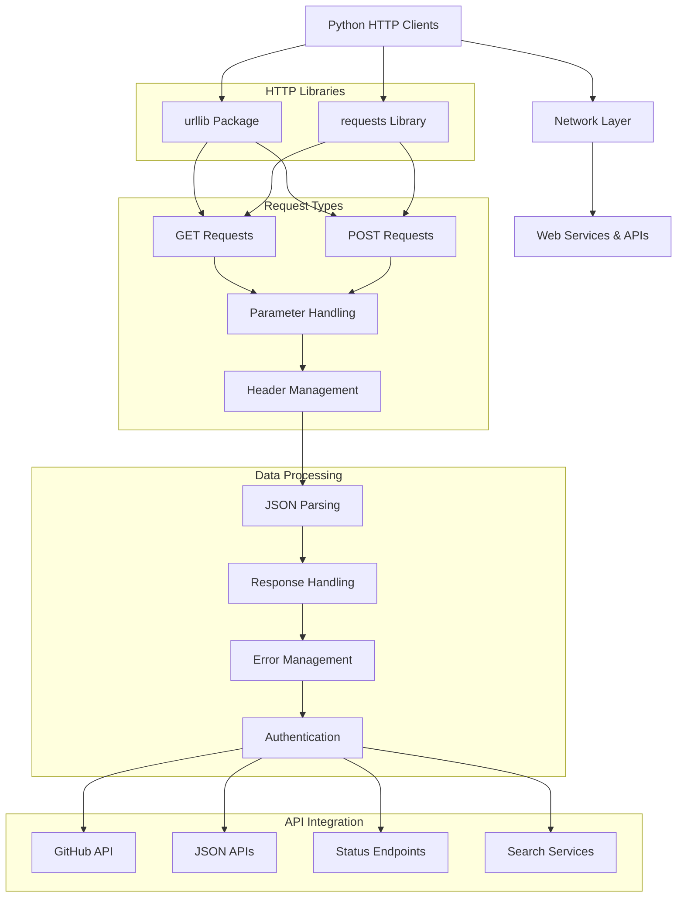
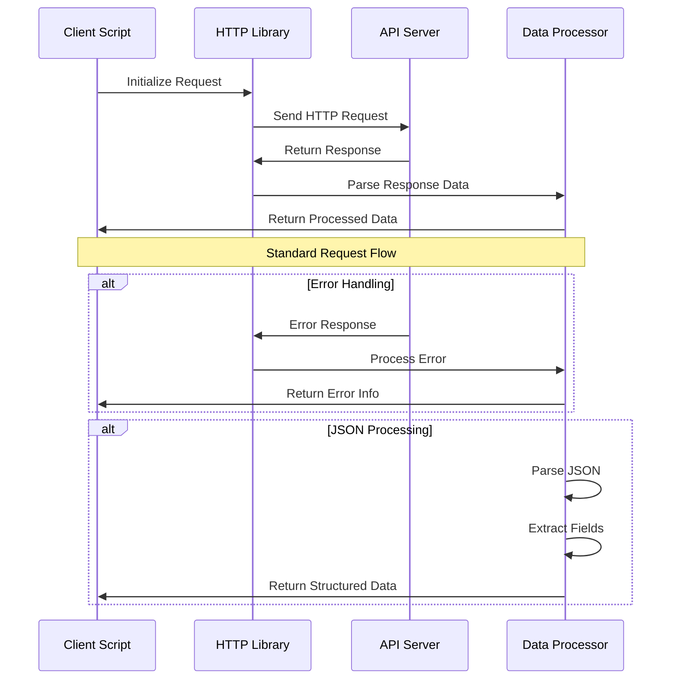

# Architecture Documentation

## Project: Python - Network #1

### System Overview

This container implements advanced HTTP networking in Python using both the standard `urllib` package and the third-party `requests` library. The project demonstrates comprehensive web service integration, API consumption, authentication mechanisms, and error handling patterns for network operations.

### Architecture Diagram



### Component Breakdown

#### Core Components

1. **urllib Implementations**
   - **0-hbtn_status.py**: Basic URL fetching with urllib
   - **1-hbtn_header.py**: Header extraction and processing
   - **2-post_email.py**: POST data submission with urllib
   - **3-error_code.py**: HTTP error handling with urllib

2. **requests Library Implementations**
   - **4-hbtn_status.py**: URL fetching with requests
   - **5-hbtn_header.py**: Header handling with requests
   - **6-post_email.py**: POST operations with requests
   - **7-error_code.py**: Error handling with requests

3. **Advanced API Operations**
   - **8-json_api.py**: JSON API consumption and processing
   - **10-my_github.py**: GitHub API authentication
   - **100-github_commits.py**: Complex API data retrieval

### Data Flow Architecture



### Security Considerations

#### Authentication Management
- **GitHub Authentication**: Basic Auth with username/token
- **Credential Handling**: Secure parameter passing
- **Token Management**: Command-line argument processing
- **API Rate Limiting**: Respectful API usage patterns

#### Data Protection
- **Input Validation**: URL and parameter sanitization
- **Error Information**: Safe error message handling
- **Connection Security**: HTTPS enforcement
- **Credential Security**: No hardcoded secrets

### API Design

#### urllib Interface Pattern
```python
# Basic request pattern
import urllib.request

with urllib.request.urlopen(url) as response:
    data = response.read()
    
# POST with data
data = urllib.parse.urlencode(params).encode()
request = urllib.request.Request(url, data)
```

#### requests Interface Pattern
```python
# Simple request pattern
import requests

response = requests.get(url)
data = response.json()

# POST with parameters
response = requests.post(url, data=params)

# Authentication
response = requests.get(url, auth=(username, token))
```

### Performance Metrics

#### Efficiency Targets
- **Request Time**: < 10 seconds per API call
- **Memory Usage**: Efficient response handling
- **Error Recovery**: Quick failure detection
- **Data Processing**: Fast JSON parsing

#### Optimization Strategies
- **Connection Reuse**: Efficient session management
- **Response Streaming**: Large data handling
- **Timeout Configuration**: Appropriate timeout values
- **Error Caching**: Avoid repeated failed requests

### Deployment Architecture

```mermaid
graph LR
    A[Development Scripts] --> B[Library Testing]
    B --> C[API Integration]
    C --> D[Production Scripts]
    
    subgraph "Testing Framework"
        E[Unit Tests]
        F[Integration Tests]
        G[API Tests]
        H[Error Tests]
    end
    
    B --> E
    C --> F
    C --> G
    D --> H
    
    subgraph "Dependencies"
        I[urllib (built-in)]
        J[requests (external)]
        K[sys/argv]
        L[json]
    end
    
    A --> I
    A --> J
    A --> K
    A --> L
```

### Error Handling Strategy

#### Network Error Management
- **HTTP Errors**: Status code interpretation and handling
- **Connection Errors**: Network failure recovery
- **Timeout Errors**: Graceful timeout handling
- **Authentication Errors**: Credential validation

#### Data Processing Errors
- **JSON Parsing**: Malformed JSON handling
- **Encoding Issues**: Character encoding management
- **Missing Data**: Null/empty response handling
- **Type Conversion**: Safe data type handling

### Monitoring and Logging

#### Request Monitoring
- **Response Times**: HTTP request duration tracking
- **Status Codes**: HTTP response code monitoring
- **Error Rates**: Failed request tracking
- **API Usage**: Rate limit monitoring

#### Debugging Support
- **Request Details**: Full request/response logging
- **Error Context**: Detailed error information
- **Performance Metrics**: Timing and resource usage
- **API Responses**: Raw response data access

### Design Decisions

#### Library Comparison
1. **urllib vs requests**: 
   - urllib: Standard library, no dependencies
   - requests: Better API, more features, external dependency

#### Implementation Patterns
1. **Error-First Design**: Comprehensive error handling
2. **Command-Line Interface**: Simple script-based usage
3. **Modular Functions**: Reusable code components
4. **Standard Compliance**: HTTP standard adherence

#### Trade-offs Considered
1. **Simplicity vs. Features**: Educational focus vs. production readiness
2. **Dependencies vs. Functionality**: Built-in vs. third-party libraries
3. **Error Handling vs. Performance**: Robust vs. fast execution
4. **Code Reuse vs. Clarity**: DRY principles vs. learning clarity

### API Integration Patterns

#### GitHub API Integration
```python
# Authentication pattern
auth = (username, password_or_token)
response = requests.get(api_url, auth=auth)

# Repository data access
commits = response.json()
for commit in commits[:10]:  # Limit results
    print(f"{commit['sha']}: {commit['commit']['author']['name']}")
```

#### JSON API Processing
```python
# Safe JSON handling
try:
    data = response.json()
    if data:
        process_data(data)
    else:
        print("No result")
except ValueError:
    print("Invalid JSON response")
```

### Future Enhancements

#### Planned Improvements
- **Async Operations**: Asynchronous HTTP requests
- **Session Management**: Persistent connection handling
- **Caching Mechanisms**: Response caching strategies
- **Batch Operations**: Multiple API calls optimization

#### Scalability Considerations
- **Rate Limiting**: API quota management
- **Connection Pooling**: Efficient connection reuse
- **Error Recovery**: Retry mechanisms with backoff
- **Monitoring Integration**: Production monitoring hooks

---

*This architecture supports the ALX Software Engineering curriculum's advanced networking module, emphasizing practical HTTP operations in Python and real-world API integration patterns.*
