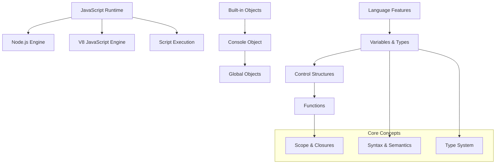
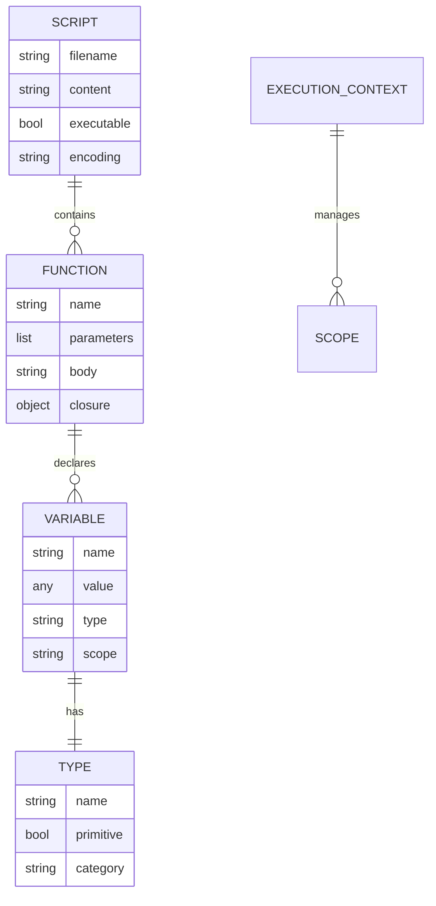
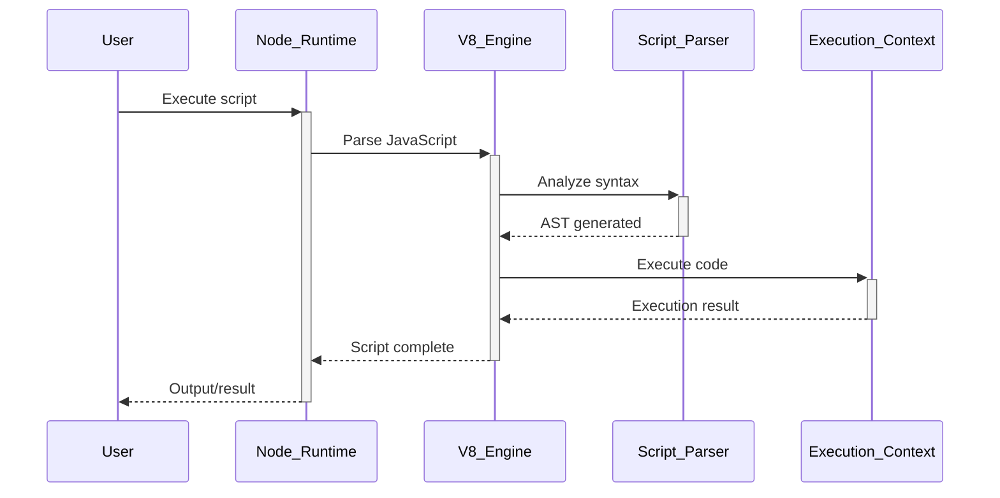

# 🏗️ System Architecture

## 📖 Overview
This container introduces JavaScript fundamentals including syntax, variables, control structures, functions, and basic programming concepts. It provides a foundation in JavaScript programming with emphasis on Node.js execution environment and modern JavaScript features.

---

## 🏛️ High-Level Architecture



The architecture demonstrates JavaScript's execution model with focus on fundamental programming constructs and runtime environment.

---

## 🧩 Core Components

### JavaScript Engine Interface
- **Purpose**: Provides JavaScript code execution through Node.js runtime
- **Technology**: Node.js, V8 JavaScript engine, script execution
- **Location**: Script execution and runtime management
- **Responsibilities**:
  - JavaScript code parsing and execution
  - Runtime environment management
  - Error handling and debugging
  - Performance optimization
- **Interfaces**: Node.js CLI, script execution, runtime APIs

### Variable and Type System
- **Purpose**: Implements JavaScript's dynamic type system and variable management
- **Technology**: JavaScript primitive types, objects, type coercion
- **Location**: Variable declarations and type operations
- **Responsibilities**:
  - Variable declaration (var, let, const)
  - Type checking and coercion
  - Scope management
  - Memory allocation and garbage collection
- **Interfaces**: Variable declaration, type operations, scope access

### Control Flow Engine
- **Purpose**: Handles program flow control through conditional and loop structures
- **Technology**: JavaScript control statements, conditional logic, iteration
- **Location**: Control structure implementations
- **Responsibilities**:
  - Conditional statement execution (if/else)
  - Loop implementation (for, while)
  - Switch statement processing
  - Break and continue handling
- **Interfaces**: Control statements, condition evaluation, loop execution

### Function Management System
- **Purpose**: Manages function definitions, calls, and closure handling
- **Technology**: JavaScript functions, closures, scope chain
- **Location**: Function definitions and execution contexts
- **Responsibilities**:
  - Function declaration and expression handling
  - Parameter passing and return values
  - Closure creation and management
  - Execution context management
- **Interfaces**: Function calls, parameter passing, return values

### Console and I/O Operations
- **Purpose**: Provides input/output operations and debugging capabilities
- **Technology**: Console API, process I/O, command-line arguments
- **Location**: I/O operations and console interactions
- **Responsibilities**:
  - Console output and logging
  - Command-line argument processing
  - Error output and debugging
  - Standard I/O operations
- **Interfaces**: Console methods, process APIs, I/O streams

---

## 📊 Data Models & Schema



### Key Data Entities
- **Scripts**: JavaScript source files with executable code
- **Functions**: Reusable code blocks with parameters and return values
- **Variables**: Named storage locations with dynamic types
- **Types**: JavaScript's built-in and custom data types

### Relationships
- Scripts → Functions: Containment and organization relationships
- Functions → Variables: Declaration and scope relationships
- Variables → Types: Dynamic typing relationships

---

## 🔄 Data Flow & Interactions



### Request/Response Flow
1. **Script Execution**: User executes JavaScript file through Node.js
2. **Parsing**: V8 engine parses JavaScript code into Abstract Syntax Tree
3. **Compilation**: Code compiled to bytecode for execution
4. **Execution**: Bytecode executed in appropriate execution context
5. **Output**: Results displayed through console or other output mechanisms

---

## 🚀 Deployment & Environment

### Development Environment
- **Platform**: Ubuntu 20.04 LTS
- **Dependencies**: Node.js 14+, npm package manager
- **Setup**: Node.js installation and PATH configuration

### Production Considerations
- **Scalability**: Single-threaded event loop with asynchronous operations
- **Performance**: V8 optimization and memory management
- **Monitoring**: Runtime performance and memory usage tracking

### Configuration Management
- **Node Version**: Specific Node.js version requirements
- **Environment Variables**: Runtime configuration through environment
- **Module Loading**: CommonJS and ES module support

---

## 🔒 Security Architecture

### Authentication & Authorization
- **Authentication**: System-level script execution permissions
- **Authorization**: File system access control

### Data Protection
- **Input Validation**: Command-line argument validation
- **Code Safety**: Safe script execution practices

### Security Measures
- **Sandbox Execution**: Controlled script execution environment
- **Resource Limits**: Memory and CPU usage constraints
- **Safe Practices**: Avoiding dangerous operations

---

## ⚡ Error Handling & Resilience

### Error Management Strategy
- **Error Detection**: Syntax errors, runtime exceptions, type errors
- **Error Reporting**: Clear error messages with stack traces
- **Error Recovery**: Graceful error handling and program termination

### Resilience Patterns
- **Input Validation**: Parameter and input checking
- **Exception Handling**: Try-catch error management
- **Safe Defaults**: Fallback values for error conditions

---

## 🎯 Design Decisions & Trade-offs

### Key Architectural Decisions
1. **Node.js Runtime Choice**
   - **Decision**: Use Node.js for JavaScript execution outside browser
   - **Rationale**: Server-side JavaScript capabilities and npm ecosystem
   - **Alternatives**: Browser-based execution or other JavaScript engines
   - **Trade-offs**: Server environment focus vs browser compatibility

2. **Fundamental Concepts Focus**
   - **Decision**: Concentrate on core JavaScript language features
   - **Rationale**: Strong foundation before advanced frameworks
   - **Alternatives**: Framework-specific or advanced feature focus
   - **Trade-offs**: Basic concepts for solid understanding

### Known Limitations
- **Advanced Features**: Limited to fundamental JavaScript concepts
- **Asynchronous Programming**: Basic introduction without deep async patterns

### Future Considerations
- **Modern JavaScript**: ES6+ features and modern syntax
- **Asynchronous Programming**: Promises, async/await, and event-driven programming

---

## 📁 Directory Structure & Organization

```
0x12-javascript-warm_up/
├── 0-javascript_is_amazing.js  # Basic output and variables
├── 1-multi_languages.js        # String concatenation
├── 2-arguments.js              # Command-line arguments
├── 3-value_argument.js         # Argument validation
├── 4-concat.js                 # String manipulation
├── 5-to_integer.js             # Type conversion
├── 6-multi_languages_loop.js   # Loop implementation
├── 7-multi_languages_loop.js   # Array iteration
├── 8-square.js                 # Function definition
├── 9-add.js                    # Function with parameters
├── 10-factorial.js             # Recursive function
├── 11-second_biggest.js        # Array processing
├── 12-object.js                # Object manipulation
├── 13-add.js                   # Function in object
├── 100-let_me_const.js         # Variable declarations
├── 101-call_me_moby.js         # Function as parameter
└── 102-add_me_maybe.js         # Callback functions
```

### Organization Principles
- **Progressive Complexity**: From basic syntax to advanced concepts
- **Concept Building**: Each script builds upon previous knowledge
- **Practical Examples**: Real-world JavaScript usage patterns

---

## 🔗 External Dependencies

| Dependency | Purpose | Version | Documentation |
|------------|---------|---------|---------------|
| Node.js | JavaScript runtime environment | 14+ | [Node.js Documentation](https://nodejs.org/docs/) |
| V8 Engine | JavaScript execution engine | Built-in | [V8 Documentation](https://v8.dev/docs) |
| npm | Package manager | 6+ | [npm Documentation](https://docs.npmjs.com/) |

---

## 📚 References
- [Project README](README.md)
- [Project Manifest](PROJECT-MANIFEST.md)
- [JavaScript Documentation](https://developer.mozilla.org/en-US/docs/Web/JavaScript)
- [Node.js Guide](https://nodejs.org/en/docs/guides/)
