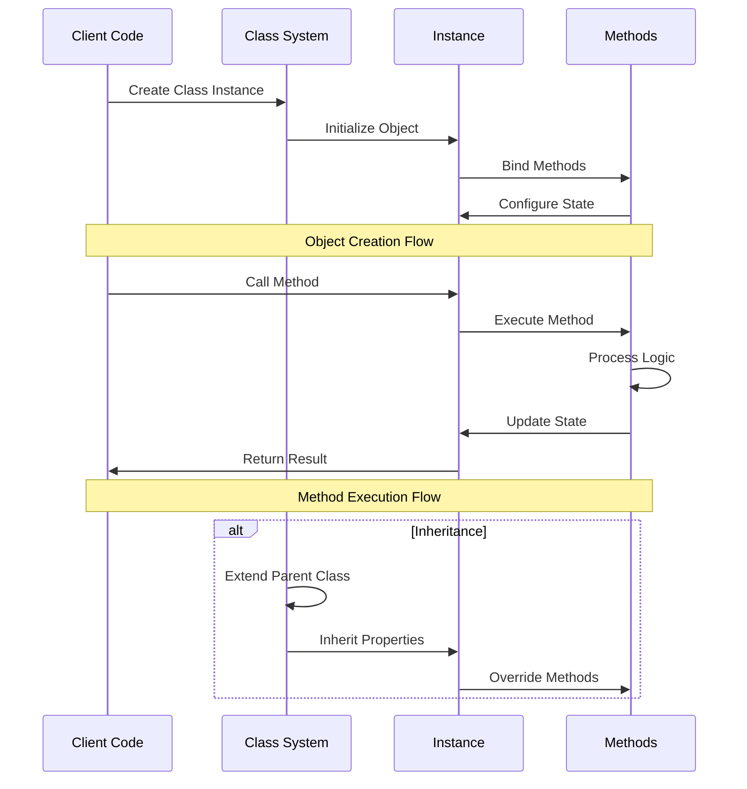
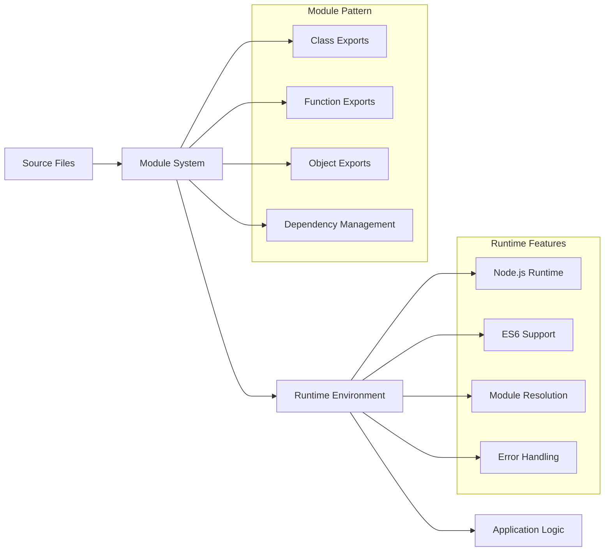

# Architecture Documentation

## Project: JavaScript - Objects, Scopes and Closures

### System Overview

This container implements advanced JavaScript concepts including object-oriented programming, class inheritance, closures, and functional programming patterns. The project demonstrates ES6 class syntax, prototype-based inheritance, scope management, and advanced array/object manipulation techniques.

### Architecture Diagram

```mermaid
graph TB
    A[JavaScript Runtime] --> B[Class System]
    B --> C[Object Instances]
    
    subgraph "Core Classes"
        D[Rectangle Class]
        E[Square Class (extends Rectangle)]
    end
    
    subgraph "Functional Programming"
        F[Closures]
        G[Higher-Order Functions]
        H[Array Methods]
        I[Object Manipulation]
    end
    
    subgraph "Language Features"
        J[ES6 Classes]
        K[Inheritance]
        L[Method Binding]
        M[Scope Management]
    end
    
    subgraph "Utility Functions"
        N[Number Conversion]
        O[String Reversal]
        P[Array Operations]
        Q[Object Counting]
    end
    
    A --> D
    A --> E
    D --> E
    
    A --> F
    A --> G
    A --> H
    A --> I
    
    J --> K
    K --> L
    L --> M
    
    F --> N
    G --> O
    H --> P
    I --> Q
```

### Component Breakdown

#### Core Components

1. **Class Hierarchy**
   - **0-rectangle.js**: Empty Rectangle class definition
   - **1-rectangle.js**: Rectangle with constructor
   - **2-rectangle.js**: Rectangle with validation
   - **3-rectangle.js**: Rectangle with methods (print)
   - **4-rectangle.js**: Rectangle with rotate/double methods
   - **5-square.js**: Square class extending Rectangle
   - **6-square.js**: Square with character printing

2. **Functional Programming**
   - **7-occurrences.js**: Function counting occurrences
   - **8-esrever.js**: Array reversal without built-in reverse
   - **9-logme.js**: Closure-based logging with counter
   - **10-converter.js**: Number base conversion using closures

3. **Advanced Operations**
   - **100-map.js**: Array transformation using map
   - **101-sorted.js**: Dictionary sorting by occurrence
   - **102-concat.js**: File concatenation utility

### Data Flow Architecture



### Security Considerations

#### Input Validation
- **Constructor Validation**: Type and value checking
- **Method Parameters**: Safe parameter handling
- **Array Bounds**: Index validation for array operations
- **Type Safety**: Dynamic type checking where needed

#### Memory Management
- **Object Lifecycle**: Proper object creation and destruction
- **Closure Variables**: Careful scope management
- **Array Operations**: Efficient memory usage
- **Method Binding**: Avoiding memory leaks

### API Design

#### Class Interface Pattern
```javascript
// Rectangle class usage
const Rectangle = require('./rectangle');
const rect = new Rectangle(width, height);
rect.print();
rect.rotate();
rect.double();

// Square class usage
const Square = require('./square');
const square = new Square(size);
square.print();
square.charPrint(char);
```

#### Functional Interface Pattern
```javascript
// Closure-based functions
const converter = require('./converter').converter;
const toBinary = converter(2);
const result = toBinary(15); // "1111"

// Array manipulation
const nbOccurences = require('./occurrences').nbOccurences;
const count = nbOccurences([1, 2, 3, 1], 1); // 2
```

### Performance Metrics

#### Efficiency Targets
- **Object Creation**: < 1ms for simple objects
- **Method Execution**: Minimal overhead for method calls
- **Array Operations**: O(n) complexity for linear operations
- **Memory Usage**: Efficient object storage

#### Optimization Strategies
- **Prototype Methods**: Shared method implementations
- **Closure Optimization**: Minimal variable capture
- **Array Methods**: Native JavaScript optimizations
- **Type Coercion**: Efficient type handling

### Deployment Architecture



### Error Handling Strategy

#### Class Error Management
- **Constructor Errors**: Invalid parameter handling
- **Method Errors**: Safe method execution
- **Inheritance Errors**: Proper super() calls
- **Type Errors**: Dynamic type validation

#### Functional Error Handling
- **Closure Errors**: Scope-related error management
- **Array Errors**: Bounds checking and validation
- **File Errors**: I/O operation error handling
- **Runtime Errors**: Exception propagation

### Monitoring and Logging

#### Development Debugging
- **Object State**: Instance property inspection
- **Method Execution**: Call stack tracing
- **Closure Variables**: Scope variable monitoring
- **Performance Profiling**: Execution time measurement

#### Testing Support
- **Unit Tests**: Individual component testing
- **Integration Tests**: Class interaction testing
- **Functional Tests**: Closure behavior validation
- **Performance Tests**: Efficiency benchmarking

### Design Decisions

#### Object-Oriented Design
1. **ES6 Classes**: Modern JavaScript class syntax
2. **Inheritance**: Classical inheritance patterns
3. **Method Binding**: Automatic method binding
4. **Encapsulation**: Private state management

#### Functional Programming
1. **Closures**: State encapsulation in functions
2. **Higher-Order Functions**: Function composition
3. **Immutability**: Non-destructive operations where possible
4. **Pure Functions**: Side-effect-free implementations

#### Trade-offs Considered
1. **Performance vs. Readability**: Clear code over micro-optimizations
2. **Flexibility vs. Simplicity**: Educational clarity over complexity
3. **Memory vs. Speed**: Balanced resource usage
4. **Standards vs. Innovation**: Following ES6 conventions

### JavaScript Features Demonstrated

#### ES6 Class System
```javascript
// Class definition with inheritance
class Square extends Rectangle {
  constructor(size) {
    super(size, size);
  }
  
  charPrint(c) {
    if (c === undefined) c = 'X';
    for (let i = 0; i < this.height; i++) {
      console.log(c.repeat(this.width));
    }
  }
}
```

#### Closure Patterns
```javascript
// Closure for maintaining state
exports.converter = function(base) {
  return function(num) {
    return num.toString(base);
  };
};

// Counter closure
let count = 0;
exports.logMe = function(item) {
  console.log(`${count}: ${item}`);
  count++;
};
```

#### Array Manipulation
```javascript
// Functional array operations
const newList = list.map((value, index) => value * index);

// Custom array processing
function esrever(list) {
  const result = [];
  for (let i = list.length - 1; i >= 0; i--) {
    result.push(list[i]);
  }
  return result;
}
```

### Future Enhancements

#### Planned Improvements
- **Async Operations**: Promise-based methods
- **Advanced Patterns**: Observer, Factory patterns
- **Error Boundaries**: Comprehensive error handling
- **Type Definitions**: TypeScript integration preparation

#### Scalability Considerations
- **Module Bundling**: Webpack/Rollup integration
- **Testing Framework**: Jest/Mocha test suites
- **Documentation**: JSDoc integration
- **Performance Monitoring**: Runtime performance tracking

---

*This architecture supports the ALX Software Engineering curriculum's JavaScript fundamentals module, emphasizing modern object-oriented programming and functional programming concepts in JavaScript.*
