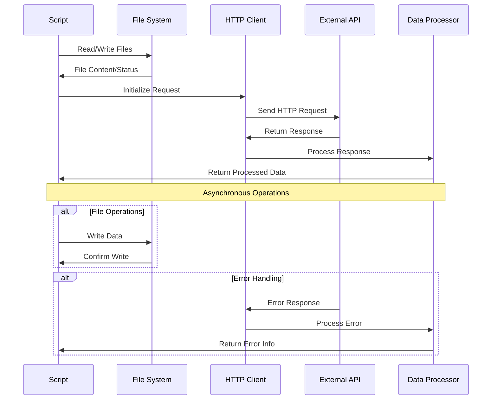

# Architecture Documentation

## Project: JavaScript - Web Scraping

### System Overview

This container implements comprehensive web scraping and API interaction capabilities using JavaScript in Node.js. The project demonstrates file system operations, HTTP request handling, JSON data processing, and asynchronous programming patterns for web automation and data extraction tasks.

### Architecture Diagram

```mermaid
graph TB
    A[Node.js Runtime] --> B[Script Engine]
    B --> C[External Services]
    
    subgraph "Core Modules"
        D[File System (fs)]
        E[HTTP Requests (request)]
        F[Process Arguments]
        G[JSON Processing]
    end
    
    subgraph "Operations"
        H[File Operations]
        I[HTTP Operations]
        J[Data Processing]
        K[Error Handling]
    end
    
    subgraph "External APIs"
        L[Star Wars API]
        M[JSONPlaceholder]
        N[Custom Endpoints]
        O[File Resources]
    end
    
    subgraph "Data Flow"
        P[Request Formation]
        Q[Response Processing]
        R[Data Transformation]
        S[Output Generation]
    end
    
    A --> D
    A --> E
    A --> F
    A --> G
    
    D --> H
    E --> I
    G --> J
    B --> K
    
    I --> L
    I --> M
    I --> N
    H --> O
    
    I --> P
    P --> Q
    Q --> R
    R --> S
```

### Component Breakdown

#### Core Components

1. **File System Operations**
   - **0-readme.js**: File reading with error handling
   - **1-writeme.js**: File writing operations
   - **5-request_store.js**: Web content storage

2. **HTTP Request Operations**
   - **2-statuscode.js**: HTTP status code retrieval
   - **3-starwars_title.js**: Basic API data extraction
   - **4-starwars_count.js**: API data filtering and counting
   - **6-completed_tasks.js**: Complex JSON processing

3. **Advanced API Integration**
   - **100-starwars_characters.js**: Nested API calls
   - **101-starwars_characters.js**: Ordered asynchronous operations

### Data Flow Architecture



### Security Considerations

#### Input Validation
- **Command Line Arguments**: Argument validation and sanitization
- **URL Construction**: Safe URL building from parameters
- **File Paths**: Path validation for file operations
- **JSON Parsing**: Safe JSON parsing with error handling

#### Network Security
- **HTTPS Usage**: Secure connections where available
- **Request Headers**: Proper header management
- **Error Information**: Safe error message handling
- **Rate Limiting**: Respectful API usage patterns

### API Design

#### File Operations Interface
```javascript
// File reading pattern
const fs = require('fs');
fs.readFile(filename, 'utf8', (error, content) => {
  console.log(error || content);
});

// File writing pattern
fs.writeFile(filename, content, 'utf8', (error) => {
  if (error) console.log(error);
});
```

#### HTTP Request Interface
```javascript
// Basic request pattern
const request = require('request');
request(url, (error, response, body) => {
  if (error) {
    console.log(error);
  } else {
    const data = JSON.parse(body);
    processData(data);
  }
});
```

### Performance Metrics

#### Efficiency Targets
- **Request Time**: < 15 seconds per API call
- **File Operations**: < 1 second for file I/O
- **Memory Usage**: Efficient JSON processing
- **Error Recovery**: Quick failure detection

#### Optimization Strategies
- **Async Operations**: Non-blocking I/O operations
- **Error Caching**: Avoid repeated failed requests
- **Data Streaming**: Efficient large data handling
- **Connection Reuse**: HTTP connection optimization

### Deployment Architecture

```mermaid
graph LR
    A[Source Scripts] --> B[Node.js Runtime]
    B --> C[External Dependencies]
    C --> D[Execution Environment]
    
    subgraph "Dependencies"
        E[request Module]
        F[fs Module (built-in)]
        G[process Module (built-in)]
        H[JSON (built-in)]
    end
    
    C --> E
    C --> F
    C --> G
    C --> H
    
    subgraph "Runtime Environment"
        I[Command Line Interface]
        J[Asynchronous Event Loop]
        K[Error Handling System]
        L[Output Management]
    end
    
    D --> I
    D --> J
    D --> K
    D --> L
```

### Error Handling Strategy

#### Network Error Management
- **HTTP Errors**: Status code and network failure handling
- **Timeout Errors**: Request timeout management
- **Connection Errors**: Network connectivity issues
- **API Errors**: Service-specific error responses

#### File System Error Handling
- **File Not Found**: Missing file handling
- **Permission Errors**: Access permission management
- **Disk Space**: Write operation failure handling
- **Encoding Issues**: Character encoding problems

### Monitoring and Logging

#### Request Monitoring
- **Response Times**: HTTP request duration tracking
- **Status Codes**: HTTP response monitoring
- **Error Rates**: Failed operation tracking
- **API Usage**: Rate limit and quota monitoring

#### Debugging Support
- **Request Details**: Full request/response logging
- **Error Context**: Detailed error information
- **Performance Metrics**: Timing and resource usage
- **Data Validation**: Input/output data verification

### Design Decisions

#### Asynchronous Programming
1. **Callback Pattern**: Traditional Node.js callback approach
2. **Error-First Callbacks**: Standard error handling pattern
3. **Non-Blocking I/O**: Asynchronous operation handling
4. **Event Loop Utilization**: Efficient resource usage

#### API Integration Patterns
1. **REST API Consumption**: Standard HTTP API interactions
2. **JSON Processing**: Native JSON parsing and manipulation
3. **Nested Requests**: Handling dependent API calls
4. **Data Filtering**: Client-side data processing

#### Trade-offs Considered
1. **Simplicity vs. Features**: Educational focus vs. production complexity
2. **Error Handling vs. Performance**: Robust vs. fast execution
3. **Sync vs. Async**: Blocking vs. non-blocking operations
4. **Dependencies vs. Features**: External modules vs. built-in capabilities

### Web Scraping Patterns

#### API Data Extraction
```javascript
// Star Wars API integration
const request = require('request');
const filmUrl = `https://swapi-api.alx-tools.com/api/films/${movieId}`;

request(filmUrl, (error, response, body) => {
  if (error) {
    console.log(error);
  } else {
    const film = JSON.parse(body);
    console.log(film.title);
  }
});
```

#### Complex Data Processing
```javascript
// Nested API calls for character data
film.characters.forEach(characterUrl => {
  request(characterUrl, (error, response, body) => {
    if (!error) {
      const character = JSON.parse(body);
      console.log(character.name);
    }
  });
});
```

#### File-Based Data Operations
```javascript
// Save API response to file
request(url, (error, response, body) => {
  if (!error) {
    fs.writeFile(filename, body, 'utf8', (writeError) => {
      if (writeError) {
        console.log(writeError);
      }
    });
  }
});
```

### Future Enhancements

#### Planned Improvements
- **Promise-Based Operations**: Modern async/await patterns
- **Advanced Error Handling**: Retry mechanisms with exponential backoff
- **Data Caching**: Response caching for repeated requests
- **Batch Operations**: Parallel request processing

#### Scalability Considerations
- **Rate Limiting**: API quota management
- **Connection Pooling**: Efficient HTTP connection reuse
- **Memory Management**: Large dataset processing
- **Error Recovery**: Robust failure handling

---

*This architecture supports the ALX Software Engineering curriculum's web scraping module, emphasizing practical JavaScript automation and API integration techniques.*
