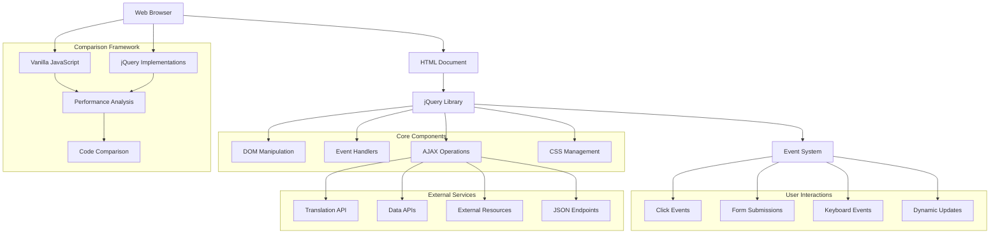
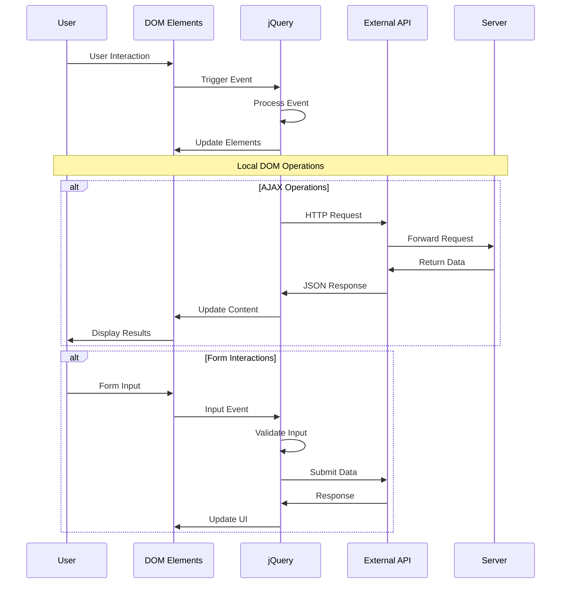
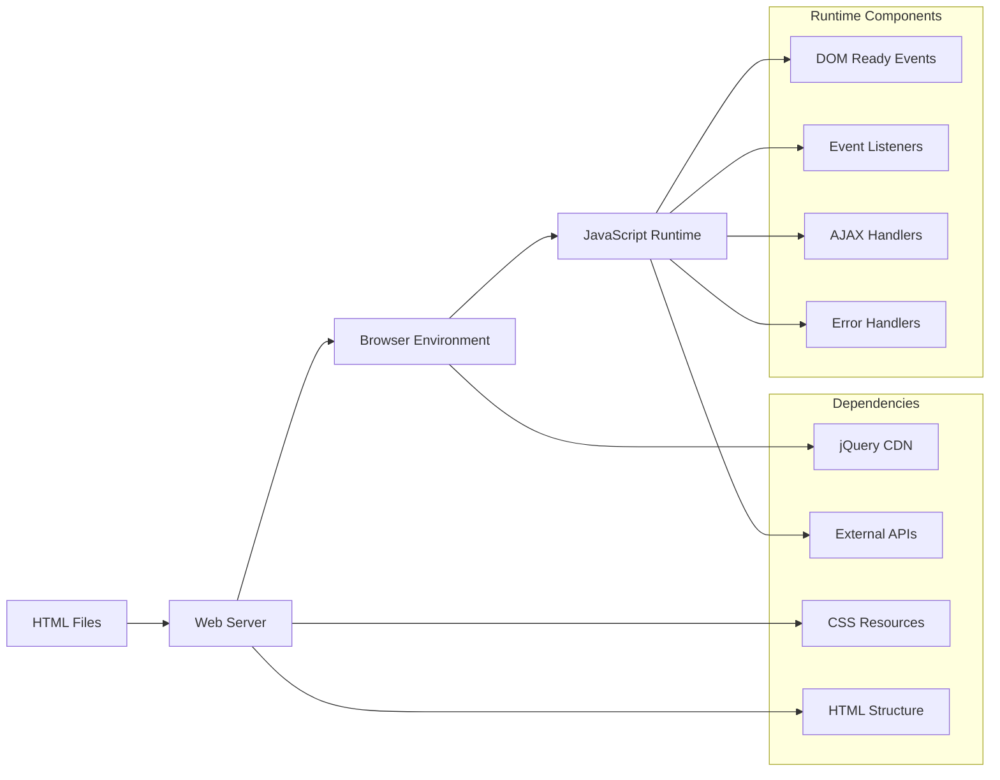

# Architecture Documentation

## Project: JavaScript - Web jQuery

### System Overview

This container implements comprehensive front-end web development using jQuery for DOM manipulation, event handling, and AJAX operations. The project demonstrates the contrast between vanilla JavaScript and jQuery approaches while building interactive web applications with external API integrations.

### Architecture Diagram



### Component Breakdown

#### Core Components

1. **DOM Manipulation Scripts**
   - **0-script.js / 100-script.js**: Header color change (vanilla vs jQuery)
   - **1-script.js**: jQuery header styling
   - **2-script.js**: Class-based styling with click events
   - **3-script.js**: CSS class toggling
   - **4-script.js**: List item management

2. **Event Handling**
   - **5-script.js**: Dynamic list item addition
   - **6-script.js**: Character name updates
   - **7-script.js**: Character fetching from API
   - **8-script.js**: Movie list population
   - **9-script.js**: Translation functionality

3. **Advanced Features**
   - **101-script.js**: Enhanced list management
   - **102-script.js**: Improved character fetching
   - **103-script.js**: Translation with keyboard support

### Data Flow Architecture



### Security Considerations

#### Client-Side Security
- **Input Validation**: Form data sanitization
- **XSS Prevention**: Safe DOM content insertion
- **API Security**: Secure external API communication
- **Error Handling**: Safe error message display

#### Data Protection
- **User Input**: Client-side input validation
- **API Responses**: Safe JSON data handling
- **DOM Updates**: Secure content insertion
- **Event Security**: Proper event handler binding

### API Design

#### jQuery Interface Patterns
```javascript
// DOM manipulation
$('selector').css('property', 'value');
$('selector').addClass('className');
$('selector').text('content');
$('selector').html('<tag>content</tag>');

// Event handling
$('selector').click(function() {
    // Event handler logic
});

// AJAX operations
$.get(url, function(data) {
    // Process response
});
```

#### Vanilla JavaScript Comparison
```javascript
// DOM manipulation
document.querySelector('selector').style.property = 'value';
document.querySelector('selector').classList.add('className');
document.querySelector('selector').textContent = 'content';

// Event handling
document.querySelector('selector').addEventListener('click', function() {
    // Event handler logic
});
```

### Performance Metrics

#### Efficiency Targets
- **DOM Updates**: < 100ms for visual changes
- **AJAX Requests**: < 3 seconds for API responses
- **Event Handling**: Immediate response to user interactions
- **Memory Usage**: Efficient jQuery object management

#### Optimization Strategies
- **Event Delegation**: Efficient event handling
- **DOM Caching**: Storing jQuery objects for reuse
- **AJAX Optimization**: Request caching and batching
- **Minimal DOM Queries**: Reduced selector usage

### Deployment Architecture



### Error Handling Strategy

#### Client-Side Error Management
- **AJAX Errors**: Network and API error handling
- **DOM Errors**: Element selection and manipulation errors
- **Event Errors**: Event handler exception management
- **Validation Errors**: Form input validation feedback

#### User Experience
- **Loading States**: User feedback during operations
- **Error Messages**: Clear error communication
- **Fallback Behavior**: Graceful degradation
- **Recovery Mechanisms**: Retry functionality

### Monitoring and Logging

#### Performance Monitoring
- **Response Times**: AJAX request duration tracking
- **DOM Operations**: Element manipulation timing
- **Event Frequency**: User interaction patterns
- **Error Rates**: Client-side error tracking

#### Debugging Support
- **Console Logging**: Development debugging output
- **Network Monitoring**: AJAX request inspection
- **DOM Inspection**: Element state monitoring
- **Event Tracing**: Event flow debugging

### Design Decisions

#### jQuery vs Vanilla JavaScript
1. **Code Simplicity**: jQuery's concise syntax vs vanilla verbosity
2. **Browser Compatibility**: jQuery's cross-browser support
3. **Learning Curve**: Educational value of both approaches
4. **Performance**: Trade-offs between convenience and speed

#### Architecture Patterns
1. **Event-Driven Design**: User interaction focus
2. **AJAX Integration**: Asynchronous data loading
3. **Progressive Enhancement**: Graceful degradation support
4. **Modular Structure**: Reusable component design

#### Trade-offs Considered
1. **Library Size vs Features**: jQuery overhead vs functionality
2. **Learning vs Production**: Educational clarity vs efficiency
3. **Compatibility vs Performance**: Cross-browser vs speed
4. **Simplicity vs Control**: Abstraction vs low-level access

### jQuery Feature Demonstrations

#### DOM Manipulation Patterns
```javascript
// Element selection and styling
$('header').css('color', '#FF0000');
$('#my_div').addClass('red');
$('li').removeClass('blue').addClass('green');

// Content manipulation
$('#character').text(characterName);
$('#hello').text(translationData.hello);
$('UL#my_list').append('<li>Item</li>');
```

#### Event Handling Patterns
```javascript
// Click events
$('#red_header').click(function() {
    $('header').addClass('red');
});

// Form events
$('#btn_translate').click(fetchTranslation);
$('#language_code').keyup(function(event) {
    if (event.keyCode === 13) {
        fetchTranslation();
    }
});
```

#### AJAX Operation Patterns
```javascript
// GET requests
$.get('https://swapi-api.alx-tools.com/api/people/5/', function(data) {
    $('#character').text(data.name);
});

// JSON requests
$.getJSON('https://swapi-api.alx-tools.com/api/films/', function(data) {
    data.results.forEach(function(movie) {
        $('UL#list_movies').append('<li>' + movie.title + '</li>');
    });
});
```

### Comparison Framework

#### Vanilla JavaScript vs jQuery
| Operation | Vanilla JavaScript | jQuery | Advantage |
|-----------|-------------------|---------|-----------|
| Element Selection | `document.querySelector()` | `$()` | jQuery: Concise |
| Event Handling | `addEventListener()` | `.click()` | jQuery: Simpler |
| AJAX | `XMLHttpRequest/fetch()` | `$.get()` | jQuery: Easier |
| DOM Manipulation | `textContent/innerHTML` | `.text()/.html()` | jQuery: Consistent |

### Future Enhancements

#### Planned Improvements
- **ES6+ Features**: Modern JavaScript syntax integration
- **Framework Migration**: React/Vue.js transition preparation
- **Performance Optimization**: Bundle optimization and caching
- **Accessibility**: ARIA support and keyboard navigation

#### Scalability Considerations
- **Component Architecture**: Reusable UI components
- **State Management**: Application state handling
- **Build Tools**: Webpack/Parcel integration
- **Testing Framework**: Automated testing implementation

---

*This architecture supports the ALX Software Engineering curriculum's front-end development module, emphasizing practical jQuery usage and modern web development patterns.*
