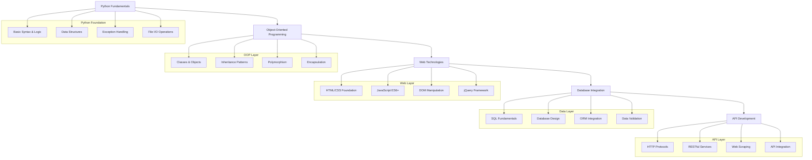
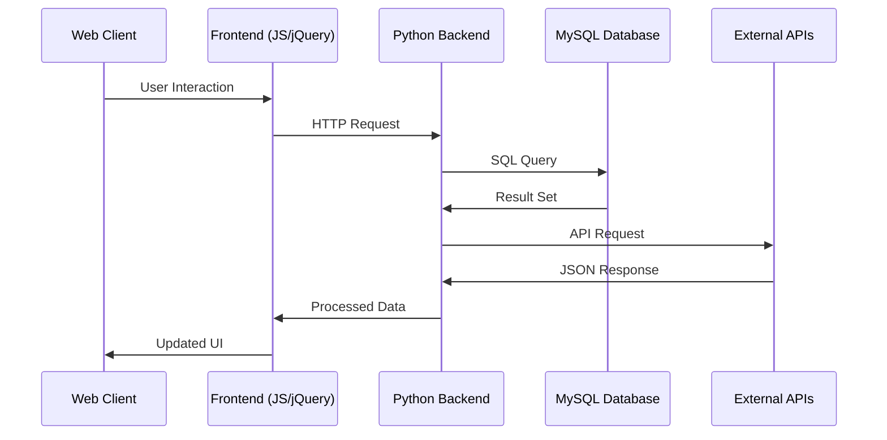
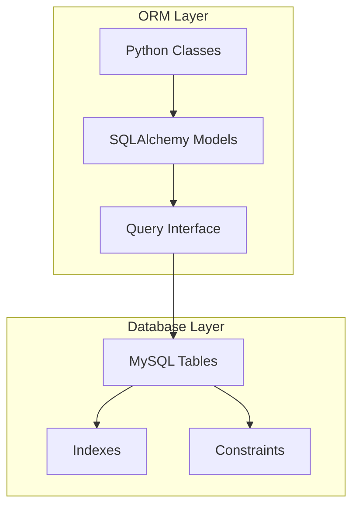
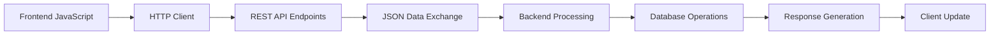
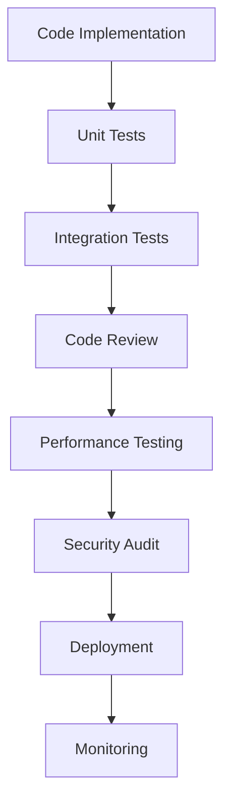
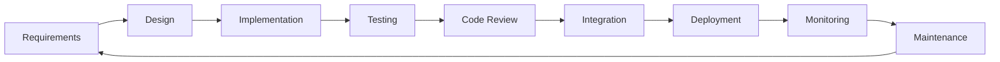

# 🏗️ System Architecture

## 📖 Overview
This repository implements a comprehensive higher-level programming education architecture focusing on Python, JavaScript, SQL, and web development technologies. The architecture demonstrates progressive skill development from basic scripting to advanced web development, database management, and API integration, following modern software development practices and design patterns.

---

## 🏛️ High-Level Architecture

The architecture follows a progressive learning model where each layer builds upon previous knowledge while introducing new concepts and technologies.

---

## 🧩 Core Components

### Python Programming Foundation
- **Purpose**: Establish strong Python programming fundamentals and best practices
- **Technology**: Python 3.x, built-in libraries, standard modules
- **Location**: `0x00-python-hello_world/`, `0x01-python-if_else_loops_functions/`, `0x02-python-import_modules/`, `0x03-python-data_structures/`, `0x04-python-more_data_structures/`, `0x05-python-exceptions/`
- **Responsibilities**:
  - Python syntax and idioms mastery
  - Control flow and function design
  - Data structure manipulation and optimization
  - Error handling and exception management
  - Module system and package management

### Object-Oriented Programming Layer
- **Purpose**: Implement advanced OOP concepts and design patterns
- **Technology**: Python classes, inheritance, polymorphism, design patterns
- **Location**: `0x06-python-classes/`, `0x08-python-more_classes/`, `0x09-python-everything_is_object/`, `0x0A-python-inheritance/`, `0x0C-python-almost_a_circle/`
- **Responsibilities**:
  - Class design and implementation
  - Inheritance hierarchy management
  - Polymorphic behavior implementation
  - Encapsulation and data hiding
  - Design pattern application

### File and Data Management
- **Purpose**: Handle file operations, data persistence, and I/O operations
- **Technology**: Python file handling, JSON, CSV, serialization
- **Location**: `0x0B-python-input_output/`, `0x07-python-test_driven_development/`
- **Responsibilities**:
  - File system operations
  - Data serialization and deserialization
  - Test-driven development practices
  - Data validation and transformation
  - Error handling in I/O operations

### Web Technologies Layer
- **Purpose**: Implement modern web development with JavaScript and frontend technologies
- **Technology**: JavaScript ES6+, HTML5, CSS3, jQuery, DOM APIs
- **Location**: `0x12-javascript-warm_up/`, `0x13-javascript_objects_scopes_closures/`, `0x14-javascript-web_scraping/`, `0x15-javascript-web_jquery/`
- **Responsibilities**:
  - JavaScript language fundamentals
  - Object-oriented JavaScript programming
  - DOM manipulation and event handling
  - Asynchronous programming patterns
  - Web scraping and data extraction

### Database Management Layer
- **Purpose**: Implement database design, querying, and integration
- **Technology**: MySQL, SQL, Python database connectors, ORM frameworks
- **Location**: `0x0D-SQL_introduction/`, `0x0E-SQL_more_queries/`, `0x0F-python-object_relational_mapping/`
- **Responsibilities**:
  - SQL query design and optimization
  - Database schema design
  - Python-database integration
  - ORM implementation and usage
  - Data integrity and validation

### Network Programming Layer
- **Purpose**: Implement network communication and API integration
- **Technology**: HTTP protocols, REST APIs, Python requests library
- **Location**: `0x10-python-network_0/`, `0x11-python-network_1/`
- **Responsibilities**:
  - HTTP protocol implementation
  - RESTful API consumption
  - Web service integration
  - Authentication and authorization
  - Data parsing and validation

---

## 🔄 Data Flow Architecture

---

## 🗄️ Database Architecture

### Relational Database Design
- **Schema Design**: Normalized table structures and relationships
- **Query Optimization**: Efficient SQL query patterns and indexing
- **Data Integrity**: Constraints, foreign keys, and validation rules
- **Performance Tuning**: Query optimization and database performance

### ORM Integration

---

## 🌐 Web Development Architecture

### Frontend Architecture
- **HTML Structure**: Semantic markup and accessibility standards
- **CSS Styling**: Responsive design and modern styling techniques
- **JavaScript Logic**: ES6+ features and modern programming patterns
- **jQuery Integration**: DOM manipulation and event handling

### API Communication

---

## 🔧 Development Tools & Environment

### Python Development Stack
- **Interpreter**: Python 3.x with virtual environment management
- **Package Management**: pip, requirements.txt, dependency management
- **Testing Framework**: unittest, doctest, test-driven development
- **Code Quality**: PEP 8 compliance, linting, code formatting

### Web Development Tools
- **Frontend**: Modern browser development tools
- **JavaScript**: ES6+ syntax, modern JavaScript features
- **Database**: MySQL client tools and administration
- **Version Control**: Git workflow and collaborative development

---

## 🔐 Security Implementation

### Data Security
- **Input Validation**: User input sanitization and validation
- **SQL Injection Prevention**: Parameterized queries and prepared statements
- **XSS Protection**: Output encoding and content security policies
- **Authentication**: Secure authentication mechanisms

### Code Security
- **Error Handling**: Secure error reporting and logging
- **Data Encryption**: Sensitive data protection
- **Session Management**: Secure session handling
- **API Security**: Authentication and authorization for API endpoints

---

## 📊 Performance Optimization

### Python Optimization
- **Algorithm Efficiency**: Big O notation and complexity analysis
- **Memory Management**: Efficient data structure usage
- **Code Profiling**: Performance measurement and optimization
- **Caching Strategies**: Data caching and performance improvement

### Database Performance
- **Query Optimization**: Efficient SQL query design
- **Index Strategy**: Proper indexing for performance
- **Connection Pooling**: Database connection management
- **Data Normalization**: Optimal database design

### Web Performance
- **Frontend Optimization**: Minification, compression, caching
- **API Efficiency**: Efficient API design and response optimization
- **Network Optimization**: Reduced latency and bandwidth usage
- **Asynchronous Processing**: Non-blocking operations

---

## 🧪 Testing Framework

### Testing Strategy
- **Unit Testing**: Individual function and class testing
- **Integration Testing**: Component interaction testing
- **Test-Driven Development**: Test-first development approach
- **Documentation Testing**: Docstring example testing

### Quality Assurance

---

## 📈 Scalability Patterns

### Code Scalability
- **Modular Design**: Component-based architecture
- **Design Patterns**: Reusable solution patterns
- **Code Reusability**: DRY principles and modularity
- **Maintainability**: Clean code and documentation standards

### System Scalability
- **Database Scaling**: Query optimization and indexing
- **API Scaling**: Efficient endpoint design
- **Caching Implementation**: Performance improvement strategies
- **Load Distribution**: Efficient resource utilization

---

## 🔄 Development Workflow

### Project Development Cycle

### Quality Gates
1. **Syntax Validation**: Code compilation and syntax checking
2. **Unit Testing**: Individual component testing
3. **Integration Testing**: System component interaction
4. **Code Review**: Peer evaluation and improvement
5. **Performance Testing**: Efficiency and optimization validation
6. **Security Audit**: Vulnerability assessment and mitigation

---

## 📚 Educational Progression

### Learning Pathway
- **Beginner**: Python syntax, basic programming concepts
- **Intermediate**: OOP, data structures, file handling
- **Advanced**: Web development, database integration
- **Expert**: API development, performance optimization, security

### Skill Assessment
- **Programming Proficiency**: Algorithm implementation and optimization
- **Problem Solving**: Complex problem decomposition and solution design
- **Code Quality**: Readability, maintainability, and documentation
- **Best Practices**: Industry standard adherence and professional development
- **Integration Skills**: Multi-technology system development

---

## 🌟 Advanced Features

### Design Patterns Implementation
- **Singleton Pattern**: Single instance management
- **Factory Pattern**: Object creation abstraction
- **Observer Pattern**: Event-driven programming
- **Strategy Pattern**: Algorithm encapsulation

### Modern Development Practices
- **Version Control**: Git workflow and collaborative development
- **Documentation**: Comprehensive code and system documentation
- **Continuous Integration**: Automated testing and deployment
- **Code Standards**: PEP 8 compliance and code quality metrics
